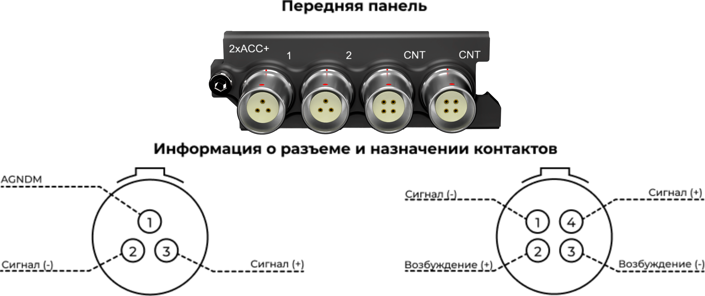
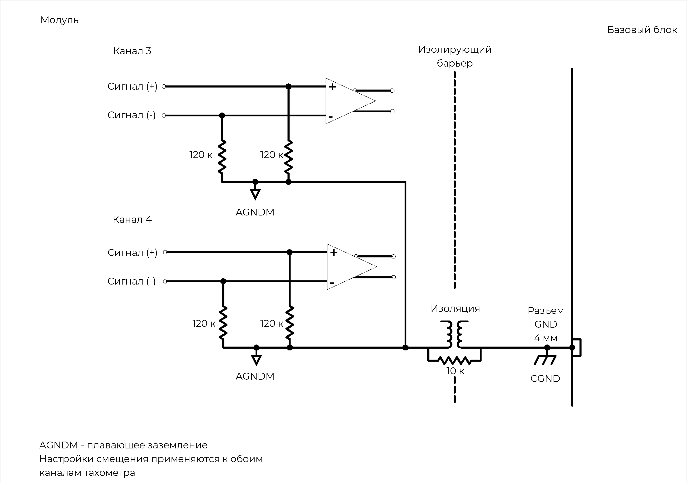
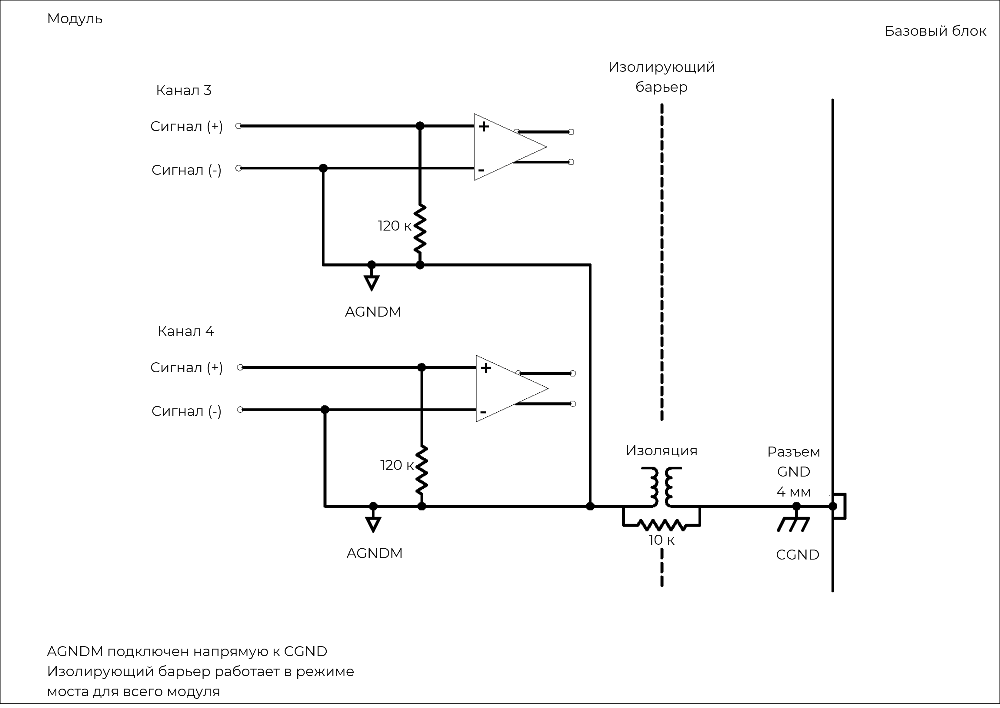
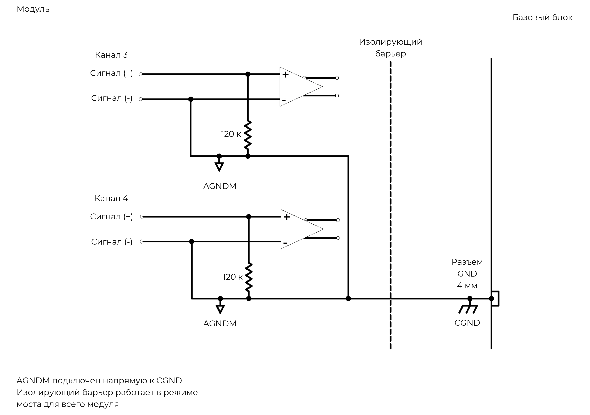

### **Описание**

Модуль 2xACC+ -- это гибридный модуль, сочетающий 2 канала модуля 4xACC и 2 входных расширенных канала тахометра. Каналы тахометра обеспечивают измерение периода тахометра с разрешением 20 нс: выборка производится, когда сигнал пересекает заданный уровень срабатывания. Триггер для сигналов тахометра можно настроить по переднему или заднему краю с регулируемым гистерезисом, дополнительно обеспечивая развязку по переменному току для датчиков с различными значениями смещения напряжения постоянного тока. Предусмотрен высокоскоростной режим осциллографа 4,9 Мвыб/с для просмотра сигналов тахометра -- это упрощает задание уровней триггера. Модуль можно использовать:

•           при измерении частоты повторения импульсов, а также времени между импульсами (например, оборотов в минуту и угла поворота коленчатого вала)

•           с любыми ICP®-датчиками, обычно применяемыми для измерения вибрации, ускорения, силы или давления

•           с любым источником напряжения до ±60 В в режиме ввода напряжения.

{width=915px height=350px}

##### *Модуль 2xACC+ с 3- и 4-контактным разъемом LEMO*® *EHG.0B: назначение контактов (если смотреть на разъем на лицевой панели).*

### **Функции**

  <table style="border-collapse: collapse; width: 100%;">
    <!-- Заголовок первого раздела -->
    <tr>
      <th colspan="2" style="border: 1px solid; padding: 6px; text-align: left; font-size: 1.1em;">
        Основные функции модуля тахометра
      </th>
    </tr>
    <!-- Списки характеристик в две колонки -->
    <tr>
      <td style="border: 1px solid; padding: 6px; vertical-align: top;">
        <ul style="margin: 0; padding-left: 1.2em;">
          <li>2 канала тахометра</li>
          <li>Входной сигнал тахометра может быть связан по перем. и пост. току</li>
          <li>Разрешение тахометра: 20 нс</li>
          <li>Частота 700 000 импульсов в секунду для 2 каналов (в сумме)</li>
          <li>Регулировка уровня триггера тахометра: 16 бит</li>
          <li>Входные диапазоны: ±(2 В, 12 В, 30 В и 60 В)</li>
          <li>Аналоговая полоса пропускания для всех диапазонов: 2 МГц</li>
        </ul>
      </td>
      <td style="border: 1px solid; padding: 6px; vertical-align: top;">
        <ul style="margin: 0; padding-left: 1.2em;">
          <li>Регулируемый гистерезис уровня триггера (схема Шмитта)</li>
          <li>Триггер по n‑краю</li>
          <li>Автокалибровка уровня триггера</li>
          <li>Режим осциллографа: 4,9 Мвыб/с на канал</li>
          <li>Выход возбуждения: ±12 В на датчик</li>
          <li>Низкое энергопотребление</li>
          <li>4‑контактные разъёмы LEMO® EHG.0B</li>
        </ul>
      </td>
    </tr>

        <!-- Параметры датчика: две колонки -->
    <tr>
      <th style="border: 1px solid; padding: 6px; text-align: left;">Датчик тахометра</th>
      <td style="border: 1px solid; padding: 6px;">Напряжение (односторонний или дифференциальный)</td>
    </tr>
    <tr>
      <th style="border: 1px solid; padding: 6px; text-align: left;">Уровень напряжения возбуждения</th>
      <td style="border: 1px solid; padding: 6px;">
        Односторонний, изолированный (0–12 В) 
        Дифференциальный (±12 В)
      </td>
    </tr>
    <tr>
      <th style="border: 1px solid; padding: 6px; text-align: left;">Максимальный ток возбуждения</th>
      <td style="border: 1px solid; padding: 6px;">140 мА (с предохранителем)</td>
    </tr>
    <tr>
      <th style="border: 1px solid; padding: 6px; text-align: left;">Развязка</th>
      <td style="border: 1px solid; padding: 6px;">Пост. или перем. ток</td>
    </tr>
    <tr>
      <th style="border: 1px solid; padding: 6px; text-align: left;">Входное сопротивление</th>
      <td style="border: 1px solid; padding: 6px;">
        Односторонний: 120 кОм 
        Дифференциальный: 240 кОм
      </td>
    </tr>
    <tr>
      <th style="border: 1px solid; padding: 6px; text-align: left;">Диапазон перенапряжения</th>
      <td style="border: 1px solid; padding: 6px;">±60 В</td>
    </tr>
    <tr>
      <th style="border: 1px solid; padding: 6px; text-align: left;">Точность триггера</th>
      <td style="border: 1px solid; padding: 6px;">Обнаружение порога по гистерезису; разрешение 16 бит</td>
    </tr>
    <tr>
      <th style="border: 1px solid; padding: 6px; text-align: left;">Мин. ширина импульса</th>
      <td style="border: 1px solid; padding: 6px;">800 нс</td>
    </tr>
    <tr>
      <th style="border: 1px solid; padding: 6px; text-align: left;">Режим осциллографа</th>
      <td style="border: 1px solid; padding: 6px;">2,048 кГц &lt; частота дискретизации &lt; 4,9 МГц</td>
    </tr>
    <tr>
      <th style="border: 1px solid; padding: 6px; text-align: left;">Калибровка модуля</th>
      <td style="border: 1px solid; padding: 6px;">Внутренняя калибровка амплитуды и фазы</td>
    </tr>
    <tr>
      <th style="border: 1px solid; padding: 6px; text-align: left;">Защита</th>
      <td style="border: 1px solid; padding: 6px;">ЭСР 2 кВ</td>
    </tr>
    <tr>
      <th style="border: 1px solid; padding: 6px; text-align: left;">Гальваническая изоляция</th>
      <td style="border: 1px solid; padding: 6px;">50 В</td>
    </tr>
    <tr>
      <th style="border: 1px solid; padding: 6px; text-align: left;">
        Уровни триггера тахометра 
        <em>Мин. разность напряжения между уровнями триггера</em>
      </th>
      <td style="border: 1px solid; padding: 6px;">
        60 В: 0,3 В 
        30 В: 0,2 В 
        12 В: 0,15 В 
        2 В: 0,05 В
      </td>
    </tr>
  </table>

### **Функциональная схема -- входной канал тахометра**

{width=915px height=350px}

##### *Функциональная схема 2xACC+ -- входной канал тахометра.*

!!! note "Примечание"
    Характеристики каналов 1 и 2 аналогичны первым двум каналам модуля 4xACC.
    Дополнительные сведения о двух каналах входного сигнала напряжения или ICP® см. в описании модуля 4xACC.

Каналы 3 и 4 модуля *2xACC+* -- каналы тахометра, а также входного сигнала осциллографа. Каждый канал тахометра функционирует отдельно и подключен к собственному датчику тахометра. Каждый канал осциллографа отображает входные данные каналов тахометра. Можно настроить каналы осциллографа так, чтобы они отображали один канал тахометра.

В стандартной конфигурации модуля для каждого входного канала тахометра (на передней панели) предназначен 4-контактный разъем LEMO® . Два контакта разъема LEMO® выделены для сигнала тахометра. Два дополнительных контакта обеспечивают напряжение возбуждения, которое может служить источником питания для внешних датчиков тахометра. Линии «Возбуждение (+)» и «Возбуждение (-)» оснащены защитой от перегрузки по току -- автоматическим предохранителем на 140 мА. Два варианта вывода возбуждения показаны в таблице ниже.

| Режим возбуждения              | Описание                                                                                                                                 | Схема                     |
|--------------------------------|------------------------------------------------------------------------------------------------------------------------------------------|---------------------------|
| Дифференциальное возбуждение   | Линии «Возбуждение (+)» и «Возбуждение (-)» подключены к +12 В и -12 В соответственно. Отрицательная и положительная шины используют AGNDM как опорное напряжение 0 В. |  |
| Одностороннее изолированное возбуждение | Линия «Возбуждение (+)» подключена к +12 В, а «Возбуждение (-)» к изолированному заземлению.                                              |  |

### **Варианты заземления на входной канал тахометра**

Для каждого входного канала тахометра модуля *2xACC+* предусмотрены следующие варианты заземления:

•           Дифференциальное смещение (балансируемое смещение):

\-     Оба входа подключены по линии 120 кОм к плавающему заземлению.

•           Несимметричное смещение (небалансируемое смещение):

\-     Один вход подключен по линии 120 кОм к плавающему заземлению, а другой -- напрямую к плавающему заземлению.

•           Несимметричное заземление (небалансируемое заземление):

\-     Один вход подключен по линии 120 кОм к плавающему заземлению, а другой -- напрямую к заземлению.

### **Схемы заземления**

{width=915px height=350px}

##### *Дифференциальное смещение (балансируемое смещение).*

{width=915px height=350px}

##### *Несимметричное смещение (небалансируемое смещение).*

{width=915px height=350px}

##### *Несимметричное заземление (небалансируемое заземление).*