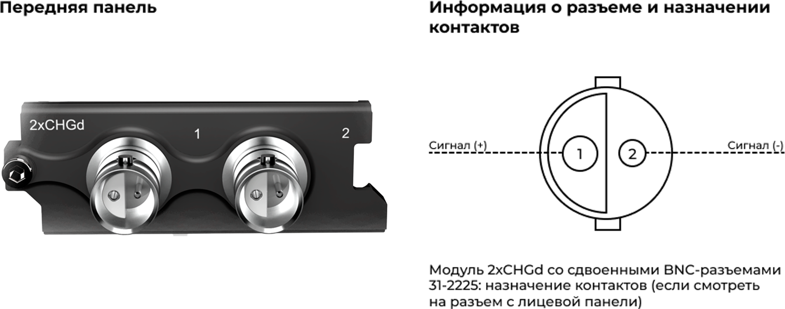
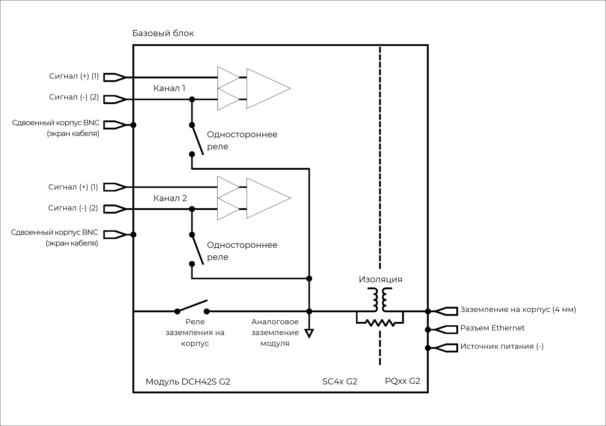

### **Описание**

Модуль 2xCHGd оснащен 2 независимыми дифференциальными входными каналами для кварцевых или пьезокерамических датчиков. Эти датчики, как правило, используются при необходимости получить более качественный сигнал, например с низким уровнем шумов и искажений, а также в случаях, когда из-за высоких температур и ядерной радиации невозможно использовать ICP®-датчики. Дополнительная функция дифференциального заряда обеспечивает дополнительную устойчивость к помехам и более высокую пропускную способности, что особенно важно для вариантов применения с длинными кабелями. Модуль можно использовать:

•           с пьезоэлектрическими датчиками, которые обычно используются для измерения вибрации, ускорения, силы, крутящего момента и давления

•           в системах с длинными кабелями из-за необходимости использовать балансируемые кабели «витая пара».

{width=915px height=350px}

!!! note "ПРЕДУПРЕЖДЕНИЕ ОБ ЭЛЕКТРОСТАТИЧЕСКИХ РАЗРЯДАХ"
    Входы модуля 2xCHGd чувствительны к электростатическим разрядам. Прежде чем подключать кабель или разъем к модулю 2xCHGd, принимайте меры по снятию статического электричества, которое может на них накапливаться.

### **Функции**

  <table style="border-collapse: collapse; width: 100%;">
    <tbody>
      
      <tr>
        <td style="border: 1px solid #ccc; padding: 6px; vertical-align: top;">
          <ul style="margin: 0; padding-left: 1.2em;">
            <li>2 канала</li>
            <li>Разрешение 24 бит</li>
            <li>Частота дискретизации до 204,8 квыб/с на канал</li>
            <li>Полоса пропускания 90 кГц</li>
            <li>Две настройки чувствительности в несимметричном режиме</li>
            <li>Две настройки чувствительности в дифференциальном режиме</li>
          </ul>
        </td>
        <td style="border: 1px solid #ccc; padding: 6px; vertical-align: top;">
          <ul style="margin: 0; padding-left: 1.2em;">
            <li>Несимметричный и дифференциальный входные режимы</li>
            <li>Выбор цифровых фильтров высоких и низких частот</li>
            <li>Обнаружение перенапряжения</li>
            <li>Низкое энергопотребление</li>
            <li>Разъемы Amphenol 31-2225 Twin BNC</li>
          </ul>
        </td>
      </tr>
      
      <tr>
        <th style="border: 1px solid #ccc; padding: 6px; text-align: left; vertical-align: top;">Диапазоны входного заряда (Несимметричный режим)</th>
        <td style="border: 1px solid #ccc; padding: 6px;">
          0,1 мВ/пКл: &plusmn;100 000 пКл (пик) 
          1 мВ/пКл: &plusmn;10 000 пКл (пик)
        </td>
      </tr>
      <tr>
        <th style="border: 1px solid #ccc; padding: 6px; text-align: left; vertical-align: top;">Диапазоны входного заряда (Дифференциальный режим)</th>
        <td style="border: 1px solid #ccc; padding: 6px;">
          0,2 мВ/пКл: &plusmn;5000 пКл (пик) 
          2 мВ/пКл: &plusmn;50 000 пКл (пик)
        </td>
      </tr>
        <tr>
        <th style="border: 1px solid #ccc; padding: 6px; text-align: left; vertical-align: top;">-3 дБ ФВЧ (Несимметричный режим)</th>
        <td style="border: 1px solid #ccc; padding: 6px;">
          0,1 мВ/пКл: 0,16 Гц или 0,016 Гц 
          1 мВ/пКл: 1,6 Гц или 0,16 Гц
        </td>
      </tr>
      <tr>
        <th style="border: 1px solid #ccc; padding: 6px; text-align: left; vertical-align: top;">-3 дБ ФВЧ (Дифференциальный режим)</th>
        <td style="border: 1px solid #ccc; padding: 6px;">
          0,2 мВ/пКл: 0,16 Гц или 0,016 Гц 
          2 мВ/пКл: 1,6 Гц или 0,16 Гц
        </td>
      </tr>
      <tr>
        <th style="border: 1px solid #ccc; padding: 6px; text-align: left; vertical-align: top;">Погрешность на фазу <em>Каналы в сходном диапазоне</em></th>
        <td style="border: 1px solid #ccc; padding: 6px;">Стандартно23: &lt; 0,5&deg; при 10 кГц</td>
      </tr>
      <tr>
        <th style="border: 1px solid #ccc; padding: 6px; text-align: left; vertical-align: top;">Другие значения частоты дискретизации</th>
        <td style="border: 1px solid #ccc; padding: 6px;">Доступно через цифровые ФНЧ и децимацию</td>
      </tr>
      <tr>
        <th style="border: 1px solid #ccc; padding: 6px; text-align: left; vertical-align: top;">Доп. программируемые цифровые БИХ-фильтры</th>
        <td style="border: 1px solid #ccc; padding: 6px;">Полосовой и заградительный фильтр: 6 дБ/октаву; ФВЧ/ФНЧ: 12 дБ/октаву</td>
      </tr>
      <tr>
        <th style="border: 1px solid #ccc; padding: 6px; text-align: left; vertical-align: top;">Дополнительный ФВЧ первого порядка</th>
        <td style="border: 1px solid #ccc; padding: 6px;">-3 дБ при 1 Гц</td>
      </tr>
      <tr>
        <th style="border: 1px solid #ccc; padding: 6px; text-align: left; vertical-align: top;">Калибровка модуля</th>
        <td style="border: 1px solid #ccc; padding: 6px;">Внутренняя калибровка амплитуды</td>
      </tr>
      <tr>
        <th style="border: 1px solid #ccc; padding: 6px; text-align: left; vertical-align: top;">Защита</th>
        <td style="border: 1px solid #ccc; padding: 6px;">Серия 1 кОм (в линии)</td>
      </tr>
      <tr>
        <th style="border: 1px solid #ccc; padding: 6px; text-align: left; vertical-align: top;">Гальваническая изоляция</th>
        <td style="border: 1px solid #ccc; padding: 6px;">50 В</td>
      </tr>
      <tr>
        <th style="border: 1px solid #ccc; padding: 6px; text-align: left; vertical-align: top;">
          Цифровой ФНЧ 
          <em>Шкала фильтра: частота дискретизации</em>
        </th>
        <td style="border: 1px solid #ccc; padding: 6px;">
          Полоса пропускания: частота дискретизации &times; 0,45 Гц 
          Полоса задержания: частота дискретизации &times; 0,55 Гц 
          Неравномерность в полосе пропускания: &plusmn;0,005 дБ 
          Затухание в полосе задержания: 100 дБ
        </td>
      </tr>
    </tbody>
  </table>

### **Функциональная схема на канал**

{width=695px height=362px}

##### *Функциональная схема 2xCHGd на канал.*

### **Схема заземления**

{width=706px height=366px}

##### *Заземление модуля 2xCHGd.*