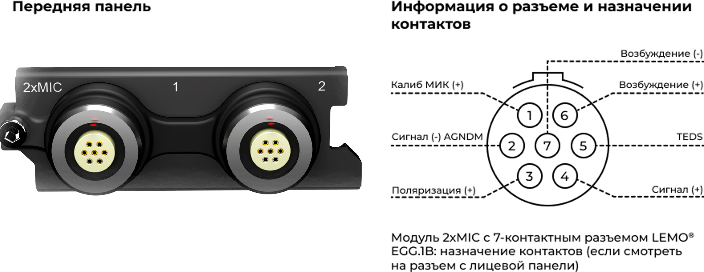
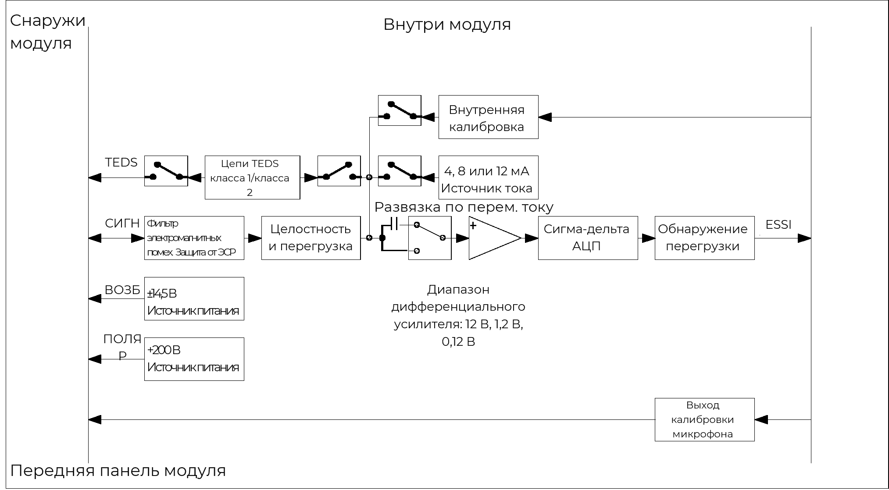
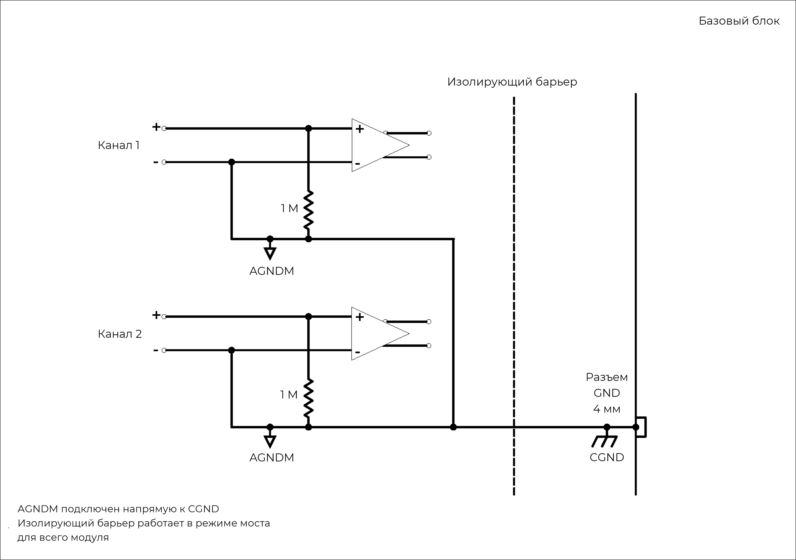

### **Описание**

Основное назначение модуля 2xMIC -- измерения с помощью микрофонов, однако он также поддерживает режимы входного сигнала напряжения и ICP®. Модуль можно использовать:

•           с любыми микрофонами 200 В или преполяризованными микрофонами с предусилителями

•           с любыми ICP®-датчиками, обычно применяемыми для измерения вибрации, ускорения, силы и давления

•           с любым источником напряжения до ±12 В в режиме ввода напряжения.

{width=915px height=350px}

### **Функции**

  <table style="border-collapse: collapse; width: 100%;">
    <tbody>
      
      <tr>
        <td style="border: 1px solid #ccc; padding: 8px; vertical-align: top;">
          <ul style="margin: 0; padding-left: 1.2em;">
            <li>2 канала</li>
            <li>Три входных режима:
                <ul style="padding-left: 1.5em; margin-top: 4px; margin-bottom: 4px;">
                    <li>Режим микрофона с микрофонами 200 В</li>
                    <li>Режим ICP® с пост. током 4 мА, 8 мА или 12 мА</li>
                    <li>Режим входного сигнала напряжения</li>
                </ul>
            </li>
            <li>Поддержка TEDS IEEE 1451.4 V0.9, V1.0</li>
            <li>Разрешение 24 бит</li>
            <li>Входные диапазоны (120 мВ, 1,2 В, 12 В)</li>
            <li>Напряжение возбуждения предусилителя микрофона ±14,5 В</li>
            <li>Выход поляризации 0 В или 200 В</li>
            <li>Выход калибровки микрофона для ввода тестового сигнала в предусилители микрофонов</li>
            <li>Низкое искажение и уровень помех</li>
          </ul>
        </td>
        <td style="border: 1px solid #ccc; padding: 8px; vertical-align: top;">
          <ul style="margin: 0; padding-left: 1.2em;">
            <li>Три режима ввода для напряжения и ICP®:
                <ul style="padding-left: 1.5em; margin-top: 4px; margin-bottom: 4px;">
                    <li>Дифференциальное или балансируемое смещение(возбуждение ±12 В)</li>
                    <li>Несимметричное или небалансируемое смещение(возбуждение 24 В)</li>
                    <li>Несимметричное или небалансируемое заземление(возбуждение 24 В)</li>
                </ul>
            </li>
            <li>Подсоединение экрана кабеля к CGND задается программно</li>
            <li>Отслеживание коротких замыканий и кабелей с разомкнутым контуром</li>
            <li>Отслеживание целостности сигнала и перегрузки</li>
            <li>Низкое энергопотребление</li>
            <li>Разъемы LEMO® ECG.1B (7-контактные)</li>
            <li>Защита от короткого замыкания цепи возбуждения предусилителя</li>
          </ul>
        </td>
      </tr>
      
      <tr>
        <th style="border: 1px solid #ccc; padding: 8px; text-align: left; vertical-align: top;">Интерфейс</th>
        <td style="border: 1px solid #ccc; padding: 8px;">
            ICP®-датчики 
            Для аналоговых источников напряжения или микрофонов
        </td>
      </tr>
      <tr>
        <th style="border: 1px solid #ccc; padding: 8px; text-align: left; vertical-align: top;">Развязка по входу</th>
        <td style="border: 1px solid #ccc; padding: 8px;">
            Перем. ток (для режима ICP®) 
            Пост. или перем. ток (для режима измерения напряжения и сигналов микрофонов)
        </td>
      </tr>
      <tr>
        <th style="border: 1px solid #ccc; padding: 8px; text-align: left; vertical-align: top;">Частотная характеристика развязки по перем. току</th>
        <td style="border: 1px solid #ccc; padding: 8px;">
            <b>Затухание:</b> -3 дБ 
            <b>Макс. частота:</b> 0,16 Гц
        </td>
      </tr>
      <tr>
        <th style="border: 1px solid #ccc; padding: 8px; text-align: left; vertical-align: top;">Другие значения частоты дискретизации</th>
        <td style="border: 1px solid #ccc; padding: 8px;">Доступно через цифровые ФНЧ и децимацию</td>
      </tr>
      <tr>
        <th style="border: 1px solid #ccc; padding: 8px; text-align: left; vertical-align: top;">Дополнительные программируемые цифровые БИХ-фильтры</th>
        <td style="border: 1px solid #ccc; padding: 8px;">Полосовой/полосовой заградительный: 6 дБ на октаву ФВЧ/ФНЧ: 12 дБ на октаву</td>
      </tr>
      <tr>
        <th style="border: 1px solid #ccc; padding: 8px; text-align: left; vertical-align: top;">Дополнительный ФВЧ первого порядка</th>
        <td style="border: 1px solid #ccc; padding: 8px;">-3 дБ при 1 Гц</td>
      </tr>
      <tr>
        <th style="border: 1px solid #ccc; padding: 8px; text-align: left; vertical-align: top;">Калибровка модуля</th>
        <td style="border: 1px solid #ccc; padding: 8px;">Внутренняя калибровка амплитуды и фазы</td>
      </tr>
      <tr>
        <th style="border: 1px solid #ccc; padding: 8px; text-align: left; vertical-align: top;">Защита</th>
        <td style="border: 1px solid #ccc; padding: 8px;">ЭСР 2 кВ</td>
      </tr>
      <tr>
        <th style="border: 1px solid #ccc; padding: 8px; text-align: left; vertical-align: top;">Гальваническая изоляция</th>
        <td style="border: 1px solid #ccc; padding: 8px;">50 В</td>
      </tr>
    </tbody>
  </table>

### **Характеристики**

  <table style="border-collapse: collapse; width: 100%;">
    <tbody>
      
      <tr>
        <th style="border: 1px solid #ccc; padding: 8px; text-align: left; vertical-align: top;">Полоса пропускания</th>
        <td style="border: 1px solid #ccc; padding: 8px;">Пост. ток до 100 кГц</td>
      </tr>
      <tr>
        <th style="border: 1px solid #ccc; padding: 8px; text-align: left; vertical-align: top;">Максимальная частота дискретизации на канал</th>
        <td style="border: 1px solid #ccc; padding: 8px;">204,8 Квыб/с</td>
      </tr>
      <tr>
        <th style="border: 1px solid #ccc; padding: 8px; text-align: left; vertical-align: top;">АЦП / Передача данных</th>
        <td style="border: 1px solid #ccc; padding: 8px;">24 бит / 16/24 бит</td>
      </tr>
      <tr>
        <th style="border: 1px solid #ccc; padding: 8px; text-align: left; vertical-align: top;">Диапазоны входного напряжения (пик)</th>
        <td style="border: 1px solid #ccc; padding: 8px;">&plusmn;120 мВ, &plusmn;1,2 В, &plusmn;12 В</td>
      </tr>
      <tr>
        <th style="border: 1px solid #ccc; padding: 8px; text-align: left; vertical-align: top;">Режим ICP®</th>
        <td style="border: 1px solid #ccc; padding: 8px;">4 мА, 8 мА или 12 мА пост. тока при возбуждении &plusmn;12 В/24 В</td>
      </tr>
      <tr>
        <th style="border: 1px solid #ccc; padding: 8px; text-align: left; vertical-align: top;">Параметры входного смещения</th>
        <td style="border: 1px solid #ccc; padding: 8px;">
          <strong>Дифференциальное смещение (балансируемое):</strong> Положительный и отрицательный входы сигнала подключены по линии 1 МОм к плавающему заземлению.  
          <strong>Несимметричное смещение (небалансируемое):</strong> Положительный вход сигнала подключен к плавающему заземлению по линии 1 МОм; отрицательный вход сигнала подключен к плавающему заземлению.  
          <strong>Несимметричное заземление (небалансируемое):</strong> Положительный вход сигнала подключен к заземлению по линии 1 МОм; отрицательный вход сигнала подключен к заземлению.
        </td>
      </tr>
      <tr>
        <th style="border: 1px solid #ccc; padding: 8px; text-align: left; vertical-align: top;">Входное сопротивление</th>
        <td style="border: 1px solid #ccc; padding: 8px;">
          <strong>Дифференциальное:</strong> 2 МОм || 570 пФ 
          <strong>Несимметричное:</strong> 1 МОм || 290 пФ
        </td>
      </tr>
      <tr>
        <th style="border: 1px solid #ccc; padding: 8px; text-align: left; vertical-align: top;">Цифровой ФНЧ <em>Шкала фильтра: частота дискретизации</em></th>
        <td style="border: 1px solid #ccc; padding: 8px;">
          <strong>Полоса пропускания:</strong> частота дискретизации &times; 0,46 Гц 
          <strong>Полоса задержания:</strong> частота дискретизации &times; 0,54 Гц 
          <strong>Неравномерность в полосе пропускания:</strong> 
          &nbsp;&nbsp;&nbsp;• при 48 кГц: &plusmn;0,001 дБ 
          &nbsp;&nbsp;&nbsp;• при 96 кГц: &plusmn;0,003 дБ 
          &nbsp;&nbsp;&nbsp;• при 192 кГц: &plusmn;0,007 дБ 
          <strong>Затухание в полосе задержания:</strong> 120 дБ
        </td>
      </tr>
      <tr>
        <th style="border: 1px solid #ccc; padding: 8px; text-align: left; vertical-align: top;">Погрешность на фазу <em>Каналы в сходном диапазоне</em></th>
        <td style="border: 1px solid #ccc; padding: 8px;">Стандартно: &lt; 0,2&deg; при 10 кГц</td>
      </tr>
    </tbody>
  </table>

  <table style="width: 100%; border-collapse: collapse; margin-bottom: 20px;">
    <thead>
      <tr>
        <th style="border: 1px solid #ccc; padding: 8px; text-align: left; ">Характеристика</th>
        <th style="border: 1px solid #ccc; padding: 8px; text-align: left; ">Входной диапазон (пик)</th>
        <th style="border: 1px solid #ccc; padding: 8px; text-align: left; ">% показания + % диапазона</th>
      </tr>
    </thead>
    <tbody>
      <tr>
        <th style="border: 1px solid #ccc; padding: 8px; text-align: left; vertical-align: middle;" rowspan="3">Точность напряжения пост. тока</th>
        <td style="border: 1px solid #ccc; padding: 8px;">&plusmn;120 мВ</td>
        <td style="border: 1px solid #ccc; padding: 8px;">0,375% + 0,125%</td>
      </tr>
      <tr>
        <td style="border: 1px solid #ccc; padding: 8px;">&plusmn;1,2 В</td>
        <td style="border: 1px solid #ccc; padding: 8px;">0,065% + 0,020%</td>
      </tr>
      <tr>
        <td style="border: 1px solid #ccc; padding: 8px;">&plusmn;12 В</td>
        <td style="border: 1px solid #ccc; padding: 8px;">0,074% + 0,024%</td>
      </tr>
    </tbody>
  </table>

  <table style="width: 100%; border-collapse: collapse;">
    <thead>
      <tr>
        <th style="border: 1px solid #ccc; padding: 8px; text-align: left; ">Характеристика</th>
        <th style="border: 1px solid #ccc; padding: 8px; text-align: left; ">Частотный диапазон</th>
        <th style="border: 1px solid #ccc; padding: 8px; text-align: left; ">Входной диапазон (пик)</th>
        <th style="border: 1px solid #ccc; padding: 8px; text-align: left; ">Гарантировано</th>
        <th style="border: 1px solid #ccc; padding: 8px; text-align: left; ">Стандартно</th>
      </tr>
    </thead>
    <tbody>
      <tr>
        <th style="border: 1px solid #ccc; padding: 8px; text-align: left;  vertical-align: middle;" rowspan="9">Шум <small>Оконечная нагрузка входа — резистор 50 Ом</small></th>
        <td style="border: 1px solid #ccc; padding: 8px;">от 10 Гц до 23 кГц</td>
        <td style="border: 1px solid #ccc; padding: 8px; vertical-align: middle;" rowspan="3">&plusmn;120 мВ</td>
        <td style="border: 1px solid #ccc; padding: 8px;">&lt; 1,9 мкВ СКЗ</td>
        <td style="border: 1px solid #ccc; padding: 8px;">&lt; 1,6 мкВ СКЗ</td>
      </tr>
      <tr>
        <td style="border: 1px solid #ccc; padding: 8px;">от 10 Гц до 49 кГц</td>
        <td style="border: 1px solid #ccc; padding: 8px;">&lt; 2,4 мкВ СКЗ</td>
        <td style="border: 1px solid #ccc; padding: 8px;">&lt; 2,1 мкВ СКЗ</td>
      </tr>
      <tr>
        <td style="border: 1px solid #ccc; padding: 8px;">от 10 Гц до 100 кГц</td>
        <td style="border: 1px solid #ccc; padding: 8px;">&lt; 3,1 мкВ СКЗ</td>
        <td style="border: 1px solid #ccc; padding: 8px;">&lt; 2,8 мкВ СКЗ</td>
      </tr>
      <tr>
        <td style="border: 1px solid #ccc; padding: 8px;">от 10 Гц до 23 кГц</td>
        <td style="border: 1px solid #ccc; padding: 8px; vertical-align: middle;" rowspan="3">&plusmn;1,2 В</td>
        <td style="border: 1px solid #ccc; padding: 8px;">&lt; 6,9 мкВ СКЗ</td>
        <td style="border: 1px solid #ccc; padding: 8px;">&lt; 4,8 мкВ СКЗ</td>
      </tr>
      <tr>
        <td style="border: 1px solid #ccc; padding: 8px;">от 10 Гц до 49 кГц</td>
        <td style="border: 1px solid #ccc; padding: 8px;">&lt; 7,8 мкВ СКЗ</td>
        <td style="border: 1px solid #ccc; padding: 8px;">&lt; 5,9 мкВ СКЗ</td>
      </tr>
      <tr>
        <td style="border: 1px solid #ccc; padding: 8px;">от 10 Гц до 100 кГц</td>
        <td style="border: 1px solid #ccc; padding: 8px;">&lt; 8,8 мкВ СКЗ</td>
        <td style="border: 1px solid #ccc; padding: 8px;">&lt; 7,3 мкВ СКЗ</td>
      </tr>
      <tr>
        <td style="border: 1px solid #ccc; padding: 8px;">от 10 Гц до 23 кГц</td>
        <td style="border: 1px solid #ccc; padding: 8px; vertical-align: middle;" rowspan="3">&plusmn;12 В</td>
        <td style="border: 1px solid #ccc; padding: 8px;">&lt; 19,7 мкВ СКЗ</td>
        <td style="border: 1px solid #ccc; padding: 8px;">&lt; 16,3 мкВ СКЗ</td>
      </tr>
      <tr>
        <td style="border: 1px solid #ccc; padding: 8px;">от 10 Гц до 49 кГц</td>
        <td style="border: 1px solid #ccc; padding: 8px;">&lt; 26,2 мкВ СКЗ</td>
        <td style="border: 1px solid #ccc; padding: 8px;">&lt; 22,4 мкВ СКЗ</td>
      </tr>
      <tr>
        <td style="border: 1px solid #ccc; padding: 8px;">от 10 Гц до 100 кГц</td>
        <td style="border: 1px solid #ccc; padding: 8px;">&lt; 48,0 мкВ СКЗ</td>
        <td style="border: 1px solid #ccc; padding: 8px;">&lt; 37,4 мкВ СКЗ</td>
      </tr>
    </tbody>
  </table>

  <table style="width: 100%; border-collapse: collapse; margin-bottom: 20px;">
    <thead>
      <tr>
        <th style="border: 1px solid #ccc; padding: 8px; text-align: left; ">Характеристика</th>
        <th style="border: 1px solid #ccc; padding: 8px; text-align: left; ">Частота дискретизации</th>
        <th style="border: 1px solid #ccc; padding: 8px; text-align: left; ">Входной диапазон (пик)</th>
        <th style="border: 1px solid #ccc; padding: 8px; text-align: left; ">Затухание (уровень входного сигнала 100% от полного диапазона)</th>
      </tr>
    </thead>
    <tbody>
      <tr>
        <th style="border: 1px solid #ccc; padding: 8px; text-align: left;  vertical-align: middle;" rowspan="9">Неравномерность амплитудной хар-ки <small>Относительно 1 кГц  Измерено до 0,39 × частота дискретизации</small></th>
        <td style="border: 1px solid #ccc; padding: 8px;">51,2 Квыб/с</td>
        <td style="border: 1px solid #ccc; padding: 8px; vertical-align: middle;" rowspan="3">&plusmn;120 мВ</td>
        <td style="border: 1px solid #ccc; padding: 8px;">-0,03 дБ</td>
      </tr>
      <tr>
        <td style="border: 1px solid #ccc; padding: 8px;">102,4 Квыб/с</td>
        <td style="border: 1px solid #ccc; padding: 8px;">-0,10 дБ</td>
      </tr>
      <tr>
        <td style="border: 1px solid #ccc; padding: 8px;">204,8 Квыб/с</td>
        <td style="border: 1px solid #ccc; padding: 8px;">-0,35 дБ</td>
      </tr>
      <tr>
        <td style="border: 1px solid #ccc; padding: 8px;">51,2 Квыб/с</td>
        <td style="border: 1px solid #ccc; padding: 8px; vertical-align: middle;" rowspan="3">&plusmn;1,2 В</td>
        <td style="border: 1px solid #ccc; padding: 8px;">-0,03 дБ</td>
      </tr>
      <tr>
        <td style="border: 1px solid #ccc; padding: 8px;">102,4 Квыб/с</td>
        <td style="border: 1px solid #ccc; padding: 8px;">-0,10 дБ</td>
      </tr>
      <tr>
        <td style="border: 1px solid #ccc; padding: 8px;">204,8 Квыб/с</td>
        <td style="border: 1px solid #ccc; padding: 8px;">-0,35 дБ</td>
      </tr>
      <tr>
        <td style="border: 1px solid #ccc; padding: 8px;">51,2 Квыб/с</td>
        <td style="border: 1px solid #ccc; padding: 8px; vertical-align: middle;" rowspan="3">&plusmn;12 В</td>
        <td style="border: 1px solid #ccc; padding: 8px;">-0,03 дБ</td>
      </tr>
      <tr>
        <td style="border: 1px solid #ccc; padding: 8px;">102,4 Квыб/с</td>
        <td style="border: 1px solid #ccc; padding: 8px;">-0,10 дБ</td>
      </tr>
      <tr>
        <td style="border: 1px solid #ccc; padding: 8px;">204,8 Квыб/с</td>
        <td style="border: 1px solid #ccc; padding: 8px;">-0,35 дБ</td>
      </tr>
    </tbody>
  </table>

  <table style="width: 100%; border-collapse: collapse;">
    <thead>
      <tr>
        <th style="border: 1px solid #ccc; padding: 8px; text-align: left; ">Характеристика</th>
        <th style="border: 1px solid #ccc; padding: 8px; text-align: left; ">Входной диапазон (пик)</th>
        <th style="border: 1px solid #ccc; padding: 8px; text-align: left; ">Гарантировано</th>
        <th style="border: 1px solid #ccc; padding: 8px; text-align: left; ">Стандартно</th>
      </tr>
    </thead>
    <tbody>
      <tr>
        <th style="border: 1px solid #ccc; padding: 8px; text-align: left; vertical-align: middle;" rowspan="3">Взаимное влияние</th>
        <td style="border: 1px solid #ccc; padding: 8px;">&plusmn;120 мВ</td>
        <td style="border: 1px solid #ccc; padding: 8px;">101 дБ</td>
        <td style="border: 1px solid #ccc; padding: 8px;">106 дБ</td>
      </tr>
      <tr>
        <td style="border: 1px solid #ccc; padding: 8px;">&plusmn;1,2 В</td>
        <td style="border: 1px solid #ccc; padding: 8px;">113 дБ</td>
        <td style="border: 1px solid #ccc; padding: 8px;">118 дБ</td>
      </tr>
      <tr>
        <td style="border: 1px solid #ccc; padding: 8px;">&plusmn;12 В</td>
        <td style="border: 1px solid #ccc; padding: 8px;">117 дБ</td>
        <td style="border: 1px solid #ccc; padding: 8px;">122 дБ</td>
      </tr>
    </tbody>
  </table>

##### *Характеристики модуля 2xMIC*

!!! info "Информация"
    Информация о параметрах модулей и условиях измерения, используемых во время измерений для определения технических характеристик, доступна по запросу.

### **Функциональная схема на канал**

{width=915px height=350px}

##### *Схема прохождения сигнала модуля 2xMIC.*

### **Схемы заземления для режима измерения напряжения**

{width=915px height=350px}

##### *Дифференциальное смещение (балансируемое смещение).*

{width=915px height=350px}

##### *Несимметричное смещение (небалансируемое смещение).*

{width=915px height=350px}

##### *Несимметричное заземление (небалансируемое заземление).*

На рис. ниже показано влияние закрытого переключателя CGND на варианты входных режимов модуля. Изолирующий барьер будет работать в режиме моста для всего модуля. Поэтому любой канал, подключенный по дифференциальной развязке, будет выдавать 1 МОм на CGND, а любой канал, подключенный по несимметричной развязке, будет подключен к несимметричному (небалансируемому) заземлению.

{width=915px height=350px}

##### *Влияние входного режима на модуль.*

### **Схемы заземления для режима ICP**®

{width=915px height=350px}

##### *Режим ICP*®*: дифференциальное смещение с возбуждением током 4 мА, 8 мА или 12 мА.*

{width=915px height=350px}

##### *Режим ICP*®*: несимметричное смещение с возбуждением током 4 мА, 8 мА или 12 мА.*

{width=915px height=350px}

##### *Режим ICP*®*: несимметричное заземление с возбуждением током 4 мА, 8 мА или 12 мА.*