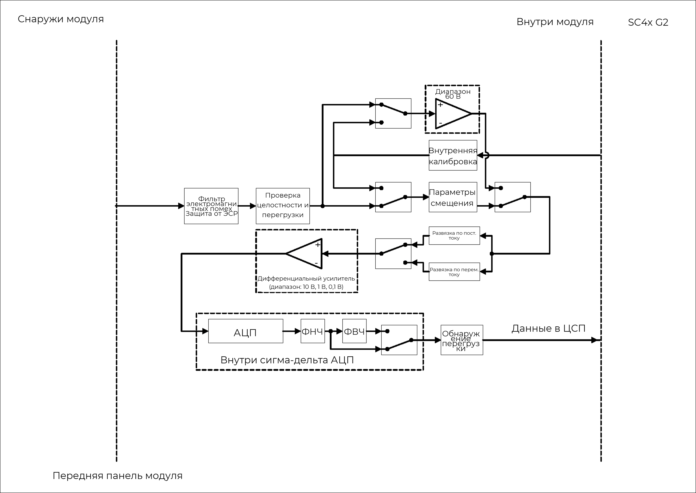
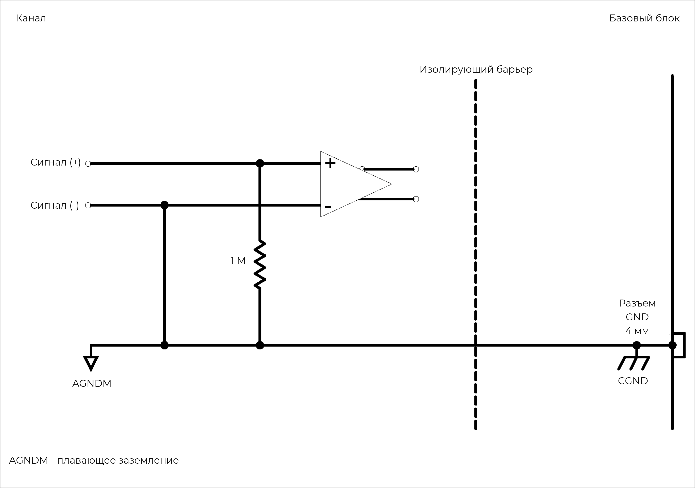
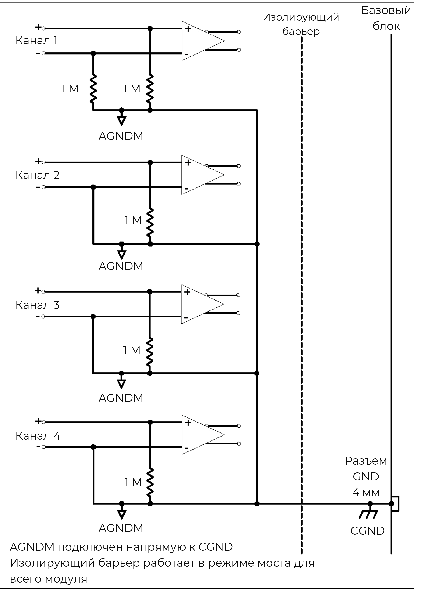
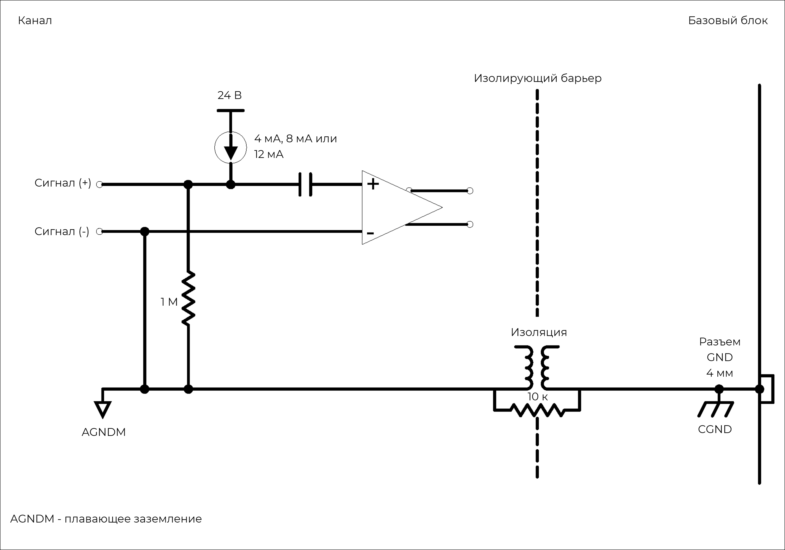
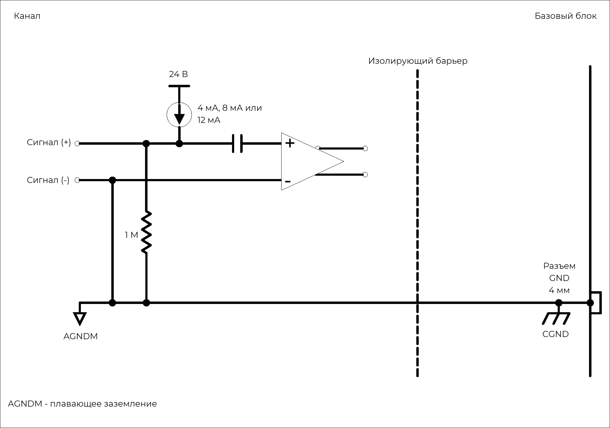

### **Описание**

Модуль 4xACC можно использовать с ICP®-акселерометрами, датчиками силы и давления, а также для измерения аналоговых сигналов напряжения. Все 4 канала работают независимо друг от друга. Для каждого можно отдельно настроить режим, усиление и развязку. Модуль можно использовать:

•           с любыми ICP®-датчиками, обычно применяемыми для измерения вибрации, ускорения, силы или давления

•           с любым источником напряжения до ±60 В в режиме ввода напряжения.

{width=915px height=350px}

### **Функции**

  <table style="border-collapse: collapse; width: 100%;">
    <tbody>
      
      <tr>
        <td style="border: 1px solid #ccc; padding: 8px; vertical-align: top;">
          <ul style="margin: 0; padding-left: 1.2em;">
            <li>4 канала</li>
            <li>Два входных режима:
                <ul style="padding-left: 1.5em; margin-top: 4px; margin-bottom: 4px;">
                    <li>Режим ICP® с пост. током 4 мА, 8 мА или 12 мА</li>
                    <li>Режим входного сигнала напряжения с развязкой по пост. или перем. току</li>
                </ul>
            </li>
            <li>Поддержка TEDS IEEE 1451.4 V0.9, V1.0</li>
            <li>Разрешение 24 бит</li>
            <li>Входные диапазоны: &plusmn;100 мВ, 1 В, 10 В и 60 В</li>
            <li>Три режима ввода для напряжения и ICP®</li>
          </ul>
        </td>
        <td style="border: 1px solid #ccc; padding: 8px; vertical-align: top;">
          <ul style="margin: 0; padding-left: 1.2em;">
            <li>Отслеживание коротких замыканий и кабелей с разомкнутым контуром</li>
            <li>Цепь целостности сигнала и защита от перегрузки</li>
            <li>Отслеживание переполнения до и после фильтра</li>
            <li>Возможность выбора цифровых фильтров</li>
            <li>Входное сопротивление 2 МОм (дифференциальное) и 1 МОм (одностороннее)</li>
            <li>Низкое энергопотребление</li>
            <li>3-контактные разъемы LEMO® EHG 0B</li>
          </ul>
        </td>
      </tr>
      
      <tr>
        <th style="border: 1px solid #ccc; padding: 8px; text-align: left; vertical-align: top;">Интерфейс</th>
        <td style="border: 1px solid #ccc; padding: 8px;">
            ICP®-датчики 
            Аналоговые входные сигналы напряжения
        </td>
      </tr>
      <tr>
        <th style="border: 1px solid #ccc; padding: 8px; text-align: left; vertical-align: top;">Развязка по входу</th>
        <td style="border: 1px solid #ccc; padding: 8px;">
            Перем. ток (в режиме ICP®) 
            Пост. или перем. ток (в режиме измерения напряжения)
        </td>
      </tr>
      <tr>
        <th style="border: 1px solid #ccc; padding: 8px; text-align: left; vertical-align: top;">Частотная характеристика развязки по перем. току</th>
        <td style="border: 1px solid #ccc; padding: 8px;">
            <strong>Затухание:</strong> -3 дБ 
            <strong>Макс. частота:</strong> 0,16 Гц
        </td>
      </tr>
      <tr>
        <th style="border: 1px solid #ccc; padding: 8px; text-align: left; vertical-align: top;">Другие значения частоты дискретизации</th>
        <td style="border: 1px solid #ccc; padding: 8px;">Доступно через цифровые ФНЧ и децимацию</td>
      </tr>
      <tr>
        <th style="border: 1px solid #ccc; padding: 8px; text-align: left; vertical-align: top;">Дополнительные программируемые цифровые БИХ-фильтры</th>
        <td style="border: 1px solid #ccc; padding: 8px;">Полосовой/полосовой заградительный: 6 дБ на октаву; ФВЧ/ФНЧ: 12 дБ на октаву</td>
      </tr>
      <tr>
        <th style="border: 1px solid #ccc; padding: 8px; text-align: left; vertical-align: top;">Дополнительный ФВЧ первого порядка</th>
        <td style="border: 1px solid #ccc; padding: 8px;">-3 дБ при 1 Гц</td>
      </tr>
       <tr>
        <th style="border: 1px solid #ccc; padding: 8px; text-align: left; vertical-align: top;">Калибровка модуля</th>
        <td style="border: 1px solid #ccc; padding: 8px;">Внутренняя калибровка амплитуды и фазы</td>
      </tr>
      <tr>
        <th style="border: 1px solid #ccc; padding: 8px; text-align: left; vertical-align: top;">Защита</th>
        <td style="border: 1px solid #ccc; padding: 8px;">
          ЭСР 2 кВ 
          Короткое замыкание между корпусом датчика и заземлением (в режиме измерения напряжения)
        </td>
      </tr>
      <tr>
        <th style="border: 1px solid #ccc; padding: 8px; text-align: left; vertical-align: top;">Гальваническая изоляция</th>
        <td style="border: 1px solid #ccc; padding: 8px;">50 В</td>
      </tr>
    </tbody>
  </table>

### **Характеристики**

  <table style="width: 100%; border-collapse: collapse;">
    <tbody>
      
      <tr>
        <th style="border: 1px solid #ccc; padding: 8px; text-align: left; vertical-align: top;">Полоса пропускания</th>
        <td style="border: 1px solid #ccc; padding: 8px;">Пост. ток до 100 кГц</td>
      </tr>
      <tr>
        <th style="border: 1px solid #ccc; padding: 8px; text-align: left; vertical-align: top;">Максимальная частота дискретизации на канал</th>
        <td style="border: 1px solid #ccc; padding: 8px;">204,8 Квыб/с</td>
      </tr>
      <tr>
        <th style="border: 1px solid #ccc; padding: 8px; text-align: left; vertical-align: top;">АЦП</th>
        <td style="border: 1px solid #ccc; padding: 8px;">24 бит</td>
      </tr>
      <tr>
        <th style="border: 1px solid #ccc; padding: 8px; text-align: left; vertical-align: top;">Передача данных</th>
        <td style="border: 1px solid #ccc; padding: 8px;">16/24 бит</td>
      </tr>
      <tr>
        <th style="border: 1px solid #ccc; padding: 8px; text-align: left; vertical-align: top;">Диапазоны входного напряжения (пик)</th>
        <td style="border: 1px solid #ccc; padding: 8px;">&plusmn;100 мВ, &plusmn;1 В, &plusmn;10 В, &plusmn;60 В</td>
      </tr>
      <tr>
        <th style="border: 1px solid #ccc; padding: 8px; text-align: left; vertical-align: top;">Режим ICP®</th>
        <td style="border: 1px solid #ccc; padding: 8px;">4 мА, 8 мА или 12 мА пост. тока при возбуждении &plusmn;12 В/24 В</td>
      </tr>
      <tr>
        <th style="border: 1px solid #ccc; padding: 8px; text-align: left; vertical-align: top;">Параметры входного смещения</th>
        <td style="border: 1px solid #ccc; padding: 8px;">
          <strong>Дифференциальное смещение (балансируемое):</strong> Положительный и отрицательный входы сигнала подключены по линии 1 МОм к плавающему заземлению.  
          <strong>Несимметричное смещение (небалансируемое):</strong> Положительный вход сигнала подключен к плавающему заземлению по кабелю 1 МОм; отрицательный вход сигнала подключен к плавающему заземлению.  
          <strong>Несимметричное заземление (небалансируемое):</strong> Положительный вход сигнала подключен к заземлению по линии 1 МОм; отрицательный вход сигнала подключен к заземлению.
        </td>
      </tr>
      <tr>
        <th style="border: 1px solid #ccc; padding: 8px; text-align: left; vertical-align: top;">Входное сопротивление</th>
        <td style="border: 1px solid #ccc; padding: 8px;">
          <strong>Дифференциальное:</strong> 2 МОм || 200 пФ 
          <strong>Несимметричное:</strong> 1 МОм || 300 пФ
        </td>
      </tr>
      <tr>
        <th style="border: 1px solid #ccc; padding: 8px; text-align: left; vertical-align: top;">Цифровой ФНЧ <small>Шкала фильтра: частота дискретизации</small></th>
        <td style="border: 1px solid #ccc; padding: 8px;">
          <strong>Полоса пропускания:</strong> частота дискретизации &times; 0,45 Гц 
          <strong>Полоса задержания:</strong> частота дискретизации &times; 0,55 Гц 
          <strong>Неравномерность в полосе пропускания:</strong> &plusmn;0,005 дБ 
          <strong>Затухание в полосе задержания:</strong> 100 дБ
        </td>
      </tr>
      <tr>
        <th style="border: 1px solid #ccc; padding: 8px; text-align: left; vertical-align: top;">Погрешность на фазу <small>Каналы в сходном диапазоне</small></th>
        <td style="border: 1px solid #ccc; padding: 8px;">Стандартно: &lt; 0,2&deg; при 10 кГц</td>
      </tr>
    </tbody>
  </table>

  <table style="width: 100%; border-collapse: collapse; margin-bottom: 20px;">
    <thead>
      <tr>
        <th style="border: 1px solid #ccc; padding: 8px; text-align: left; ">Характеристика</th>
        <th style="border: 1px solid #ccc; padding: 8px; text-align: left; ">Входной диапазон (пик)</th>
        <th style="border: 1px solid #ccc; padding: 8px; text-align: left; ">% показания + % диапазона</th>
      </tr>
    </thead>
    <tbody>
      <tr>
        <th style="border: 1px solid #ccc; padding: 8px; text-align: left;  vertical-align: middle;" rowspan="4">Точность напряжения пост. тока</th>
        <td style="border: 1px solid #ccc; padding: 8px;">&plusmn;100 мВ</td>
        <td style="border: 1px solid #ccc; padding: 8px;">0,275% + 0,275%</td>
      </tr>
      <tr>
        <td style="border: 1px solid #ccc; padding: 8px;">&plusmn;1 В</td>
        <td style="border: 1px solid #ccc; padding: 8px;">0,062% + 0,023%</td>
      </tr>
      <tr>
        <td style="border: 1px solid #ccc; padding: 8px;">&plusmn;10 В</td>
        <td style="border: 1px solid #ccc; padding: 8px;">0,089% + 0,006%</td>
      </tr>
      <tr>
        <td style="border: 1px solid #ccc; padding: 8px;">&plusmn;60 В</td>
        <td style="border: 1px solid #ccc; padding: 8px;">1,187% + 0,013%</td>
      </tr>
    </tbody>
  </table>

  <table style="width: 100%; border-collapse: collapse;">
    <thead>
      <tr>
        <th style="border: 1px solid #ccc; padding: 8px; text-align: left; ">Характеристика</th>
        <th style="border: 1px solid #ccc; padding: 8px; text-align: left; ">Диапазон частот</th>
        <th style="border: 1px solid #ccc; padding: 8px; text-align: left; ">Входной диапазон (пик)</th>
        <th style="border: 1px solid #ccc; padding: 8px; text-align: left; ">Гарантировано</th>
        <th style="border: 1px solid #ccc; padding: 8px; text-align: left; ">Стандартно</th>
      </tr>
    </thead>
    <tbody>
      <tr>
        <th style="border: 1px solid #ccc; padding: 8px; text-align: left;  vertical-align: middle;" rowspan="12">Шум <small>Оконечная нагрузка входа — резистор 50 Ом</small></th>
        <td style="border: 1px solid #ccc; padding: 8px;">от 10 Гц до 23 кГц</td>
        <td style="border: 1px solid #ccc; padding: 8px; vertical-align: middle;" rowspan="3">&plusmn;100 мВ</td>
        <td style="border: 1px solid #ccc; padding: 8px;">&lt; 3,5 мкВ СКЗ</td>
        <td style="border: 1px solid #ccc; padding: 8px;">&lt; 2,5 мкВ СКЗ</td>
      </tr>
      <tr>
        <td style="border: 1px solid #ccc; padding: 8px;">от 10 Гц до 49 кГц</td>
        <td style="border: 1px solid #ccc; padding: 8px;">&lt; 4 мкВ СКЗ</td>
        <td style="border: 1px solid #ccc; padding: 8px;">&lt; 3 мкВ СКЗ</td>
      </tr>
      <tr>
        <td style="border: 1px solid #ccc; padding: 8px;">от 10 Гц до 100 кГц</td>
        <td style="border: 1px solid #ccc; padding: 8px;">&lt; 12 мкВ СКЗ</td>
        <td style="border: 1px solid #ccc; padding: 8px;">&lt; 10 мкВ СКЗ</td>
      </tr>
      <tr>
        <td style="border: 1px solid #ccc; padding: 8px;">от 10 Гц до 23 кГц</td>
        <td style="border: 1px solid #ccc; padding: 8px; vertical-align: middle;" rowspan="3">&plusmn;1 В</td>
        <td style="border: 1px solid #ccc; padding: 8px;">&lt; 10 мкВ СКЗ</td>
        <td style="border: 1px solid #ccc; padding: 8px;">&lt; 7 мкВ СКЗ</td>
      </tr>
      <tr>
        <td style="border: 1px solid #ccc; padding: 8px;">от 10 Гц до 49 кГц</td>
        <td style="border: 1px solid #ccc; padding: 8px;">&lt; 14 мкВ СКЗ</td>
        <td style="border: 1px solid #ccc; padding: 8px;">&lt; 10 мкВ СКЗ</td>
      </tr>
      <tr>
        <td style="border: 1px solid #ccc; padding: 8px;">от 10 Гц до 100 кГц</td>
        <td style="border: 1px solid #ccc; padding: 8px;">&lt; 90 мкВ СКЗ</td>
        <td style="border: 1px solid #ccc; padding: 8px;">&lt; 85 мкВ СКЗ</td>
      </tr>
      <tr>
        <td style="border: 1px solid #ccc; padding: 8px;">от 10 Гц до 23 кГц</td>
        <td style="border: 1px solid #ccc; padding: 8px; vertical-align: middle;" rowspan="3">&plusmn;10 В</td>
        <td style="border: 1px solid #ccc; padding: 8px;">&lt; 50 мкВ СКЗ</td>
        <td style="border: 1px solid #ccc; padding: 8px;">&lt; 41 мкВ СКЗ</td>
      </tr>
      <tr>
        <td style="border: 1px solid #ccc; padding: 8px;">от 10 Гц до 49 кГц</td>
        <td style="border: 1px solid #ccc; padding: 8px;">&lt; 85 мкВ СКЗ</td>
        <td style="border: 1px solid #ccc; padding: 8px;">&lt; 74 мкВ СКЗ</td>
      </tr>
      <tr>
        <td style="border: 1px solid #ccc; padding: 8px;">от 10 Гц до 100 кГц</td>
        <td style="border: 1px solid #ccc; padding: 8px;">&lt; 870 мкВ СКЗ</td>
        <td style="border: 1px solid #ccc; padding: 8px;">&lt; 840 мкВ СКЗ</td>
      </tr>
       <tr>
        <td style="border: 1px solid #ccc; padding: 8px;">от 10 Гц до 23 кГц</td>
        <td style="border: 1px solid #ccc; padding: 8px; vertical-align: middle;" rowspan="3">&plusmn;60 В</td>
        <td style="border: 1px solid #ccc; padding: 8px;">&lt; 580 мкВ СКЗ</td>
        <td style="border: 1px solid #ccc; padding: 8px;">&lt; 470 мкВ СКЗ</td>
      </tr>
      <tr>
        <td style="border: 1px solid #ccc; padding: 8px;">от 10 Гц до 49 кГц</td>
        <td style="border: 1px solid #ccc; padding: 8px;">&lt; 780 мкВ СКЗ</td>
        <td style="border: 1px solid #ccc; padding: 8px;">&lt; 660 мкВ СКЗ</td>
      </tr>
      <tr>
        <td style="border: 1px solid #ccc; padding: 8px;">от 10 Гц до 100 кГц</td>
        <td style="border: 1px solid #ccc; padding: 8px;">&lt; 4500 мкВ СКЗ</td>
        <td style="border: 1px solid #ccc; padding: 8px;">&lt; 4300 мкВ СКЗ</td>
      </tr>
    </tbody>
  </table>

  <table style="width: 100%; border-collapse: collapse; margin-bottom: 20px;">
    <thead>
      <tr>
        <th style="border: 1px solid #ccc; padding: 8px; text-align: left; ">Характеристика</th>
        <th style="border: 1px solid #ccc; padding: 8px; text-align: left; ">Частота дискретизации</th>
        <th style="border: 1px solid #ccc; padding: 8px; text-align: left; ">Входной диапазон (пик)</th>
        <th style="border: 1px solid #ccc; padding: 8px; text-align: left; ">Затухание (уровень входного сигнала 100% от полного диапазона)</th>
      </tr>
    </thead>
    <tbody>
      <tr>
        <th style="border: 1px solid #ccc; padding: 8px; text-align: left;  vertical-align: middle;" rowspan="12">Неравномерность амплитудной хар-ки <small>Относительно 1 кГц  Измерено до 0,39 × частота дискретизации</small></th>
        <td style="border: 1px solid #ccc; padding: 8px;">51,2 Квыб/с</td>
        <td style="border: 1px solid #ccc; padding: 8px; vertical-align: middle;" rowspan="3">&plusmn;100 мВ</td>
        <td style="border: 1px solid #ccc; padding: 8px;">-0,04 дБ</td>
      </tr>
      <tr>
        <td style="border: 1px solid #ccc; padding: 8px;">102,4 Квыб/с</td>
        <td style="border: 1px solid #ccc; padding: 8px;">-0,10 дБ</td>
      </tr>
      <tr>
        <td style="border: 1px solid #ccc; padding: 8px;">204,8 Квыб/с</td>
        <td style="border: 1px solid #ccc; padding: 8px;">-0,32 дБ</td>
      </tr>
      <tr>
        <td style="border: 1px solid #ccc; padding: 8px;">51,2 Квыб/с</td>
        <td style="border: 1px solid #ccc; padding: 8px; vertical-align: middle;" rowspan="3">&plusmn;1 В</td>
        <td style="border: 1px solid #ccc; padding: 8px;">-0,05 дБ</td>
      </tr>
      <tr>
        <td style="border: 1px solid #ccc; padding: 8px;">102,4 Квыб/с</td>
        <td style="border: 1px solid #ccc; padding: 8px;">-0,07 дБ</td>
      </tr>
      <tr>
        <td style="border: 1px solid #ccc; padding: 8px;">204,8 Квыб/с</td>
        <td style="border: 1px solid #ccc; padding: 8px;">-0,18 дБ</td>
      </tr>
      <tr>
        <td style="border: 1px solid #ccc; padding: 8px;">51,2 Квыб/с</td>
        <td style="border: 1px solid #ccc; padding: 8px; vertical-align: middle;" rowspan="3">&plusmn;10 В</td>
        <td style="border: 1px solid #ccc; padding: 8px;">-0,04 дБ</td>
      </tr>
      <tr>
        <td style="border: 1px solid #ccc; padding: 8px;">102,4 Квыб/с</td>
        <td style="border: 1px solid #ccc; padding: 8px;">-0,05 дБ</td>
      </tr>
      <tr>
        <td style="border: 1px solid #ccc; padding: 8px;">204,8 Квыб/с</td>
        <td style="border: 1px solid #ccc; padding: 8px;">-0,10 дБ</td>
      </tr>
      <tr>
        <td style="border: 1px solid #ccc; padding: 8px;">51,2 Квыб/с</td>
        <td style="border: 1px solid #ccc; padding: 8px; vertical-align: middle;" rowspan="3">&plusmn;60 В</td>
        <td style="border: 1px solid #ccc; padding: 8px;">-0,05 дБ</td>
      </tr>
      <tr>
        <td style="border: 1px solid #ccc; padding: 8px;">102,4 Квыб/с</td>
        <td style="border: 1px solid #ccc; padding: 8px;">-0,09 дБ</td>
      </tr>
      <tr>
        <td style="border: 1px solid #ccc; padding: 8px;">204,8 Квыб/с</td>
        <td style="border: 1px solid #ccc; padding: 8px;">-0,26 дБ</td>
      </tr>
    </tbody>
  </table>

  <table style="width: 100%; border-collapse: collapse;">
    <thead>
      <tr>
        <th style="border: 1px solid #ccc; padding: 8px; text-align: left; ">Характеристика</th>
        <th style="border: 1px solid #ccc; padding: 8px; text-align: left; ">Входной диапазон (пик)</th>
        <th style="border: 1px solid #ccc; padding: 8px; text-align: left; ">Гарантировано</th>
        <th style="border: 1px solid #ccc; padding: 8px; text-align: left; ">Стандартно</th>
      </tr>
    </thead>
    <tbody>
      <tr>
        <th style="border: 1px solid #ccc; padding: 8px; text-align: left;  vertical-align: middle;" rowspan="4">Взаимное влияние</th>
        <td style="border: 1px solid #ccc; padding: 8px;">&plusmn;100 мВ</td>
        <td style="border: 1px solid #ccc; padding: 8px;">113 дБ</td>
        <td style="border: 1px solid #ccc; padding: 8px;">118 дБ</td>
      </tr>
      <tr>
        <td style="border: 1px solid #ccc; padding: 8px;">&plusmn;1 В</td>
        <td style="border: 1px solid #ccc; padding: 8px;">110 дБ</td>
        <td style="border: 1px solid #ccc; padding: 8px;">115 дБ</td>
      </tr>
      <tr>
        <td style="border: 1px solid #ccc; padding: 8px;">&plusmn;10 В</td>
        <td style="border: 1px solid #ccc; padding: 8px;">102 дБ</td>
        <td style="border: 1px solid #ccc; padding: 8px;">107 дБ</td>
      </tr>
      <tr>
        <td style="border: 1px solid #ccc; padding: 8px;">&plusmn;60 В</td>
        <td style="border: 1px solid #ccc; padding: 8px;">84 дБ</td>
        <td style="border: 1px solid #ccc; padding: 8px;">89 дБ</td>
      </tr>
    </tbody>
  </table>

!!! info "Информация"
    Информация о параметрах модулей и условиях измерения, используемых во время измерений для определения технических характеристик, доступна по запросу.

### **Функциональная схема на канал**

{width=915px height=350px}

##### *Режим ICP*® *модуля 4xACC (на канал).*

{width=915px height=350px}

##### *Режим измерения напряжения модуля 4xACC (на канал).*

### **Варианты заземления**

Благодаря дополнительной шине питания 24 В модуля 4xACC обеспечивается расширенное общее заземление:

•           Дифференциальное смещение (балансируемое смещение):

\-     Возбуждение от -12 В до +12 В

\-     Оба входа подключены по линии 1 МОм к плавающему заземлению.

•           Несимметричное смещение (небалансируемое смещение):

\-     Возбуждение от 0 В до 24 В

\-     Один вход подключен по линии 1 МОм к плавающему заземлению, а другой -- напрямую к плавающему заземлению.

•           Несимметричное заземление (небалансируемое заземление):

\-     Возбуждение от 0 В до 24 В

\-    Один вход подключен к заземлению по кабелю 1 МОм, а другой -- к заземлению напрямую.

### **Схемы заземления: режим измерения напряжения**

{width=915px height=350px}

##### *Модуль 4xACC в режиме измерения напряжения с дифференциальным смещением (на канал).*

{width=915px height=350px}

##### *Модуль 4xACC в режиме изм. напряжения с несимметричным смещением (на канал).*

{width=915px height=350px}

##### *Несимметричное заземление модуля 4xACC (влияет на весь модуль).*

Для каждого канала *4xACC* можно задать собственный вариант заземления, однако при включении несимметричного заземления для одного канала все четыре канала подключаются к заземлению напрямую. Если один из каналов настроен таким образом, вариант заземления «несимметричное» задается в ПО автоматически.

{width=915px height=350px}

##### *Несимметричное заземление 4xACC влияет на все 4 канала.*

Аналогично режиму измерения напряжения для режима ICP® предусмотрено три варианта заземления. Однако для режима ICP® есть еще один вариант конфигурации, а именно значение тока возбуждения, подаваемого на подключенный датчик.

### **Схемы заземления: режим ICP**®

{width=915px height=350px}

##### *Модуль 4xACC в режиме ICP*® *с возбуждением током 4 мА, 8 мА или 12 мА и дифференциальным смещением.*

{width=915px height=350px}

##### *Модуль 4xACC в режиме ICP*® *с возбуждением током 4 мА, 8 мА или 12 мА и несимметричным смещением.*

{width=915px height=350px}

##### *Модуль 4xACC в режиме ICP*® *с возбуждением током 4 мА, 8 мА или 12 мА и несимметричным заземлением.*

