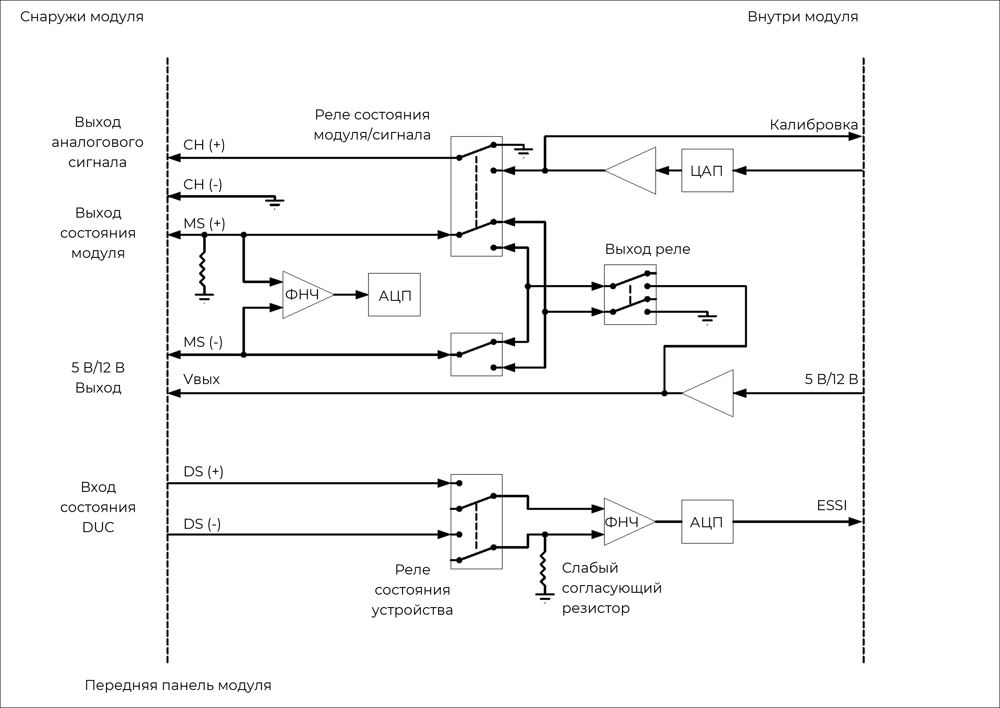
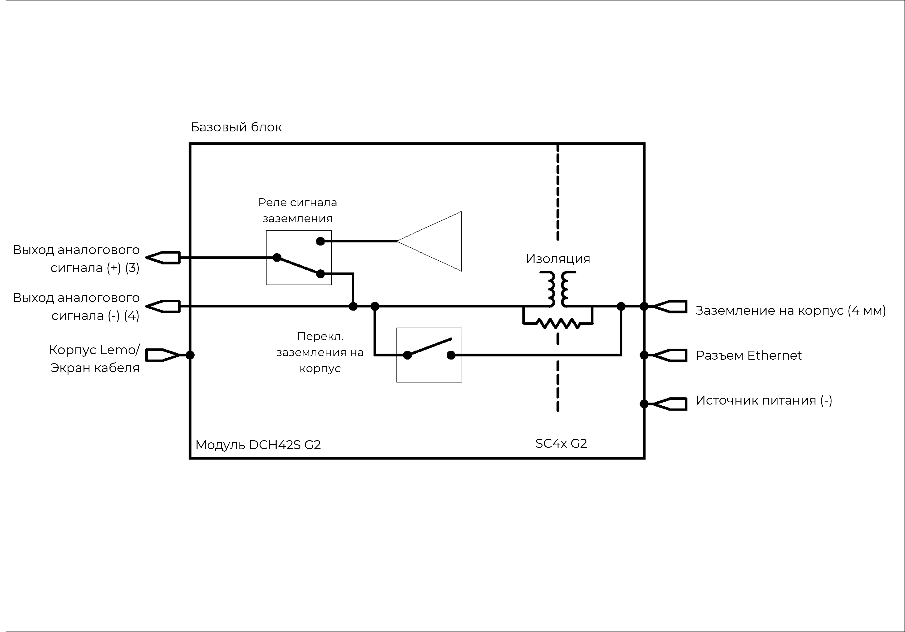

### **Описание**

Модуль 4xAO обеспечивает 4 независимых выходных канала для формирования аналоговых сигналов. Каждый канал также оснащен сигналами выхода и входа состояния, что обеспечивает возможности дальнейшего взаимодействия с внешним оборудованием, например для контроля над испытаниями и для управления рабочим процессом. Модуль 4xAO можно использовать для решения следующих задач:

•           сигналы возбуждения для вибростендов/модальных испытаний;

•           управляющий сигнал для акустических испытаний;

•           произвольные аналоговые сигналы для подачи в другие цепи, требующие динамических или статических сигналов ±10 В.

{width=915px height=350px}

### **Функции**

  <table style="border-collapse: collapse; width: 100%;">
    <tbody>
      
      <tr>
        <td style="border: 1px solid #ccc; padding: 6px; vertical-align: top;">
          <ul style="margin: 0; padding-left: 1.2em;">
            <li>4 канала, на каждом:
                <ul style="padding-left: 1.5em; margin-top: 4px; margin-bottom: 4px;">
                    <li>выход аналогового сигнала</li>
                    <li>выход состояния модуля</li>
                    <li>вход состояния управляемого устройства (DUC)</li>
                    <li>выход напряжения пост. тока 5 В или 12 В</li>
                </ul>
            </li>
            <li>Разрешение 24 бит</li>
          </ul>
        </td>
        <td style="border: 1px solid #ccc; padding: 6px; vertical-align: top;">
          <ul style="margin: 0; padding-left: 1.2em;">
            <li>Неравномерность полосы пропускания 20 кГц 0,1 дБ</li>
            <li>Низкий уровень помех и искажения</li>
            <li>Стабильность смещения и усиления пост. тока</li>
            <li>Выход &plusmn;10 В при 30 мА</li>
            <li>Автоматическое безопасное отключение</li>
            <li>Выходное сопротивление 10 Ом</li>
            <li>7-контактные разъемы LEMO® EHG.0B</li>
          </ul>
        </td>
      </tr>
      
      <tr>
        <th style="border: 1px solid #ccc; padding: 6px; text-align: left; vertical-align: top;">Пары сигналов</th>
        <td style="border: 1px solid #ccc; padding: 6px;">
          Состояние модуля (+), Состояние модуля (-) 
          Состояние DUC (+), Состояние DUC (-) 
          Сигнал (+), Сигнал (-) 
          5 В или 12 В пост. тока, Сигнал (-)
        </td>
      </tr>
      <tr>
        <th style="border: 1px solid #ccc; padding: 6px; text-align: left; vertical-align: top;">Вход состояния управляемого устройства (DUC)</th>
        <td style="border: 1px solid #ccc; padding: 6px;">
          <b>Диапазон входного напряжения:</b> от 0 В до 24 В 
          <b>Частота дискретизации:</b> 15,6 квыб/с 
          <b>Разрешение:</b> 12 бит
        </td>
      </tr>
      <tr>
        <th style="border: 1px solid #ccc; padding: 6px; text-align: left; vertical-align: top;">Варианты выхода состояния модуля (Реле)</th>
        <td style="border: 1px solid #ccc; padding: 6px;">
          <b>Исправно:</b> Реле закрыто 
          <b>Неисправно:</b> Реле открыто 
          <em>(макс. вход 24 В)</em>
        </td>
      </tr>
      <tr>
        <th style="border: 1px solid #ccc; padding: 6px; text-align: left; vertical-align: top;">Варианты выхода состояния модуля (Выход напряжения)</th>
        <td style="border: 1px solid #ccc; padding: 6px;">
          <b>Исправно:</b> Выход напряжения пост. тока 
          <b>Неисправно:</b> Нет выхода напряжения 
          <em>(5 В или 12 В)</em>
        </td>
      </tr>
      <tr>
        <th style="border: 1px solid #ccc; padding: 6px; text-align: left; vertical-align: top;">Выход напряжения пост. тока</th>
        <td style="border: 1px solid #ccc; padding: 6px;">
          <b>Напряжение:</b> 5 В или 12 В 
          <b>Ток:</b> 15 мА (макс.)
        </td>
      </tr>
    </tbody>
  </table>

    <table style="width: 100%; border-collapse: collapse;">
        <tbody>
            <tr>
                <th style="border: 1px solid #ccc; padding: 8px; text-align: left;">Подмодуль</th>
                <td style="border: 1px solid #ccc; padding: 8px;">Подмодуль Quad BNC (QBNC12) служит для разделения сигналов от 7-контактного разъема LEMO® на 4 разъема BNC.</td>
            </tr>
            <tr>
                <th style="border: 1px solid #ccc; padding: 8px; text-align: left; ">Другие значения частоты дискретизации</th>
                <td style="border: 1px solid #ccc; padding: 8px;">Доступно через цифровые ФНЧ и децимацию</td>
            </tr>
            <tr>
                <th style="border: 1px solid #ccc; padding: 8px; text-align: left; ">Калибровка модуля</th>
                <td style="border: 1px solid #ccc; padding: 8px;">Внутренняя калибровка амплитуды</td>
            </tr>
            <tr>
                <th style="border: 1px solid #ccc; padding: 8px; text-align: left; ">Параметры выходного смещения</th>
                <td style="border: 1px solid #ccc; padding: 8px;">Несимметричное смещение или несимметричное заземление (на модуль)</td>
            </tr>
            <tr>
                <th style="border: 1px solid #ccc; padding: 6px; text-align: left; ">Защита</th>
                <td style="border: 1px solid #ccc; padding: 8px;">ЭСР 2 кВ</td>
            </tr>
            <tr>
                <th style="border: 1px solid #ccc; padding: 8px; text-align: left; ">Гальваническая изоляция</th>
                <td style="border: 1px solid #ccc; padding: 8px;">50 В</td>
            </tr>
        </tbody>
    </table>

## **Основные характеристики**

<table style="border-collapse: collapse;">
  <tbody>
    <tr>
      <td style="border: 1px solid #ccc;"><strong>Максимальная частота дискретизации на канал</strong></td>
      <td colspan="2" style="border: 1px solid #ccc;">204,8&nbsp;Квыб/с</td>
    </tr>
    <tr>
      <td style="border: 1px solid #ccc;"><strong>Ц/А-преобразование</strong></td>
      <td colspan="2" style="border: 1px solid #ccc;">24&nbsp;бит</td>
    </tr>
    <tr>
      <td style="border: 1px solid #ccc;"><strong>Диапазоны выходного напряжения (пик)</strong></td>
      <td colspan="2" style="border: 1px solid #ccc;">&plusmn;10&nbsp;В</td>
    </tr>
    <tr>
      <td style="border: 1px solid #ccc;"><strong>Погрешность на фазу Каналы в сходном диапазоне</strong></td>
      <td style="border: 1px solid #ccc;">Стандартно24</td>
      <td style="border: 1px solid #ccc;">&lt;&nbsp;0,5&deg; при 10&nbsp;кГц</td>
    </tr>
    <tr>
      <td style="border: 1px solid #ccc;"><strong>Точность напряжения пост.&nbsp;тока</strong></td>
      <td style="border: 1px solid #ccc;">Выходной диапазон (пик): &plusmn;10&nbsp;В</td>
      <td style="border: 1px solid #ccc;">0,27&nbsp;% диапазона</td>
    </tr>
    <tr>
      <td style="border: 1px solid #ccc;"><strong>Погрешность по частоте</strong></td>
      <td style="border: 1px solid #ccc;">Выходная частота &gt;&nbsp;100&nbsp;Гц</td>
      <td style="border: 1px solid #ccc;">0,025&nbsp;% выходной частоты</td>
    </tr>
  </tbody>
</table>

!!! info "Информация"
    Информация о параметрах модулей и условиях измерения, используемых во время измерений для определения технических характеристик, доступна по запросу.

### **Функциональная схема на канал**

{width=915px height=350px}

##### *Функциональная схема 4xAO на канал.*

Управляемое устройство (DUC) подключается к модулю 4xAO через 7-контактный разъем LEMO®:

•по двум линиям аналогового сигнала (CH (+) и CH (-)) передается аналоговая информация;

•по двум линиям выхода состояния модуля (MS (+) и MS (-)) данные из модуля 4xAO передаются на управляемое устройство;

•по двум линиям входа состояния DUC (DS (+) и DS (-)) данные от управляемого устройства поступают в модуль 4xAO.

•Выход пост. тока 5 В или 12 В

### **Схема заземления**

{width=915px height=350px}

##### *Заземление модуля 4xAO.*

Разъем LEMO® на модуле 4xAO контактирует с экраном кабеля, подключенного к управляемому устройству. По этой причине необходим разрыв экрана на стороне управляемого устройства, чтобы избежать подсоединения этого устройства к заземлению на корпус системы.

Этот разъем LEMO® также подключен к 4-мм разъему заземления на корпус в нижнем правом углу передней панели ORION, экрану разъема Ethernet и отрицательному контакту источника питания ORION.