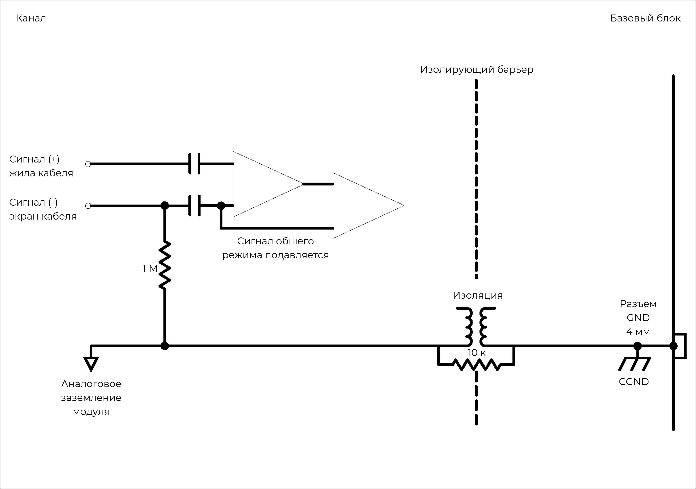

**Описание**

Модуль 4xCHG оснащен 4 независимыми входными каналами для кварцевых или пьезокерамических датчиков. Эти датчики, как правило, используются при необходимости получить более качественный сигнал, например с низким уровнем шумов и искажений, а также в случаях, когда из-за высоких температур или ядерной радиации невозможно использовать ICP®-датчики. Различные варианты заземления позволяют проводить измерения с низким уровнем шумов независимо от внешних ограничений заземления.

Модуль можно использовать: с пьезоэлектрическими датчиками, которые обычно используются для измерения вибрации, ускорения, силы, крутящего момента и давления.

{width=915px height=350px}

!!! note "ПРЕДУПРЕЖДЕНИЕ ОБ ЭЛЕКТРОСТАТИЧЕСКИХ РАЗРЯДАХ"
    Входы модуля 4xCHG чувствительны к электростатическим разрядам. Прежде чем подключать кабель или разъем к модулю 4xCHG, принимайте меры по снятию статического электричества, которое может на них накапливаться.

### **Функции**

  <table style="border-collapse: collapse; width: 100%;">
    <tbody>
      
      <tr>
        <td style="border: 1px solid #ccc; padding: 8px; vertical-align: top;">
          <ul style="margin: 0; padding-left: 1.2em;">
            <li>4 канала</li>
            <li>Разрешение 24 бит, частота дискретизации до 204,8 Квыб/с на канал, полоса пропускания 90 кГц</li>
            <li>Уход напряжения менее 4 мВ/ч при любой чувствительности и усилении</li>
            <li>Экран кабеля можно подсоединить или отсоединить от заземления модуля</li>
          </ul>
        </td>
        <td style="border: 1px solid #ccc; padding: 8px; vertical-align: top;">
          <ul style="margin: 0; padding-left: 1.2em;">
            <li>Возможность выбора цифровых фильтров высоких и низких частот</li>
            <li>Обнаружение перенапряжения для интерфейсных входных сигналов</li>
            <li>Низкое энергопотребление</li>
            <li>Высокое входное сопротивление</li>
            <li>Разъемы MicroDot 10-32</li>
          </ul>
        </td>
      </tr>
     
      <tr>
        <th style="border: 1px solid #ccc; padding: 8px; text-align: left; vertical-align: top;">Интерфейс</th>
        <td style="border: 1px solid #ccc; padding: 8px;">Для пьезоэлектрических датчиков</td>
      </tr>
      <tr>
        <th style="border: 1px solid #ccc; padding: 8px; text-align: left; vertical-align: top;">Входной диапазон заряда (пик)</th>
        <td style="border: 1px solid #ccc; padding: 8px;">
          0,1 мВ/пКл: &plusmn;100 000 пКл 
          1 мВ/пКл: &plusmn;10 000 пКл 
          10 мВ/пКл: &plusmn;1000 пКл
        </td>
      </tr>
      <tr>
        <th style="border: 1px solid #ccc; padding: 8px; text-align: left; vertical-align: top;">ФВЧ -3 дБ</th>
        <td style="border: 1px solid #ccc; padding: 8px;">
          0,1 мВ/пКл: 0,016 Гц 
          1 мВ/пКл: 0,016 Гц 
          10 мВ/пКл: 0,16 Гц
        </td>
      </tr>
      <tr>
        <th style="border: 1px solid #ccc; padding: 8px; text-align: left; vertical-align: top;">Другие значения частоты дискретизации</th>
        <td style="border: 1px solid #ccc; padding: 8px;">Доступно через цифровые ФНЧ и децимацию</td>
      </tr>
      <tr>
        <th style="border: 1px solid #ccc; padding: 8px; text-align: left; vertical-align: top;">Дополнительные программируемые цифровые БИХ-фильтры</th>
        <td style="border: 1px solid #ccc; padding: 8px;">Полосовой фильтр и полосовой заградительный фильтр: 6 дБ на октаву, ФВЧ/ФНЧ: 12 дБ на октаву</td>
      </tr>
      <tr>
        <th style="border: 1px solid #ccc; padding: 8px; text-align: left; vertical-align: top;">Дополнительный ФВЧ первого порядка</th>
        <td style="border: 1px solid #ccc; padding: 8px;">-3 дБ при 1 Гц</td>
      </tr>
       <tr>
        <th style="border: 1px solid #ccc; padding: 8px; text-align: left; vertical-align: top;">Калибровка модуля</th>
        <td style="border: 1px solid #ccc; padding: 8px;">Внутренняя калибровка амплитуды</td>
      </tr>
      <tr>
        <th style="border: 1px solid #ccc; padding: 8px; text-align: left; vertical-align: top;">Защита</th>
        <td style="border: 1px solid #ccc; padding: 8px;">Серия 1 кОм (в линии)</td>
      </tr>
      <tr>
        <th style="border: 1px solid #ccc; padding: 8px; text-align: left; vertical-align: top;">Гальваническая изоляция</th>
        <td style="border: 1px solid #ccc; padding: 8px;">50 В</td>
      </tr>
    </tbody>
  </table>

### **Характеристики**

  <table style="width: 100%; border-collapse: collapse;">
    <tbody>
      <tr>
        <th style="border: 1px solid #ccc; padding: 8px; text-align: left;  vertical-align: top;">Полоса пропускания</th>
        <td colspan="3" style="border: 1px solid #ccc; padding: 8px;">Пост. ток до 90 кГц</td>
      </tr>
      <tr>
        <th style="border: 1px solid #ccc; padding: 8px; text-align: left;  vertical-align: top;">Максимальная частота дискретизации на канал</th>
        <td colspan="3" style="border: 1px solid #ccc; padding: 8px;">204,8 Квыб/с</td>
      </tr>
      <tr>
        <th style="border: 1px solid #ccc; padding: 8px; text-align: left;  vertical-align: top;">АЦП</th>
        <td colspan="3" style="border: 1px solid #ccc; padding: 8px;">24 бит</td>
      </tr>
      <tr>
        <th style="border: 1px solid #ccc; padding: 8px; text-align: left;  vertical-align: top;">Передача данных</th>
        <td colspan="3" style="border: 1px solid #ccc; padding: 8px;">16/24 бит</td>
      </tr>
      <tr>
        <th style="border: 1px solid #ccc; padding: 8px; text-align: left;  vertical-align: middle;" rowspan="4">Параметры входного смещения</th>
        <td style="border: 1px solid #ccc; padding: 8px; vertical-align: middle;" rowspan="2">Несимметричное смещение</td>
        <td style="border: 1px solid #ccc; padding: 8px;">Экран кабеля отсоединен</td>
        <td style="border: 1px solid #ccc; padding: 8px;">Отрицательный вход сигнала (экран кабеля) подсоединен к плавающему заземлению через 1 МОм</td>
      </tr>
      <tr>
        <td style="border: 1px solid #ccc; padding: 8px;">Экран кабеля подсоединен</td>
        <td style="border: 1px solid #ccc; padding: 8px;">Отрицательный вход сигнала (экран кабеля) подсоединен к плавающему заземлению</td>
      </tr>
      <tr>
        <td style="border: 1px solid #ccc; padding: 8px; vertical-align: middle;" rowspan="2">Несимметричное заземление</td>
        <td style="border: 1px solid #ccc; padding: 8px;">Экран кабеля отсоединен</td>
        <td style="border: 1px solid #ccc; padding: 8px;">Отрицательный вход сигнала (экран кабеля) подсоединен к заземлению через 1 МОм</td>
      </tr>
      <tr>
        <td style="border: 1px solid #ccc; padding: 8px;">Экран кабеля подсоединен</td>
        <td style="border: 1px solid #ccc; padding: 8px;">Отрицательный вход сигнала (экран кабеля) подсоединен к заземлению</td>
      </tr>
      <tr>
        <th style="border: 1px solid #ccc; padding: 8px; text-align: left; vertical-align: middle;" rowspan="4">Цифровой ФНЧ <small>Шкала фильтра: частота дискретизации</small></th>
        <td colspan="2" style="border: 1px solid #ccc; padding: 8px;">Полоса пропускания</td>
        <td style="border: 1px solid #ccc; padding: 8px;">частота дискретизации &times; 0,45 Гц</td>
      </tr>
      <tr>
        <td colspan="2" style="border: 1px solid #ccc; padding: 8px;">Полоса задержания</td>
        <td style="border: 1px solid #ccc; padding: 8px;">частота дискретизации &times; 0,55 Гц</td>
      </tr>
      <tr>
        <td colspan="2" style="border: 1px solid #ccc; padding: 8px;">Неравномерность в полосе пропускания</td>
        <td style="border: 1px solid #ccc; padding: 8px;">&plusmn;0,005 дБ</td>
      </tr>
      <tr>
        <td colspan="2" style="border: 1px solid #ccc; padding: 8px;">Затухание в полосе задержания</td>
        <td style="border: 1px solid #ccc; padding: 8px;">100 дБ</td>
      </tr>
      <tr>
        <th style="border: 1px solid #ccc; padding: 8px; text-align: left;  vertical-align: top;">Погрешность на фазу <small>Каналы в сходном диапазоне</small></th>
        <td style="border: 1px solid #ccc; padding: 8px;">Стандартно⁹</td>
        <td colspan="2" style="border: 1px solid #ccc; padding: 8px;">&lt; 0,5&deg; при 10 кГц</td>
      </tr>
    </tbody>
  </table>

  <table style="width: 100%; border-collapse: collapse; margin-bottom: 20px;">
    <thead>
      <tr>
        <th style="border: 1px solid #ccc; padding: 8px; text-align: left; ">Характеристика</th>
        <th style="border: 1px solid #ccc; padding: 8px; text-align: left; ">Входной диапазон (пик)</th>
        <th style="border: 1px solid #ccc; padding: 8px; text-align: left; ">Диапазон чувствительности</th>
        <th style="border: 1px solid #ccc; padding: 8px; text-align: left; ">% от диапазона (стандартно)</th>
      </tr>
    </thead>
    <tbody>
      <tr>
        <th style="border: 1px solid #ccc; padding: 8px; text-align: left;  vertical-align: middle;" rowspan="9">Точность напряжения перем. тока <small>Измерено при 1 кГц</small></th>
        <td style="border: 1px solid #ccc; padding: 8px; vertical-align: middle;" rowspan="3">&plusmn;100 мВ</td>
        <td style="border: 1px solid #ccc; padding: 8px;">0,1 мВ/пКл</td>
        <td style="border: 1px solid #ccc; padding: 8px;">3,1%</td>
      </tr>
      <tr>
        <td style="border: 1px solid #ccc; padding: 8px;">1 мВ/пКл</td>
        <td style="border: 1px solid #ccc; padding: 8px;">2,7%</td>
      </tr>
      <tr>
        <td style="border: 1px solid #ccc; padding: 8px;">10 мВ/пКл</td>
        <td style="border: 1px solid #ccc; padding: 8px;">2,7%</td>
      </tr>
      <tr>
        <td style="border: 1px solid #ccc; padding: 8px; vertical-align: middle;" rowspan="3">&plusmn;1 В</td>
        <td style="border: 1px solid #ccc; padding: 8px;">0,1 мВ/пКл</td>
        <td style="border: 1px solid #ccc; padding: 8px;">2,7%</td>
      </tr>
      <tr>
        <td style="border: 1px solid #ccc; padding: 8px;">1 мВ/пКл</td>
        <td style="border: 1px solid #ccc; padding: 8px;">1,9%</td>
      </tr>
      <tr>
        <td style="border: 1px solid #ccc; padding: 8px;">10 мВ/пКл</td>
        <td style="border: 1px solid #ccc; padding: 8px;">2,5%</td>
      </tr>
      <tr>
        <td style="border: 1px solid #ccc; padding: 8px; vertical-align: middle;" rowspan="3">&plusmn;10 В</td>
        <td style="border: 1px solid #ccc; padding: 8px;">0,1 мВ/пКл</td>
        <td style="border: 1px solid #ccc; padding: 8px;">2,6%</td>
      </tr>
      <tr>
        <td style="border: 1px solid #ccc; padding: 8px;">1 мВ/пКл</td>
        <td style="border: 1px solid #ccc; padding: 8px;">2,1%</td>
      </tr>
      <tr>
        <td style="border: 1px solid #ccc; padding: 8px;">10 мВ/пКл</td>
        <td style="border: 1px solid #ccc; padding: 8px;">2,6%</td>
      </tr>
    </tbody>
  </table>

  <table style="width: 100%; border-collapse: collapse;">
    <thead>
      <tr>
        <th style="border: 1px solid #ccc; padding: 8px; text-align: left; ">Характеристика</th>
        <th style="border: 1px solid #ccc; padding: 8px; text-align: left; ">Диапазон частот</th>
        <th style="border: 1px solid #ccc; padding: 8px; text-align: left; ">Входной диапазон (пик)</th>
        <th style="border: 1px solid #ccc; padding: 8px; text-align: left; ">Гарантировано</th>
        <th style="border: 1px solid #ccc; padding: 8px; text-align: left; ">Стандартно</th>
      </tr>
    </thead>
    <tbody>
      <tr>
        <th style="border: 1px solid #ccc; padding: 8px; text-align: left;  vertical-align: middle;" rowspan="9">Шум <small>Измерено для открытого входа с диапазоном чувствительности 0,1 мВ/пКл</small></th>
        <td style="border: 1px solid #ccc; padding: 8px;">от 10 Гц до 23 кГц</td>
        <td style="border: 1px solid #ccc; padding: 8px; vertical-align: middle;" rowspan="3">&plusmn;100 мВ</td>
        <td style="border: 1px solid #ccc; padding: 8px;">&lt; 50 мкВ СКЗ</td>
        <td style="border: 1px solid #ccc; padding: 8px;">&lt; 46 мкВ СКЗ</td>
      </tr>
      <tr>
        <td style="border: 1px solid #ccc; padding: 8px;">от 10 Гц до 49 кГц</td>
        <td style="border: 1px solid #ccc; padding: 8px;">&lt; 73 мкВ СКЗ</td>
        <td style="border: 1px solid #ccc; padding: 8px;">&lt; 68 мкВ СКЗ</td>
      </tr>
      <tr>
        <td style="border: 1px solid #ccc; padding: 8px;">от 10 Гц до 90 кГц</td>
        <td style="border: 1px solid #ccc; padding: 8px;">&lt; 160 мкВ СКЗ</td>
        <td style="border: 1px solid #ccc; padding: 8px;">&lt; 144 мкВ СКЗ</td>
      </tr>
      <tr>
        <td style="border: 1px solid #ccc; padding: 8px;">от 10 Гц до 23 кГц</td>
        <td style="border: 1px solid #ccc; padding: 8px; vertical-align: middle;" rowspan="3">&plusmn;1 В</td>
        <td style="border: 1px solid #ccc; padding: 8px;">&lt; 109 мкВ СКЗ</td>
        <td style="border: 1px solid #ccc; padding: 8px;">&lt; 81 мкВ СКЗ</td>
      </tr>
      <tr>
        <td style="border: 1px solid #ccc; padding: 8px;">от 10 Гц до 49 кГц</td>
        <td style="border: 1px solid #ccc; padding: 8px;">&lt; 140 мкВ СКЗ</td>
        <td style="border: 1px solid #ccc; padding: 8px;">&lt; 116 мкВ СКЗ</td>
      </tr>
      <tr>
        <td style="border: 1px solid #ccc; padding: 8px;">от 10 Гц до 90 кГц</td>
        <td style="border: 1px solid #ccc; padding: 8px;">&lt; 1085 мкВ СКЗ</td>
        <td style="border: 1px solid #ccc; padding: 8px;">&lt; 924 мкВ СКЗ</td>
      </tr>
      <tr>
        <td style="border: 1px solid #ccc; padding: 8px;">от 10 Гц до 23 кГц</td>
        <td style="border: 1px solid #ccc; padding: 8px; vertical-align: middle;" rowspan="3">&plusmn;10 В</td>
        <td style="border: 1px solid #ccc; padding: 8px;">&lt; 460 мкВ СКЗ</td>
        <td style="border: 1px solid #ccc; padding: 8px;">&lt; 409 мкВ СКЗ</td>
      </tr>
      <tr>
        <td style="border: 1px solid #ccc; padding: 8px;">от 10 Гц до 49 кГц</td>
        <td style="border: 1px solid #ccc; padding: 8px;">&lt; 1175 мкВ СКЗ</td>
        <td style="border: 1px solid #ccc; padding: 8px;">&lt; 859 мкВ СКЗ</td>
      </tr>
      <tr>
        <td style="border: 1px solid #ccc; padding: 8px;">от 10 Гц до 90 кГц</td>
        <td style="border: 1px solid #ccc; padding: 8px;">&lt; 10 816 мкВ СКЗ</td>
        <td style="border: 1px solid #ccc; padding: 8px;">&lt; 9114 мкВ СКЗ</td>
      </tr>
    </tbody>
  </table>

  <table style="width: 100%; border-collapse: collapse; margin-bottom: 20px;">
    <thead>
      <tr>
        <th style="border: 1px solid #ccc; padding: 8px; text-align: left; ">Характеристика</th>
        <th style="border: 1px solid #ccc; padding: 8px; text-align: left; ">Диапазон частот</th>
        <th style="border: 1px solid #ccc; padding: 8px; text-align: left; ">Входной диапазон (пик)</th>
        <th style="border: 1px solid #ccc; padding: 8px; text-align: left; ">Гарантировано</th>
        <th style="border: 1px solid #ccc; padding: 8px; text-align: left; ">Стандартно</th>
      </tr>
    </thead>
    <tbody>
      <tr>
        <th style="border: 1px solid #ccc; padding: 8px; text-align: left;  vertical-align: middle;" rowspan="9">Шум <small>Измерено для открытого входа с диапазоном чувствительности 1 мВ/пКл</small></th>
        <td style="border: 1px solid #ccc; padding: 8px;">от 10 Гц до 23 кГц</td>
        <td style="border: 1px solid #ccc; padding: 8px; vertical-align: middle;" rowspan="3">&plusmn;100 мВ</td>
        <td style="border: 1px solid #ccc; padding: 8px;">&lt; 8,8 мкВ СКЗ</td>
        <td style="border: 1px solid #ccc; padding: 8px;">&lt; 6,2 мкВ СКЗ</td>
      </tr>
      <tr>
        <td style="border: 1px solid #ccc; padding: 8px;">от 10 Гц до 49 кГц</td>
        <td style="border: 1px solid #ccc; padding: 8px;">&lt; 10 мкВ СКЗ</td>
        <td style="border: 1px solid #ccc; padding: 8px;">&lt; 8 мкВ СКЗ</td>
      </tr>
      <tr>
        <td style="border: 1px solid #ccc; padding: 8px;">от 10 Гц до 90 кГц</td>
        <td style="border: 1px solid #ccc; padding: 8px;">&lt; 17,8 мкВ СКЗ</td>
        <td style="border: 1px solid #ccc; padding: 8px;">&lt; 15,3 мкВ СКЗ</td>
      </tr>
      <tr>
        <td style="border: 1px solid #ccc; padding: 8px;">от 10 Гц до 23 кГц</td>
        <td style="border: 1px solid #ccc; padding: 8px; vertical-align: middle;" rowspan="3">&plusmn;1 В</td>
        <td style="border: 1px solid #ccc; padding: 8px;">&lt; 11,4 мкВ СКЗ</td>
        <td style="border: 1px solid #ccc; padding: 8px;">&lt; 8,5 мкВ СКЗ</td>
      </tr>
      <tr>
        <td style="border: 1px solid #ccc; padding: 8px;">от 10 Гц до 49 кГц</td>
        <td style="border: 1px solid #ccc; padding: 8px;">&lt; 14,9 мкВ СКЗ</td>
        <td style="border: 1px solid #ccc; padding: 8px;">&lt; 12,1 мкВ СКЗ</td>
      </tr>
      <tr>
        <td style="border: 1px solid #ccc; padding: 8px;">от 10 Гц до 90 кГц</td>
        <td style="border: 1px solid #ccc; padding: 8px;">&lt; 107 мкВ СКЗ</td>
        <td style="border: 1px solid #ccc; padding: 8px;">&lt; 92 мкВ СКЗ</td>
      </tr>
      <tr>
        <td style="border: 1px solid #ccc; padding: 8px;">от 10 Гц до 23 кГц</td>
        <td style="border: 1px solid #ccc; padding: 8px; vertical-align: middle;" rowspan="3">&plusmn;10 В</td>
        <td style="border: 1px solid #ccc; padding: 8px;">&lt; 46 мкВ СКЗ</td>
        <td style="border: 1px solid #ccc; padding: 8px;">&lt; 41 мкВ СКЗ</td>
      </tr>
      <tr>
        <td style="border: 1px solid #ccc; padding: 8px;">от 10 Гц до 49 кГц</td>
        <td style="border: 1px solid #ccc; padding: 8px;">&lt; 125 мкВ СКЗ</td>
        <td style="border: 1px solid #ccc; padding: 8px;">&lt; 89 мкВ СКЗ</td>
      </tr>
      <tr>
        <td style="border: 1px solid #ccc; padding: 8px;">от 10 Гц до 90 кГц</td>
        <td style="border: 1px solid #ccc; padding: 8px;">&lt; 1077 мкВ СКЗ</td>
        <td style="border: 1px solid #ccc; padding: 8px;">&lt; 910 мкВ СКЗ</td>
      </tr>
    </tbody>
  </table>

  <table style="width: 100%; border-collapse: collapse;">
    <thead>
      <tr>
        <th style="border: 1px solid #ccc; padding: 8px; text-align: left; ">Характеристика</th>
        <th style="border: 1px solid #ccc; padding: 8px; text-align: left; ">Диапазон частот</th>
        <th style="border: 1px solid #ccc; padding: 8px; text-align: left; ">Входной диапазон (пик)</th>
        <th style="border: 1px solid #ccc; padding: 8px; text-align: left; ">Гарантировано</th>
        <th style="border: 1px solid #ccc; padding: 8px; text-align: left; ">Стандартно</th>
      </tr>
    </thead>
    <tbody>
      <tr>
        <th style="border: 1px solid #ccc; padding: 8px; text-align: left;  vertical-align: middle;" rowspan="9">Шум <small>Измерено для открытого входа с диапазоном чувствительности 10 мВ/пКл</small></th>
        <td style="border: 1px solid #ccc; padding: 8px;">от 10 Гц до 23 кГц</td>
        <td style="border: 1px solid #ccc; padding: 8px; vertical-align: middle;" rowspan="3">&plusmn;100 мВ</td>
        <td style="border: 1px solid #ccc; padding: 8px;">&lt; 9,1 мкВ СКЗ</td>
        <td style="border: 1px solid #ccc; padding: 8px;">&lt; 4,4 мкВ СКЗ</td>
      </tr>
      <tr>
        <td style="border: 1px solid #ccc; padding: 8px;">от 10 Гц до 49 кГц</td>
        <td style="border: 1px solid #ccc; padding: 8px;">&lt; 9 мкВ СКЗ</td>
        <td style="border: 1px solid #ccc; padding: 8px;">&lt; 4,6 мкВ СКЗ</td>
      </tr>
      <tr>
        <td style="border: 1px solid #ccc; padding: 8px;">от 10 Гц до 90 кГц</td>
        <td style="border: 1px solid #ccc; padding: 8px;">&lt; 9,1 мкВ СКЗ</td>
        <td style="border: 1px solid #ccc; padding: 8px;">&lt; 5,1 мкВ СКЗ</td>
      </tr>
      <tr>
        <td style="border: 1px solid #ccc; padding: 8px;">от 10 Гц до 23 кГц</td>
        <td style="border: 1px solid #ccc; padding: 8px; vertical-align: middle;" rowspan="3">&plusmn;1 В</td>
        <td style="border: 1px solid #ccc; padding: 8px;">&lt; 8,9 мкВ СКЗ</td>
        <td style="border: 1px solid #ccc; padding: 8px;">&lt; 4,4 мкВ СКЗ</td>
      </tr>
      <tr>
        <td style="border: 1px solid #ccc; padding: 8px;">от 10 Гц до 49 кГц</td>
        <td style="border: 1px solid #ccc; padding: 8px;">&lt; 8,8 мкВ СКЗ</td>
        <td style="border: 1px solid #ccc; padding: 8px;">&lt; 4,6 мкВ СКЗ</td>
      </tr>
      <tr>
        <td style="border: 1px solid #ccc; padding: 8px;">от 10 Гц до 90 кГц</td>
        <td style="border: 1px solid #ccc; padding: 8px;">&lt; 8,2 мкВ СКЗ</td>
        <td style="border: 1px solid #ccc; padding: 8px;">&lt; 7,3 мкВ СКЗ</td>
      </tr>
      <tr>
        <td style="border: 1px solid #ccc; padding: 8px;">от 10 Гц до 23 кГц</td>
        <td style="border: 1px solid #ccc; padding: 8px; vertical-align: middle;" rowspan="3">&plusmn;10 В</td>
        <td style="border: 1px solid #ccc; padding: 8px;">&lt; 8,6 мкВ СКЗ</td>
        <td style="border: 1px solid #ccc; padding: 8px;">&lt; 5,8 мкВ СКЗ</td>
      </tr>
      <tr>
        <td style="border: 1px solid #ccc; padding: 8px;">от 10 Гц до 49 кГц</td>
        <td style="border: 1px solid #ccc; padding: 8px;">&lt; 13,2 мкВ СКЗ</td>
        <td style="border: 1px solid #ccc; padding: 8px;">&lt; 9,3 мкВ СКЗ</td>
      </tr>
      <tr>
        <td style="border: 1px solid #ccc; padding: 8px;">от 10 Гц до 90 кГц</td>
        <td style="border: 1px solid #ccc; padding: 8px;">&lt; 108 мкВ СКЗ</td>
        <td style="border: 1px solid #ccc; padding: 8px;">&lt; 91 мкВ СКЗ</td>
      </tr>
    </tbody>
  </table>

  <table style="width: 100%; border-collapse: collapse;">
    <thead>
      <tr>
        <th style="border: 1px solid #ccc; padding: 8px; text-align: left;  vertical-align: middle;" rowspan="2">Характеристика</th>
        <th style="border: 1px solid #ccc; padding: 8px; text-align: left;  vertical-align: middle;" rowspan="2">Частота дискретизации</th>
        <th style="border: 1px solid #ccc; padding: 8px; text-align: left;  vertical-align: middle;" rowspan="2">Входной диапазон (пик)</th>
        <th style="border: 1px solid #ccc; padding: 8px; text-align: center; " colspan="3">Затухание (уровень входного сигнала 100% от полного диапазона)</th>
      </tr>
      <tr>
        <th style="border: 1px solid #ccc; padding: 8px; text-align: left; ">0,1 мВ/пКл <small>диапазон ч-сти</small></th>
        <th style="border: 1px solid #ccc; padding: 8px; text-align: left; ">1 мВ/пКл <small>диапазон ч-сти</small></th>
        <th style="border: 1px solid #ccc; padding: 8px; text-align: left; ">10 мВ/пКл <small>диапазон ч-сти</small></th>
      </tr>
    </thead>
    <tbody>
      <tr>
        <th style="border: 1px solid #ccc; padding: 8px; text-align: left;  vertical-align: middle;" rowspan="9">Неравномерность амплитудной хар-ки <small>Относительно 1 кГц  Измерено до 0,39 × частота дискретизации</small></th>
        <td style="border: 1px solid #ccc; padding: 8px;">51,2 Квыб/с</td>
        <td style="border: 1px solid #ccc; padding: 8px; vertical-align: middle;" rowspan="3">&plusmn;100 мВ</td>
        <td style="border: 1px solid #ccc; padding: 8px;">-0,12 дБ</td>
        <td style="border: 1px solid #ccc; padding: 8px;">-0,19 дБ</td>
        <td style="border: 1px solid #ccc; padding: 8px;">-0,88 дБ</td>
      </tr>
      <tr>
        <td style="border: 1px solid #ccc; padding: 8px;">102,4 Квыб/с</td>
        <td style="border: 1px solid #ccc; padding: 8px;">-0,44 дБ</td>
        <td style="border: 1px solid #ccc; padding: 8px;">-0,70 дБ</td>
        <td style="border: 1px solid #ccc; padding: 8px;">-2,88 дБ</td>
      </tr>
      <tr>
        <td style="border: 1px solid #ccc; padding: 8px;">204,8 Квыб/с</td>
        <td style="border: 1px solid #ccc; padding: 8px;">-1,91 дБ</td>
        <td style="border: 1px solid #ccc; padding: 8px;">-2,40 дБ</td>
        <td style="border: 1px solid #ccc; padding: 8px;">-7,43 дБ</td>
      </tr>
      <tr>
        <td style="border: 1px solid #ccc; padding: 8px;">51,2 Квыб/с</td>
        <td style="border: 1px solid #ccc; padding: 8px; vertical-align: middle;" rowspan="3">&plusmn;1 В</td>
        <td style="border: 1px solid #ccc; padding: 8px;">-0,15 дБ</td>
        <td style="border: 1px solid #ccc; padding: 8px;">-0,14 дБ</td>
        <td style="border: 1px solid #ccc; padding: 8px;">-0,86 дБ</td>
      </tr>
      <tr>
        <td style="border: 1px solid #ccc; padding: 8px;">102,4 Квыб/с</td>
        <td style="border: 1px solid #ccc; padding: 8px;">-0,47 дБ</td>
        <td style="border: 1px solid #ccc; padding: 8px;">-0,52 дБ</td>
        <td style="border: 1px solid #ccc; padding: 8px;">-2,82 дБ</td>
      </tr>
      <tr>
        <td style="border: 1px solid #ccc; padding: 8px;">204,8 Квыб/с</td>
        <td style="border: 1px solid #ccc; padding: 8px;">-1,57 дБ</td>
        <td style="border: 1px solid #ccc; padding: 8px;">-1,86 дБ</td>
        <td style="border: 1px solid #ccc; padding: 8px;">-7,07 дБ</td>
      </tr>
      <tr>
        <td style="border: 1px solid #ccc; padding: 8px;">51,2 Квыб/с</td>
        <td style="border: 1px solid #ccc; padding: 8px; vertical-align: middle;" rowspan="3">&plusmn;10 В</td>
        <td style="border: 1px solid #ccc; padding: 8px;">-0,14 дБ</td>
        <td style="border: 1px solid #ccc; padding: 8px;">-0,14 дБ</td>
        <td style="border: 1px solid #ccc; padding: 8px;">-0,79 дБ</td>
      </tr>
      <tr>
        <td style="border: 1px solid #ccc; padding: 8px;">102,4 Квыб/с</td>
        <td style="border: 1px solid #ccc; padding: 8px;">-0,45 дБ</td>
        <td style="border: 1px solid #ccc; padding: 8px;">-0,51 дБ</td>
        <td style="border: 1px solid #ccc; padding: 8px;">-2,66 дБ</td>
      </tr>
      <tr>
        <td style="border: 1px solid #ccc; padding: 8px;">204,8 Квыб/с</td>
        <td style="border: 1px solid #ccc; padding: 8px;">-1,50 дБ</td>
        <td style="border: 1px solid #ccc; padding: 8px;">-2,81 дБ</td>
        <td style="border: 1px solid #ccc; padding: 8px;">-6,84 дБ</td>
      </tr>
    </tbody>
  </table>

### **Взаимное влияние**

  <table style="width: 100%; border-collapse: collapse; margin-bottom: 20px;">
    <thead>
      <tr>
        <th style="border: 1px solid #ccc; padding: 8px; text-align: left; ">Характеристика</th>
        <th style="border: 1px solid #ccc; padding: 8px; text-align: left; ">Входной диапазон (пик)</th>
        <th style="border: 1px solid #ccc; padding: 8px; text-align: left; ">Гарантировано</th>
        <th style="border: 1px solid #ccc; padding: 8px; text-align: left; ">Стандартно</th>
      </tr>
    </thead>
    <tbody>
      <tr>
        <th style="border: 1px solid #ccc; padding: 8px; text-align: left;  vertical-align: middle;" rowspan="3">Взаимное влияние <small>Измерено с диапазоном чувствительности 0,1 мВ/пКл</small></th>
        <td style="border: 1px solid #ccc; padding: 8px;">&plusmn;100 мВ</td>
        <td style="border: 1px solid #ccc; padding: 8px;">83 дБ</td>
        <td style="border: 1px solid #ccc; padding: 8px;">88 дБ</td>
      </tr>
      <tr>
        <td style="border: 1px solid #ccc; padding: 8px;">&plusmn;1 В</td>
        <td style="border: 1px solid #ccc; padding: 8px;">93 дБ</td>
        <td style="border: 1px solid #ccc; padding: 8px;">98 дБ</td>
      </tr>
      <tr>
        <td style="border: 1px solid #ccc; padding: 8px;">&plusmn;10 В</td>
        <td style="border: 1px solid #ccc; padding: 8px;">90 дБ</td>
        <td style="border: 1px solid #ccc; padding: 8px;">95 дБ</td>
      </tr>
    </tbody>
  </table>

  <table style="width: 100%; border-collapse: collapse; margin-bottom: 20px;">
    <thead>
      <tr>
        <th style="border: 1px solid #ccc; padding: 8px; text-align: left; ">Характеристика</th>
        <th style="border: 1px solid #ccc; padding: 8px; text-align: left; ">Входной диапазон (пик)</th>
        <th style="border: 1px solid #ccc; padding: 8px; text-align: left; ">Гарантировано</th>
        <th style="border: 1px solid #ccc; padding: 8px; text-align: left; ">Стандартно</th>
      </tr>
    </thead>
    <tbody>
      <tr>
        <th style="border: 1px solid #ccc; padding: 8px; text-align: left;  vertical-align: middle;" rowspan="3">Взаимное влияние <small>Измерено с диапазоном чувствительности 1 мВ/пКл</small></th>
        <td style="border: 1px solid #ccc; padding: 8px;">&plusmn;100 мВ</td>
        <td style="border: 1px solid #ccc; padding: 8px;">60 дБ</td>
        <td style="border: 1px solid #ccc; padding: 8px;">65 дБ</td>
      </tr>
      <tr>
        <td style="border: 1px solid #ccc; padding: 8px;">&plusmn;1 В</td>
        <td style="border: 1px solid #ccc; padding: 8px;">83 дБ</td>
        <td style="border: 1px solid #ccc; padding: 8px;">88 дБ</td>
      </tr>
      <tr>
        <td style="border: 1px solid #ccc; padding: 8px;">&plusmn;10 В</td>
        <td style="border: 1px solid #ccc; padding: 8px;">85 дБ</td>
        <td style="border: 1px solid #ccc; padding: 8px;">90 дБ</td>
      </tr>
    </tbody>
  </table>

  <table style="width: 100%; border-collapse: collapse;">
    <thead>
      <tr>
        <th style="border: 1px solid #ccc; padding: 8px; text-align: left; ">Характеристика</th>
        <th style="border: 1px solid #ccc; padding: 8px; text-align: left; ">Входной диапазон (пик)</th>
        <th style="border: 1px solid #ccc; padding: 8px; text-align: left; ">Гарантировано</th>
        <th style="border: 1px solid #ccc; padding: 8px; text-align: left; ">Стандартно</th>
      </tr>
    </thead>
    <tbody>
      <tr>
        <th style="border: 1px solid #ccc; padding: 8px; text-align: left;  vertical-align: middle;" rowspan="3">Взаимное влияние <small>Измерено с диапазоном чувствительности 10 мВ/пКл</small></th>
        <td style="border: 1px solid #ccc; padding: 8px;">&plusmn;100 мВ</td>
        <td style="border: 1px solid #ccc; padding: 8px;">41 дБ</td>
        <td style="border: 1px solid #ccc; padding: 8px;">46 дБ</td>
      </tr>
      <tr>
        <td style="border: 1px solid #ccc; padding: 8px;">&plusmn;1 В</td>
        <td style="border: 1px solid #ccc; padding: 8px;">62 дБ</td>
        <td style="border: 1px solid #ccc; padding: 8px;">67 дБ</td>
      </tr>
      <tr>
        <td style="border: 1px solid #ccc; padding: 8px;">&plusmn;10 В</td>
        <td style="border: 1px solid #ccc; padding: 8px;">67 дБ</td>
        <td style="border: 1px solid #ccc; padding: 8px;">72 дБ</td>
      </tr>
    </tbody>
  </table>

!!! info "Информация"
    Информация о параметрах модулей и условиях измерения, используемых во время измерений для определения технических характеристик, доступна по запросу.

### **Функциональная схема на канал**

{width=915px height=350px}

##### *Обзор функций одного канала 4xCHG.*

### **Схема заземления**

Для модуля 4xCHG предусмотрено 4 варианта заземления. Они служат для снижения электромагнитных помех, которые могут присутствовать в кабелях датчиков.

| **Модуль**  | **Экран кабеля подсоединен** | **Тип**        | **Экран-корпус** |
|-------------|------------------------------|----------------|------------------|
| \*Плавающее | \*Нет                        | Плавающее      | 1 МОм + 10 кОм   |
| Плавающее   | Да                           | \-             | 10 кОм           |
| Заземлено   | Нет                          | \-             | 1 МОм            |
| Заземлено   | Да                           | Несимметричное | \< 20 Ом         |

!!! note "Варианты заземления"
    \* Значение по умолчанию при запуске модуля. Эта комбинация обеспечивает путь для медленного снятия электростатического разряда, а также некоторую защиту от быстрых разрядов, которые могут повредить чувствительные входы сигнала заряда.

{width=915px height=350px}

##### *Схема заземления 4xCHG: плавающее заземление модуля, экран кабеля отсоединен.*

{width=915px height=350px}

##### *Схема заземления 4xCHG: плавающее заземление модуля, экран кабеля подсоединен.*

{width=915px height=350px}

##### *Схема заземления 4xCHG: модуль заземлен, экран кабеля отсоединен.*

{width=915px height=350px}

##### *Схема заземления 4xCHG: модуль заземлен, экран кабеля подсоединен.*

