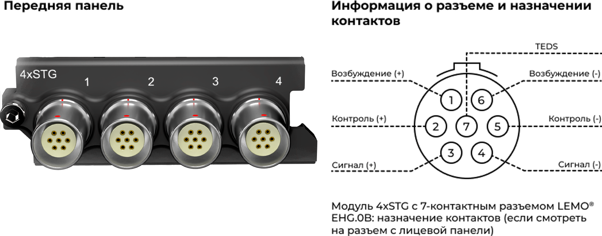
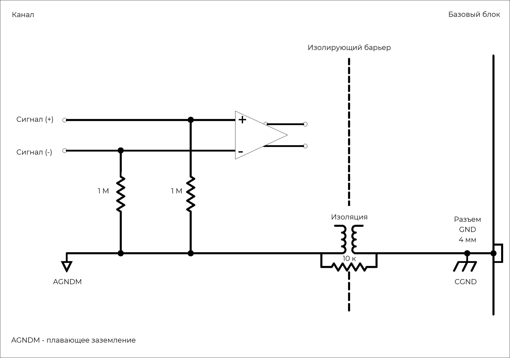
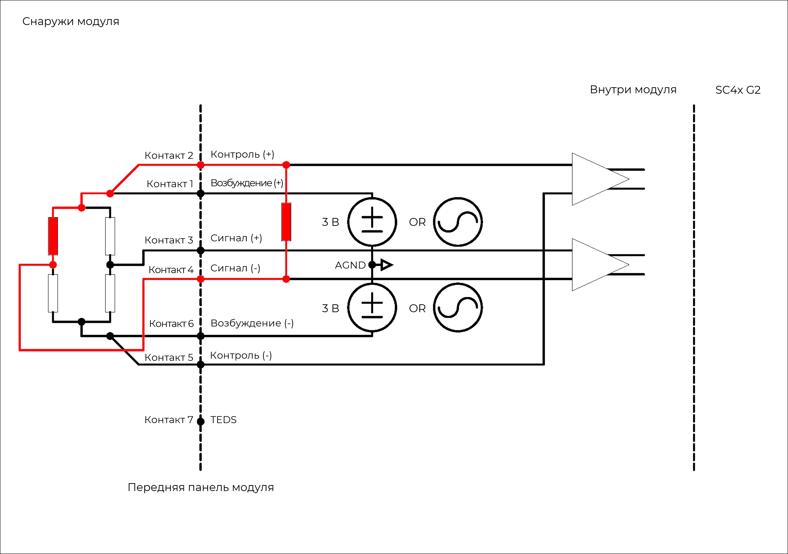
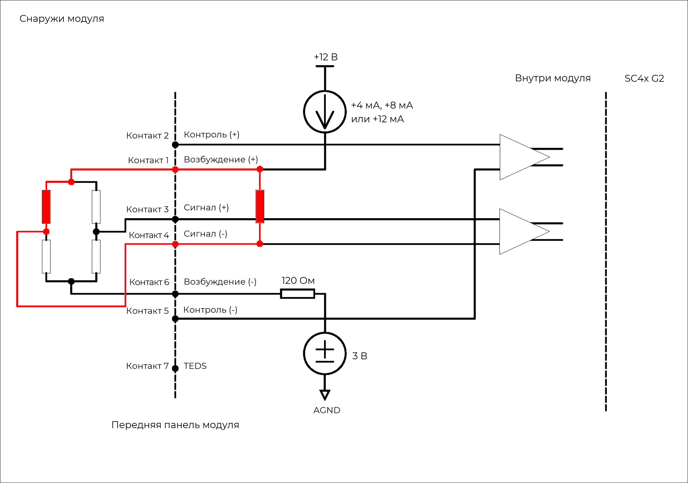

### **Описание**

Модуль 4xSTG используется для измерений перем. и пост. тока по мостовой схеме, включая тензодатчики в конфигурации полного моста, полумоста или четвертьмоста и индуктивными датчиками перемещений (LVDT). Модуль поддерживает широкий ряд программно выбираемых функций, таких как возбуждение постоянным напряжением (перем. или пост. ток) и возбуждение постоянным током (пост. ток), контроль моста, дополняющие резисторы, калибровка по шунту, режим динамической деформации и поддержка датчиков ICP®. Балансировка моста может выполняться по команде, кроме того, можно применять предыдущее значение балансировки. Модуль можно использовать:

•           с любыми тензодатчиками в режиме четверть-, полу- и полного моста, датчиками нагрузки и измерительными датчиками давления

•           с индуктивными датчиками перемещений (LVDT)

•           с любым источником напряжения до ±10 В в режиме ввода напряжения

•           с датчиками, возбуждаемыми сигналом тока, в 4-проводной схеме (полный мост или 1 внешний элемент, пост. или перем. ток)

•           с датчиками, возбуждаемыми сигналом тока, в 2-проводной схеме (только динамическая деформация)

•           с любыми ICP®-датчиками, обычно применяемыми для измерения вибрации, ускорения, силы или давления.

{width=915px height=350px}

### **Функции**

  <table style="border-collapse: collapse; width: 100%;">
    <tbody>
      
      <tr>
        <td style="border: 1px solid #ccc; padding: 8px; vertical-align: top;">
          <ul style="margin: 0; padding-left: 1.2em;">
            <li>4 канала</li>
            <li>Семь режимов работы:
                <ul style="padding-left: 1.5em; margin-top: 4px; margin-bottom: 4px;">
                    <li>Режим аналогового входа</li>
                    <li>Режим ICP® с постоянным током 4,8 или 12 мА при возбуждении напряжением &plusmn;12 В</li>
                    <li>Режим моста с возбуждением сигналом напряжения</li>
                    <li>Режим моста с возбуждением сигналом напряжения 8-10 В (пост. тока) для моста 1 кОм</li>
                    <li>Режим моста с возбуждением сигнала тока 4,8 или 12 мА (пост. тока)</li>
                    <li>Режим деформации с возбуждением сигнала тока</li>
                    <li>Режим индуктивного датчика перемещений LVDT (перем. ток)</li>
                </ul>
            </li>
            <li>Поддержка TEDS IEEE 1451.4 V0.9, V1.0</li>
            <li>Разрешение 24 бит</li>
            <li>Входные диапазоны: &plusmn;10 мВ, 100 мВ, 1 В, 10 В</li>
          </ul>
        </td>
        <td style="border: 1px solid #ccc; padding: 8px; vertical-align: top;">
          <ul style="margin: 0; padding-left: 1.2em;">
            <li>Возбуждение перем. током &le; 10 кГц</li>
            <li>Балансируемый дифференциальный вход/выход</li>
            <li>Конфигурации полного моста, полумоста и четвертьмоста</li>
            <li>Встроенные дополняющие резисторы</li>
            <li>Возможность локального и дистанционного контроля</li>
            <li>Встроенный резистор для калибровки по шунту</li>
            <li>Отслеживание переполнения до и после фильтра</li>
            <li>Возможность выбора цифровых фильтров</li>
            <li>7-контактные разъемы LEMO® EHG 0B</li>
          </ul>
        </td>
      </tr>
      
      <tr>
        <th style="border: 1px solid #ccc; padding: 8px; text-align: left; vertical-align: top;">Тип моста</th>
        <td style="border: 1px solid #ccc; padding: 8px;">Резистивный или индуктивный</td>
      </tr>
      <tr>
        <th style="border: 1px solid #ccc; padding: 8px; text-align: left; vertical-align: top;">Интерфейс</th>
        <td style="border: 1px solid #ccc; padding: 8px;">
            ICP®-датчики 
            Для аналоговых источников напряжения (в режиме измерения напряжения) 
            Мостовые датчики
        </td>
      </tr>
      <tr>
        <th style="border: 1px solid #ccc; padding: 8px; text-align: left; vertical-align: top;">Развязка по входу</th>
        <td style="border: 1px solid #ccc; padding: 8px;">
            Перем. ток (для режима ICP®) 
            Пост. или перем. ток (для режима измерения напряжения и подключения мостовых датчиков)
        </td>
      </tr>
      <tr>
        <th style="border: 1px solid #ccc; padding: 8px; text-align: left; vertical-align: top;">Частотная характеристика развязки по перем. току</th>
        <td style="border: 1px solid #ccc; padding: 8px;">
            <strong>Затухание:</strong> -3 дБ 
            <strong>Макс. частота:</strong> 1,5 Гц
        </td>
      </tr>
    </tbody>
  </table>

  <table style="width: 100%; border-collapse: collapse; margin-bottom: 20px;">
    <thead>
      <tr>
        <th style="border: 1px solid #ccc; padding: 8px; text-align: left; ">Характеристика</th>
        <th style="border: 1px solid #ccc; padding: 8px; text-align: left; ">Сопротивление моста</th>
        <th style="border: 1px solid #ccc; padding: 8px; text-align: left; ">Напряжение возбуждения</th>
        <th style="border: 1px solid #ccc; padding: 8px; text-align: left; ">Мин. сопротивление</th>
        <th style="border: 1px solid #ccc; padding: 8px; text-align: left; ">Макс. сопротивление</th>
      </tr>
    </thead>
    <tbody>
      <tr>
        <th style="border: 1px solid #ccc; padding: 8px; text-align: left;  vertical-align: middle;" rowspan="10">Диапазоны балансировки моста для возбуждения напряжением <small>Представление минимального или максимального сопротивления одного элемента, если другие три элемента моста сохраняют номинальное значение</small></th>
        <td style="border: 1px solid #ccc; padding: 8px; vertical-align: middle;" rowspan="3">120 Ом</td>
        <td style="border: 1px solid #ccc; padding: 8px;">0,5–5 В</td>
        <td style="border: 1px solid #ccc; padding: 8px;">0 Ом</td>
        <td style="border: 1px solid #ccc; padding: 8px;">Не ограничено</td>
      </tr>
      <tr>
        <td style="border: 1px solid #ccc; padding: 8px;">5,5 В</td>
        <td style="border: 1px solid #ccc; padding: 8px;">6 Ом</td>
        <td style="border: 1px solid #ccc; padding: 8px;">2520 Ом</td>
      </tr>
      <tr>
        <td style="border: 1px solid #ccc; padding: 8px;">6 В</td>
        <td style="border: 1px solid #ccc; padding: 8px;">11 Ом</td>
        <td style="border: 1px solid #ccc; padding: 8px;">1320 Ом</td>
      </tr>
      <tr>
        <td style="border: 1px solid #ccc; padding: 8px; vertical-align: middle;" rowspan="3">350 Ом</td>
        <td style="border: 1px solid #ccc; padding: 8px;">0,5–5 В</td>
        <td style="border: 1px solid #ccc; padding: 8px;">0 Ом</td>
        <td style="border: 1px solid #ccc; padding: 8px;">Не ограничено</td>
      </tr>
      <tr>
        <td style="border: 1px solid #ccc; padding: 8px;">5,5 В</td>
        <td style="border: 1px solid #ccc; padding: 8px;">17 Ом</td>
        <td style="border: 1px solid #ccc; padding: 8px;">7350 Ом</td>
      </tr>
      <tr>
        <td style="border: 1px solid #ccc; padding: 8px;">6 В</td>
        <td style="border: 1px solid #ccc; padding: 8px;">32 Ом</td>
        <td style="border: 1px solid #ccc; padding: 8px;">3850 Ом</td>
      </tr>
      <tr>
        <td style="border: 1px solid #ccc; padding: 8px; vertical-align: middle;" rowspan="4">1 кОм</td>
        <td style="border: 1px solid #ccc; padding: 8px;">8,5 В</td>
        <td style="border: 1px solid #ccc; padding: 8px;">850 Ом</td>
        <td style="border: 1px solid #ccc; padding: 8px;">3850 Ом</td>
      </tr>
       <tr>
        <td style="border: 1px solid #ccc; padding: 8px;">9 В</td>
        <td style="border: 1px solid #ccc; padding: 8px;">850 Ом</td>
        <td style="border: 1px solid #ccc; padding: 8px;">3500 Ом</td>
      </tr>
       <tr>
        <td style="border: 1px solid #ccc; padding: 8px;">9,5 В</td>
        <td style="border: 1px solid #ccc; padding: 8px;">850 Ом</td>
        <td style="border: 1px solid #ccc; padding: 8px;">3220 Ом</td>
      </tr>
       <tr>
        <td style="border: 1px solid #ccc; padding: 8px;">10 В</td>
        <td style="border: 1px solid #ccc; padding: 8px;">850 Ом</td>
        <td style="border: 1px solid #ccc; padding: 8px;">3000 Ом</td>
      </tr>
    </tbody>
  </table>

  <table style="width: 100%; border-collapse: collapse; margin-bottom: 20px;">
    <thead>
      <tr>
        <th style="border: 1px solid #ccc; padding: 8px; text-align: left; ">Характеристика</th>
        <th style="border: 1px solid #ccc; padding: 8px; text-align: left; ">Сопротивление моста</th>
        <th style="border: 1px solid #ccc; padding: 8px; text-align: left; ">Ток возбуждения</th>
        <th style="border: 1px solid #ccc; padding: 8px; text-align: left; ">Мин. Сопр. <small>(2-пров. и 4-пров.)</small></th>
        <th style="border: 1px solid #ccc; padding: 8px; text-align: left; ">Макс. Сопр. <small>(2-пров.)</small></th>
        <th style="border: 1px solid #ccc; padding: 8px; text-align: left; ">Макс. Сопр. <small>(4-пров.)</small></th>
      </tr>
    </thead>
    <tbody>
      <tr>
        <th style="border: 1px solid #ccc; padding: 8px; text-align: left;  vertical-align: middle;" rowspan="9">Диапазоны балансировки моста для возбуждения током <small>Представление минимального или максимального сопротивления одного элемента, если другие три элемента моста сохраняют номинальное значение</small></th>
        <td style="border: 1px solid #ccc; padding: 8px; vertical-align: middle;" rowspan="3">120 Ом</td>
        <td style="border: 1px solid #ccc; padding: 8px;">4 мА</td>
        <td style="border: 1px solid #ccc; padding: 8px;">0 Ом</td>
        <td style="border: 1px solid #ccc; padding: 8px;">Не ограничено</td>
        <td style="border: 1px solid #ccc; padding: 8px;">Не ограничено</td>
      </tr>
      <tr>
        <td style="border: 1px solid #ccc; padding: 8px;">8 мА</td>
        <td style="border: 1px solid #ccc; padding: 8px;">0 Ом</td>
        <td style="border: 1px solid #ccc; padding: 8px;">Не ограничено</td>
        <td style="border: 1px solid #ccc; padding: 8px;">Не ограничено</td>
      </tr>
      <tr>
        <td style="border: 1px solid #ccc; padding: 8px;">12 мА</td>
        <td style="border: 1px solid #ccc; padding: 8px;">0 Ом</td>
        <td style="border: 1px solid #ccc; padding: 8px;">Не ограничено</td>
        <td style="border: 1px solid #ccc; padding: 8px;">Не ограничено</td>
      </tr>
      <tr>
        <td style="border: 1px solid #ccc; padding: 8px; vertical-align: middle;" rowspan="3">350 Ом</td>
        <td style="border: 1px solid #ccc; padding: 8px;">4 мА</td>
        <td style="border: 1px solid #ccc; padding: 8px;">0 Ом</td>
        <td style="border: 1px solid #ccc; padding: 8px;">Не ограничено</td>
        <td style="border: 1px solid #ccc; padding: 8px;">Не ограничено</td>
      </tr>
      <tr>
        <td style="border: 1px solid #ccc; padding: 8px;">8 мА</td>
        <td style="border: 1px solid #ccc; padding: 8px;">0 Ом</td>
        <td style="border: 1px solid #ccc; padding: 8px;">12000 Ом</td>
        <td style="border: 1px solid #ccc; padding: 8px;">12000 Ом</td>
      </tr>
      <tr>
        <td style="border: 1px solid #ccc; padding: 8px;">12 мА</td>
        <td style="border: 1px solid #ccc; padding: 8px;">0 Ом</td>
        <td style="border: 1px solid #ccc; padding: 8px;">2400 Ом</td>
        <td style="border: 1px solid #ccc; padding: 8px;">2400 Ом</td>
      </tr>
      <tr>
        <td style="border: 1px solid #ccc; padding: 8px; vertical-align: middle;" rowspan="3">1 кОм</td>
        <td style="border: 1px solid #ccc; padding: 8px;">4 мА</td>
        <td style="border: 1px solid #ccc; padding: 8px;">0 Ом</td>
        <td style="border: 1px solid #ccc; padding: 8px;">7660 Ом</td>
        <td style="border: 1px solid #ccc; padding: 8px;">7660 Ом</td>
      </tr>
      <tr>
        <td style="border: 1px solid #ccc; padding: 8px;">8 мА</td>
        <td style="border: 1px solid #ccc; padding: 8px;">48 Ом</td>
        <td style="border: 1px solid #ccc; padding: 8px;">2810 Ом</td>
        <td style="border: 1px solid #ccc; padding: 8px;">2810 Ом</td>
      </tr>
      <tr>
        <td style="border: 1px solid #ccc; padding: 8px;">12 мА</td>
        <td style="border: 1px solid #ccc; padding: 8px;">310 Ом</td>
        <td style="border: 1px solid #ccc; padding: 8px;">2050 Ом</td>
        <td style="border: 1px solid #ccc; padding: 8px;">1360 Ом</td>
      </tr>
    </tbody>
  </table>
  
  <table style="width: 100%; border-collapse: collapse;">
    <thead>
      <tr>
        <th style="border: 1px solid #ccc; padding: 8px; text-align: left; ">Характеристика</th>
        <th style="border: 1px solid #ccc; padding: 8px; text-align: left; ">Ток возбуждения</th>
        <th style="border: 1px solid #ccc; padding: 8px; text-align: left; ">Соответствие напряжения</th>
        <th style="border: 1px solid #ccc; padding: 8px; text-align: left; ">Макс. Сопр. датчика</th>
      </tr>
    </thead>
    <tbody>
      <tr>
        <th style="border: 1px solid #ccc; padding: 8px; text-align: left;  vertical-align: middle;" rowspan="3">Возбуждение постоянным током (2-проводной) <small>По линии «Сигнал (+)» передается сигнал и возбуждение. Развязка по перем. току. Ток не отслеживается</small></th>
        <td style="border: 1px solid #ccc; padding: 8px;">4 мА</td>
        <td style="border: 1px solid #ccc; padding: 8px;">20 В</td>
        <td style="border: 1px solid #ccc; padding: 8px;">5000 Ом</td>
      </tr>
      <tr>
        <td style="border: 1px solid #ccc; padding: 8px;">8 мА</td>
        <td style="border: 1px solid #ccc; padding: 8px;">20 В</td>
        <td style="border: 1px solid #ccc; padding: 8px;">2500 Ом</td>
      </tr>
      <tr>
        <td style="border: 1px solid #ccc; padding: 8px;">12 мА</td>
        <td style="border: 1px solid #ccc; padding: 8px;">20 В</td>
        <td style="border: 1px solid #ccc; padding: 8px;">1660 Ом</td>
      </tr>
    </tbody>
  </table>

  <table style="width: 100%; border-collapse: collapse; margin-bottom: 20px;">
    <thead>
      <tr>
        <th style="border: 1px solid #ccc; padding: 8px; text-align: left; ">Характеристика</th>
        <th style="border: 1px solid #ccc; padding: 8px; text-align: left; ">Ток возбуждения</th>
        <th style="border: 1px solid #ccc; padding: 8px; text-align: left; ">Напряжение</th>
        <th style="border: 1px solid #ccc; padding: 8px; text-align: left; ">Макс. Сопр. датчика</th>
      </tr>
    </thead>
    <tbody>
      <tr>
        <th style="border: 1px solid #ccc; padding: 8px; text-align: left;  vertical-align: middle;" rowspan="3">Возбуждение постоянным током (4-проводной) <small>По линии «Сигнал (±)» передается сигнал, а по линии «Возбуждение (±)» передается возбуждение. Связь по перем. или пост. току. Отслеживание тока через прецизионный резистор.</small></th>
        <td style="border: 1px solid #ccc; padding: 8px;">4 мА</td>
        <td style="border: 1px solid #ccc; padding: 8px;">13 В</td>
        <td style="border: 1px solid #ccc; padding: 8px;">3250 Ом</td>
      </tr>
      <tr>
        <td style="border: 1px solid #ccc; padding: 8px;">8 мА</td>
        <td style="border: 1px solid #ccc; padding: 8px;">13 В</td>
        <td style="border: 1px solid #ccc; padding: 8px;">1620 Ом</td>
      </tr>
      <tr>
        <td style="border: 1px solid #ccc; padding: 8px;">12 мА</td>
        <td style="border: 1px solid #ccc; padding: 8px;">13 В</td>
        <td style="border: 1px solid #ccc; padding: 8px;">1080 Ом</td>
      </tr>
    </tbody>
  </table>

  <table style="width: 100%; border-collapse: collapse; margin-bottom: 20px;">
    <thead>
      <tr>
        <th style="border: 1px solid #ccc; padding: 8px; text-align: left; ">Характеристика</th>
        <th style="border: 1px solid #ccc; padding: 8px; text-align: left; ">Напряж. Возбужд.</th>
        <th style="border: 1px solid #ccc; padding: 8px; text-align: left; ">Макс. ток нагрузки</th>
        <th style="border: 1px solid #ccc; padding: 8px; text-align: left; ">Разрешение напряжения</th>
        <th style="border: 1px solid #ccc; padding: 8px; text-align: left; ">Полярность</th>
      </tr>
    </thead>
    <tbody>
      <tr>
        <th style="border: 1px solid #ccc; padding: 8px; text-align: left;  vertical-align: middle;" rowspan="2">Возбуждение постоянным напряжением</th>
        <td style="border: 1px solid #ccc; padding: 8px;">&lt; 6 В</td>
        <td style="border: 1px solid #ccc; padding: 8px;">&lt; 90 мА</td>
        <td style="border: 1px solid #ccc; padding: 8px;">0,2 мВ</td>
        <td style="border: 1px solid #ccc; padding: 8px;">Биполярное (балансируемое)</td>
      </tr>
      <tr>
        <td style="border: 1px solid #ccc; padding: 8px;">8–10 В</td>
        <td style="border: 1px solid #ccc; padding: 8px;">&lt; 12 мА</td>
        <td style="border: 1px solid #ccc; padding: 8px;">0,1 мВ</td>
        <td style="border: 1px solid #ccc; padding: 8px;">Однополярное (небалансируемое)</td>
      </tr>
    </tbody>
  </table>
  
  <table style="width: 100%; border-collapse: collapse;">
    <tbody>
      <tr>
        <th style="border: 1px solid #ccc; padding: 8px; text-align: left;  width: 30%;">Другие значения частоты дискретизации</th>
        <td style="border: 1px solid #ccc; padding: 8px;">Доступно через цифровые ФНЧ и децимацию</td>
      </tr>
      <tr>
        <th style="border: 1px solid #ccc; padding: 8px; text-align: left; ">Дополнительные программируемые цифровые БИХ-фильтры</th>
        <td style="border: 1px solid #ccc; padding: 8px;">Полосовой фильтр и полосовой заградительный фильтр: 6 дБ на октаву, ФВЧ/ФНЧ: 12 дБ на октаву</td>
      </tr>
      <tr>
        <th style="border: 1px solid #ccc; padding: 8px; text-align: left; ">Дополнительный ФВЧ первого порядка</th>
        <td style="border: 1px solid #ccc; padding: 8px;">-3 дБ при 1 Гц</td>
      </tr>
      <tr>
        <th style="border: 1px solid #ccc; padding: 8px; text-align: left; ">Защита</th>
        <td style="border: 1px solid #ccc; padding: 8px;">
          ЭСР 2 кВ по всем линиям 
          Перенапряжение по линиям сигнала 
          Короткое замыкание между корпусом датчика и заземлением (для режима ICP®) 
          Короткое замыкание между линиями возбуждения (для режима работы с мостовыми датчиками)
        </td>
      </tr>
      <tr>
        <th style="border: 1px solid #ccc; padding: 8px; text-align: left; ">Гальваническая изоляция</th>
        <td style="border: 1px solid #ccc; padding: 8px;">50 В</td>
      </tr>
    </tbody>
  </table>

### **Характеристики**

  <table style="width: 100%; border-collapse: collapse;">
    <tbody>
      <tr>
        <th style="border: 1px solid #ccc; padding: 8px; text-align: left;  width: 30%;">Полоса пропускания</th>
        <td colspan="3" style="border: 1px solid #ccc; padding: 8px;">Пост. ток до 100 кГц</td>
      </tr>
      <tr>
        <th style="border: 1px solid #ccc; padding: 8px; text-align: left; ">Максимальная частота дискретизации на канал</th>
        <td colspan="3" style="border: 1px solid #ccc; padding: 8px;">204,8 Квыб/с</td>
      </tr>
      <tr>
        <th style="border: 1px solid #ccc; padding: 8px; text-align: left; ">АЦП</th>
        <td colspan="3" style="border: 1px solid #ccc; padding: 8px;">24 бит</td>
      </tr>
      <tr>
        <th style="border: 1px solid #ccc; padding: 8px; text-align: left; ">Передача данных</th>
        <td colspan="3" style="border: 1px solid #ccc; padding: 8px;">16/24 бит</td>
      </tr>
      <tr>
        <th style="border: 1px solid #ccc; padding: 8px; text-align: left; ">Диапазоны входного напряжения (пик)</th>
        <td colspan="3" style="border: 1px solid #ccc; padding: 8px;">&plusmn;10 мВ, &plusmn;100 мВ, &plusmn;1 В, &plusmn;10 В</td>
      </tr>
      <tr>
        <th style="border: 1px solid #ccc; padding: 8px; text-align: left; ">Режим ICP®</th>
        <td colspan="3" style="border: 1px solid #ccc; padding: 8px;">4 мА, 8 мА или 12 мА пост. тока при возбуждении &plusmn;12 В</td>
      </tr>
      <tr>
        <th style="border: 1px solid #ccc; padding: 8px; text-align: left; ">Параметры входного смещения</th>
        <td style="border: 1px solid #ccc; padding: 8px;"><strong>Дифференциальное смещение (балансируемое)</strong></td>
        <td colspan="2" style="border: 1px solid #ccc; padding: 8px;">Положительный и отрицательный входы сигнала подключены по линии 1 МОм к плавающему заземлению.</td>
      </tr>
      <tr>
        <th style="border: 1px solid #ccc; padding: 8px; text-align: left; ">Входное сопротивление</th>
        <td colspan="3" style="border: 1px solid #ccc; padding: 8px;">2,1 МОм || 1200 пФ</td>
      </tr>
      
      <tr>
        <th style="border: 1px solid #ccc; padding: 8px; text-align: left; " rowspan="2">Резистор калибровки по шунту <small>Между «Сигнал (+)» и «Возбуждение (+_»/«Контроль (+)»</small></th>
        <th style="border: 1px solid #ccc; padding: 8px; text-align: left; ">Сопротивление</th>
        <th style="border: 1px solid #ccc; padding: 8px; text-align: left; ">Допуск</th>
        <th style="border: 1px solid #ccc; padding: 8px; text-align: left; ">Температурный дрейф</th>
      </tr>
      <tr>
        <td style="border: 1px solid #ccc; padding: 8px;">100 кОм</td>
        <td style="border: 1px solid #ccc; padding: 8px;">0,1%</td>
        <td style="border: 1px solid #ccc; padding: 8px;">5 ppm/°C</td>
      </tr>
      <tr>
        <th style="border: 1px solid #ccc; padding: 8px; text-align: left; " rowspan="2">Встроенные дополняющие резисторы</th>
        <th style="border: 1px solid #ccc; padding: 8px; text-align: left; ">Сопротивление</th>
        <th style="border: 1px solid #ccc; padding: 8px; text-align: left; ">Допуск</th>
        <th style="border: 1px solid #ccc; padding: 8px; text-align: left; ">Температурный дрейф</th>
      </tr>
      <tr>
        <td style="border: 1px solid #ccc; padding: 8px;">120 Ом или 350 Ом</td>
        <td style="border: 1px solid #ccc; padding: 8px;">0,02%</td>
        <td style="border: 1px solid #ccc; padding: 8px;">0,2 ppm/°C</td>
      </tr>

      <tr>
        <th style="border: 1px solid #ccc; padding: 8px; text-align: left;  vertical-align: middle;" rowspan="4">Цифровой ФНЧ <small>Шкала фильтра: частота дискретизации</small></th>
        <td style="border: 1px solid #ccc; padding: 8px;" colspan="2">Полоса пропускания</td>
        <td style="border: 1px solid #ccc; padding: 8px;">частота дискретизации &times; 0,45 Гц</td>
      </tr>
      <tr>
        <td style="border: 1px solid #ccc; padding: 8px;" colspan="2">Полоса задержания</td>
        <td style="border: 1px solid #ccc; padding: 8px;">частота дискретизации &times; 0,55 Гц</td>
      </tr>
      <tr>
        <td style="border: 1px solid #ccc; padding: 8px;" colspan="2">Неравномерность в полосе пропускания</td>
        <td style="border: 1px solid #ccc; padding: 8px;">&plusmn;0,005 дБ</td>
      </tr>
      <tr>
        <td style="border: 1px solid #ccc; padding: 8px;" colspan="2">Затухание в полосе задержания</td>
        <td style="border: 1px solid #ccc; padding: 8px;">100 дБ</td>
      </tr>
      
      <tr>
        <th style="border: 1px solid #ccc; padding: 8px; text-align: left; ">Погрешность на фазу <small>Каналы в сходном диапазоне</small></th>
        <td style="border: 1px solid #ccc; padding: 8px;">Стандартно</td>
        <td colspan="2" style="border: 1px solid #ccc; padding: 8px;">&lt; 0,2&deg; при 10 кГц</td>
      </tr>
      
      <tr>
        <th style="border: 1px solid #ccc; padding: 8px; text-align: left;  vertical-align: middle;" rowspan="7">Возбуждение током по схеме моста Уитстона</th>
        <th style="border: 1px solid #ccc; padding: 8px; text-align: left; ">Схема</th>
        <th style="border: 1px solid #ccc; padding: 8px; text-align: left; ">Режим возбуждения</th>
        <th style="border: 1px solid #ccc; padding: 8px; text-align: left; ">% режима возбуждения + мА</th>
      </tr>
      <tr>
        <td style="border: 1px solid #ccc; padding: 8px; vertical-align: middle;" rowspan="3">2-проводной</td>
        <td style="border: 1px solid #ccc; padding: 8px;">4 мА</td>
        <td style="border: 1px solid #ccc; padding: 8px;">0,58% + 0,025 мА</td>
      </tr>
      <tr>
        <td style="border: 1px solid #ccc; padding: 8px;">8 мА</td>
        <td style="border: 1px solid #ccc; padding: 8px;">0,38% + 0,031 мА</td>
      </tr>
      <tr>
        <td style="border: 1px solid #ccc; padding: 8px;">12 мА</td>
        <td style="border: 1px solid #ccc; padding: 8px;">0,36% + 0,042 мА</td>
      </tr>
      <tr>
        <td style="border: 1px solid #ccc; padding: 8px; vertical-align: middle;" rowspan="3">4-проводной</td>
        <td style="border: 1px solid #ccc; padding: 8px;">4 мА</td>
        <td style="border: 1px solid #ccc; padding: 8px;">0,58% + 0,011 мА</td>
      </tr>
      <tr>
        <td style="border: 1px solid #ccc; padding: 8px;">8 мА</td>
        <td style="border: 1px solid #ccc; padding: 8px;">0,38% + 0,018 мА</td>
      </tr>
      <tr>
        <td style="border: 1px solid #ccc; padding: 8px;">12 мА</td>
        <td style="border: 1px solid #ccc; padding: 8px;">0,36% + 0,029 мА</td>
      </tr>
    </tbody>
  </table>

  <table style="width: 100%; border-collapse: collapse; margin-bottom: 20px;">
    <thead>
      <tr>
        <th style="border: 1px solid #ccc; padding: 8px; text-align: left; ">Характеристика</th>
        <th style="border: 1px solid #ccc; padding: 8px; text-align: left; ">Напряжение возбуждения</th>
        <th style="border: 1px solid #ccc; padding: 8px; text-align: left; ">Макс. напряжение рассогласования</th>
      </tr>
    </thead>
    <tbody>
      <tr>
        <th style="border: 1px solid #ccc; padding: 8px; text-align: left;  vertical-align: middle;" rowspan="2">Возбуждение напряжением по схеме моста Уитстона</th>
        <td style="border: 1px solid #ccc; padding: 8px;">&lt; 6 В</td>
        <td style="border: 1px solid #ccc; padding: 8px;">&plusmn;4 мВ</td>
      </tr>
      <tr>
        <td style="border: 1px solid #ccc; padding: 8px;">8–10 В</td>
        <td style="border: 1px solid #ccc; padding: 8px;">&plusmn;4 мВ</td>
      </tr>
    </tbody>
  </table>

  <table style="width: 100%; border-collapse: collapse; margin-bottom: 20px;">
    <thead>
      <tr>
        <th style="border: 1px solid #ccc; padding: 8px; text-align: left; ">Характеристика</th>
        <th style="border: 1px solid #ccc; padding: 8px; text-align: left; ">Входной диапазон (пик)</th>
        <th style="border: 1px solid #ccc; padding: 8px; text-align: left; ">% диапазона</th>
      </tr>
    </thead>
    <tbody>
      <tr>
        <th style="border: 1px solid #ccc; padding: 8px; text-align: left;  vertical-align: middle;" rowspan="4">Точность напряжения пост. тока</th>
        <td style="border: 1px solid #ccc; padding: 8px;">&plusmn;10 мВ</td>
        <td style="border: 1px solid #ccc; padding: 8px;">Требует уточнения</td>
      </tr>
      <tr>
        <td style="border: 1px solid #ccc; padding: 8px;">&plusmn;100 мВ</td>
        <td style="border: 1px solid #ccc; padding: 8px;">0,30%</td>
      </tr>
      <tr>
        <td style="border: 1px solid #ccc; padding: 8px;">&plusmn;1 В</td>
        <td style="border: 1px solid #ccc; padding: 8px;">0,15%</td>
      </tr>
       <tr>
        <td style="border: 1px solid #ccc; padding: 8px;">&plusmn;10 В</td>
        <td style="border: 1px solid #ccc; padding: 8px;">0,15%</td>
      </tr>
    </tbody>
  </table>
  
  <table style="width: 100%; border-collapse: collapse;">
    <thead>
      <tr>
        <th style="border: 1px solid #ccc; padding: 8px; text-align: left; ">Характеристика</th>
        <th style="border: 1px solid #ccc; padding: 8px; text-align: left; ">Диапазон частот</th>
        <th style="border: 1px solid #ccc; padding: 8px; text-align: left; ">Входной диапазон (пик)</th>
        <th style="border: 1px solid #ccc; padding: 8px; text-align: left; ">Гарантировано</th>
        <th style="border: 1px solid #ccc; padding: 8px; text-align: left; ">Стандартно</th>
      </tr>
    </thead>
    <tbody>
      <tr>
        <th style="border: 1px solid #ccc; padding: 8px; text-align: left;  vertical-align: middle;" rowspan="12">Шум <small>Оконечная нагрузка входа — резистор 50 Ом</small></th>
        <td style="border: 1px solid #ccc; padding: 8px;">от 10 Гц до 23 кГц</td>
        <td style="border: 1px solid #ccc; padding: 8px; vertical-align: middle;" rowspan="3">&plusmn;10 мВ</td>
        <td style="border: 1px solid #ccc; padding: 8px;">&lt; 3,6 мкВ СКЗ</td>
        <td style="border: 1px solid #ccc; padding: 8px;">&lt; 2,9 мкВ СКЗ</td>
      </tr>
      <tr>
        <td style="border: 1px solid #ccc; padding: 8px;">от 10 Гц до 49 кГц</td>
        <td style="border: 1px solid #ccc; padding: 8px;">&lt; 5,8 мкВ СКЗ</td>
        <td style="border: 1px solid #ccc; padding: 8px;">&lt; 4,3 мкВ СКЗ</td>
      </tr>
      <tr>
        <td style="border: 1px solid #ccc; padding: 8px;">от 10 Гц до 100 кГц</td>
        <td style="border: 1px solid #ccc; padding: 8px;">&lt; 6,9 мкВ СКЗ</td>
        <td style="border: 1px solid #ccc; padding: 8px;">&lt; 5,6 мкВ СКЗ</td>
      </tr>
      <tr>
        <td style="border: 1px solid #ccc; padding: 8px;">от 10 Гц до 23 кГц</td>
        <td style="border: 1px solid #ccc; padding: 8px; vertical-align: middle;" rowspan="3">&plusmn;100 мВ</td>
        <td style="border: 1px solid #ccc; padding: 8px;">&lt; 5,0 мкВ СКЗ</td>
        <td style="border: 1px solid #ccc; padding: 8px;">&lt; 4,4 мкВ СКЗ</td>
      </tr>
      <tr>
        <td style="border: 1px solid #ccc; padding: 8px;">от 10 Гц до 49 кГц</td>
        <td style="border: 1px solid #ccc; padding: 8px;">&lt; 10 мкВ СКЗ</td>
        <td style="border: 1px solid #ccc; padding: 8px;">&lt; 7,8 мкВ СКЗ</td>
      </tr>
      <tr>
        <td style="border: 1px solid #ccc; padding: 8px;">от 10 Гц до 100 кГц</td>
        <td style="border: 1px solid #ccc; padding: 8px;">&lt; 82 мкВ СКЗ</td>
        <td style="border: 1px solid #ccc; padding: 8px;">&lt; 72 мкВ СКЗ</td>
      </tr>
      <tr>
        <td style="border: 1px solid #ccc; padding: 8px;">от 10 Гц до 23 кГц</td>
        <td style="border: 1px solid #ccc; padding: 8px; vertical-align: middle;" rowspan="3">&plusmn;1 В</td>
        <td style="border: 1px solid #ccc; padding: 8px;">&lt; 5,0 мкВ СКЗ</td>
        <td style="border: 1px solid #ccc; padding: 8px;">&lt; 4,4 мкВ СКЗ</td>
      </tr>
      <tr>
        <td style="border: 1px solid #ccc; padding: 8px;">от 10 Гц до 49 кГц</td>
        <td style="border: 1px solid #ccc; padding: 8px;">&lt; 10 мкВ СКЗ</td>
        <td style="border: 1px solid #ccc; padding: 8px;">&lt; 7,8 мкВ СКЗ</td>
      </tr>
      <tr>
        <td style="border: 1px solid #ccc; padding: 8px;">от 10 Гц до 100 кГц</td>
        <td style="border: 1px solid #ccc; padding: 8px;">&lt; 86 мкВ СКЗ</td>
        <td style="border: 1px solid #ccc; padding: 8px;">&lt; 74 мкВ СКЗ</td>
      </tr>
       <tr>
        <td style="border: 1px solid #ccc; padding: 8px;">от 10 Гц до 23 кГц</td>
        <td style="border: 1px solid #ccc; padding: 8px; vertical-align: middle;" rowspan="3">&plusmn;10 В</td>
        <td style="border: 1px solid #ccc; padding: 8px;">&lt; 41 мкВ СКЗ</td>
        <td style="border: 1px solid #ccc; padding: 8px;">&lt; 37 мкВ СКЗ</td>
      </tr>
      <tr>
        <td style="border: 1px solid #ccc; padding: 8px;">от 10 Гц до 49 кГц</td>
        <td style="border: 1px solid #ccc; padding: 8px;">&lt; 86 мкВ СКЗ</td>
        <td style="border: 1px solid #ccc; padding: 8px;">&lt; 68 мкВ СКЗ</td>
      </tr>
      <tr>
        <td style="border: 1px solid #ccc; padding: 8px;">от 10 Гц до 100 кГц</td>
        <td style="border: 1px solid #ccc; padding: 8px;">&lt; 755 мкВ СКЗ</td>
        <td style="border: 1px solid #ccc; padding: 8px;">&lt; 700 мкВ СКЗ</td>
      </tr>
    </tbody>
  </table>

  <table style="width: 100%; border-collapse: collapse; margin-bottom: 20px;">
    <thead>
      <tr>
        <th style="border: 1px solid #ccc; padding: 8px; text-align: left; ">Характеристика</th>
        <th style="border: 1px solid #ccc; padding: 8px; text-align: left; ">Частота дискретизации</th>
        <th style="border: 1px solid #ccc; padding: 8px; text-align: left; ">Входной диапазон (пик)</th>
        <th style="border: 1px solid #ccc; padding: 8px; text-align: left; ">Затухание <small>(уровень входного сигнала 100% от полного диапазона)</small></th>
      </tr>
    </thead>
    <tbody>
      <tr>
        <th style="border: 1px solid #ccc; padding: 8px; text-align: left;  vertical-align: middle;" rowspan="12">Неравномерность амплитудной хар-ки <small>Относительно 1 кГц  Измерено до 0,39 × частота дискретизации</small></th>
        <td style="border: 1px solid #ccc; padding: 8px;">51,2 Квыб/с</td>
        <td style="border: 1px solid #ccc; padding: 8px; vertical-align: middle;" rowspan="3">&plusmn;10 мВ</td>
        <td style="border: 1px solid #ccc; padding: 8px;">-0,03 дБ</td>
      </tr>
      <tr>
        <td style="border: 1px solid #ccc; padding: 8px;">102,4 Квыб/с</td>
        <td style="border: 1px solid #ccc; padding: 8px;">-0,07 дБ</td>
      </tr>
      <tr>
        <td style="border: 1px solid #ccc; padding: 8px;">204,8 Квыб/с</td>
        <td style="border: 1px solid #ccc; padding: 8px;">-0,18 дБ</td>
      </tr>
      <tr>
        <td style="border: 1px solid #ccc; padding: 8px;">51,2 Квыб/с</td>
        <td style="border: 1px solid #ccc; padding: 8px; vertical-align: middle;" rowspan="3">&plusmn;100 мВ</td>
        <td style="border: 1px solid #ccc; padding: 8px;">-0,02 дБ</td>
      </tr>
      <tr>
        <td style="border: 1px solid #ccc; padding: 8px;">102,4 Квыб/с</td>
        <td style="border: 1px solid #ccc; padding: 8px;">-0,06 дБ</td>
      </tr>
      <tr>
        <td style="border: 1px solid #ccc; padding: 8px;">204,8 Квыб/с</td>
        <td style="border: 1px solid #ccc; padding: 8px;">-0,15 дБ</td>
      </tr>
      <tr>
        <td style="border: 1px solid #ccc; padding: 8px;">51,2 Квыб/с</td>
        <td style="border: 1px solid #ccc; padding: 8px; vertical-align: middle;" rowspan="3">&plusmn;1 В</td>
        <td style="border: 1px solid #ccc; padding: 8px;">-0,02 дБ</td>
      </tr>
      <tr>
        <td style="border: 1px solid #ccc; padding: 8px;">102,4 Квыб/с</td>
        <td style="border: 1px solid #ccc; padding: 8px;">-0,06 дБ</td>
      </tr>
      <tr>
        <td style="border: 1px solid #ccc; padding: 8px;">204,8 Квыб/с</td>
        <td style="border: 1px solid #ccc; padding: 8px;">-0,11 дБ</td>
      </tr>
       <tr>
        <td style="border: 1px solid #ccc; padding: 8px;">51,2 Квыб/с</td>
        <td style="border: 1px solid #ccc; padding: 8px; vertical-align: middle;" rowspan="3">&plusmn;10 В</td>
        <td style="border: 1px solid #ccc; padding: 8px;">-0,02 дБ</td>
      </tr>
      <tr>
        <td style="border: 1px solid #ccc; padding: 8px;">102,4 Квыб/с</td>
        <td style="border: 1px solid #ccc; padding: 8px;">-0,05 дБ</td>
      </tr>
      <tr>
        <td style="border: 1px solid #ccc; padding: 8px;">204,8 Квыб/с</td>
        <td style="border: 1px solid #ccc; padding: 8px;">-0,11 дБ</td>
      </tr>
    </tbody>
  </table>

  <table style="width: 100%; border-collapse: collapse; margin-bottom: 20px;">
    <thead>
      <tr>
        <th style="border: 1px solid #ccc; padding: 8px; text-align: left; ">Характеристика</th>
        <th style="border: 1px solid #ccc; padding: 8px; text-align: left; ">Частота дискретизации</th>
        <th style="border: 1px solid #ccc; padding: 8px; text-align: left; ">Входной диапазон (пик)</th>
        <th style="border: 1px solid #ccc; padding: 8px; text-align: left; ">Затухание <small>(уровень входного сигнала 100% от полного диапазона)</small></th>
      </tr>
    </thead>
    <tbody>
      <tr>
        <th style="border: 1px solid #ccc; padding: 8px; text-align: left; vertical-align: middle;" rowspan="12">Неравномерность амплитудной хар-ки <small>Относительно 1 кГц с источником 1 кОм  Измерено до 0,39 × частота дискретизации</small></th>
        <td style="border: 1px solid #ccc; padding: 8px;">51,2 Квыб/с</td>
        <td style="border: 1px solid #ccc; padding: 8px; vertical-align: middle;" rowspan="3">&plusmn;10 мВ</td>
        <td style="border: 1px solid #ccc; padding: 8px;">-0,40 дБ</td>
      </tr>
      <tr>
        <td style="border: 1px solid #ccc; padding: 8px;">102,4 Квыб/с</td>
        <td style="border: 1px solid #ccc; padding: 8px;">-1,10 дБ</td>
      </tr>
      <tr>
        <td style="border: 1px solid #ccc; padding: 8px;">204,8 Квыб/с</td>
        <td style="border: 1px solid #ccc; padding: 8px;">-3,50 дБ</td>
      </tr>
      <tr>
        <td style="border: 1px solid #ccc; padding: 8px;">51,2 Квыб/с</td>
        <td style="border: 1px solid #ccc; padding: 8px; vertical-align: middle;" rowspan="3">&plusmn;100 мВ</td>
        <td style="border: 1px solid #ccc; padding: 8px;">-0,31 дБ</td>
      </tr>
      <tr>
        <td style="border: 1px solid #ccc; padding: 8px;">102,4 Квыб/с</td>
        <td style="border: 1px solid #ccc; padding: 8px;">-1,06 дБ</td>
      </tr>
      <tr>
        <td style="border: 1px solid #ccc; padding: 8px;">204,8 Квыб/с</td>
        <td style="border: 1px solid #ccc; padding: 8px;">-3,20 дБ</td>
      </tr>
      <tr>
        <td style="border: 1px solid #ccc; padding: 8px;">51,2 Квыб/с</td>
        <td style="border: 1px solid #ccc; padding: 8px; vertical-align: middle;" rowspan="3">&plusmn;1 В</td>
        <td style="border: 1px solid #ccc; padding: 8px;">-0,30 дБ</td>
      </tr>
      <tr>
        <td style="border: 1px solid #ccc; padding: 8px;">102,4 Квыб/с</td>
        <td style="border: 1px solid #ccc; padding: 8px;">-1,06 дБ</td>
      </tr>
      <tr>
        <td style="border: 1px solid #ccc; padding: 8px;">204,8 Квыб/с</td>
        <td style="border: 1px solid #ccc; padding: 8px;">-3,21 дБ</td>
      </tr>
       <tr>
        <td style="border: 1px solid #ccc; padding: 8px;">51,2 Квыб/с</td>
        <td style="border: 1px solid #ccc; padding: 8px; vertical-align: middle;" rowspan="3">&plusmn;10 В</td>
        <td style="border: 1px solid #ccc; padding: 8px;">-0,30 дБ</td>
      </tr>
      <tr>
        <td style="border: 1px solid #ccc; padding: 8px;">102,4 Квыб/с</td>
        <td style="border: 1px solid #ccc; padding: 8px;">-1,05 дБ</td>
      </tr>
      <tr>
        <td style="border: 1px solid #ccc; padding: 8px;">204,8 Квыб/с</td>
        <td style="border: 1px solid #ccc; padding: 8px;">-3,18 дБ</td>
      </tr>
    </tbody>
  </table>
  
  <table style="width: 100%; border-collapse: collapse;">
    <thead>
      <tr>
        <th style="border: 1px solid #ccc; padding: 8px; text-align: left; ">Характеристика</th>
        <th style="border: 1px solid #ccc; padding: 8px; text-align: left; ">Входной диапазон (пик)</th>
        <th style="border: 1px solid #ccc; padding: 8px; text-align: left; ">Гарантировано</th>
        <th style="border: 1px solid #ccc; padding: 8px; text-align: left; ">Стандартно</th>
      </tr>
    </thead>
    <tbody>
      <tr>
        <th style="border: 1px solid #ccc; padding: 8px; text-align: left;  vertical-align: middle;" rowspan="4">Взаимное влияние</th>
        <td style="border: 1px solid #ccc; padding: 8px;">&plusmn;10 мВ</td>
        <td style="border: 1px solid #ccc; padding: 8px;">68 дБ</td>
        <td style="border: 1px solid #ccc; padding: 8px;">73 дБ</td>
      </tr>
      <tr>
        <td style="border: 1px solid #ccc; padding: 8px;">&plusmn;100 мВ</td>
        <td style="border: 1px solid #ccc; padding: 8px;">62 дБ</td>
        <td style="border: 1px solid #ccc; padding: 8px;">67 дБ</td>
      </tr>
      <tr>
        <td style="border: 1px solid #ccc; padding: 8px;">&plusmn;1 В</td>
        <td style="border: 1px solid #ccc; padding: 8px;">102 дБ</td>
        <td style="border: 1px solid #ccc; padding: 8px;">107 дБ</td>
      </tr>
      <tr>
        <td style="border: 1px solid #ccc; padding: 8px;">&plusmn;10 В</td>
        <td style="border: 1px solid #ccc; padding: 8px;">83 дБ</td>
        <td style="border: 1px solid #ccc; padding: 8px;">88 дБ</td>
      </tr>
    </tbody>
  </table>

!!! info "Информация"
    Информация о параметрах модулей и условиях измерения, используемых во время измерений для определения технических характеристик, доступна по запросу.

### Характеристики малоемкостного режима

  <table style="width: 100%; border-collapse: collapse;">
    <tbody>
      <tr>
        <th style="border: 1px solid #ccc; padding: 8px; text-align: left;  width: 30%;">Полоса пропускания</th>
        <td colspan="3" style="border: 1px solid #ccc; padding: 8px;">Пост. ток до 100 кГц</td>
      </tr>
      <tr>
        <th style="border: 1px solid #ccc; padding: 8px; text-align: left; ">Максимальная частота дискретизации на канал</th>
        <td colspan="3" style="border: 1px solid #ccc; padding: 8px;">204,8 Квыб/с</td>
      </tr>
      <tr>
        <th style="border: 1px solid #ccc; padding: 8px; text-align: left; ">АЦП</th>
        <td colspan="3" style="border: 1px solid #ccc; padding: 8px;">24 бит</td>
      </tr>
      <tr>
        <th style="border: 1px solid #ccc; padding: 8px; text-align: left; ">Передача данных</th>
        <td colspan="3" style="border: 1px solid #ccc; padding: 8px;">16/24 бит</td>
      </tr>
      <tr>
        <th style="border: 1px solid #ccc; padding: 8px; text-align: left; ">Диапазоны входного напряжения (пик)</th>
        <td colspan="3" style="border: 1px solid #ccc; padding: 8px;">&plusmn;10 мВ, &plusmn;100 мВ, &plusmn;1 В, &plusmn;10 В</td>
      </tr>
      <tr>
        <th style="border: 1px solid #ccc; padding: 8px; text-align: left; ">Режим ICP®</th>
        <td colspan="3" style="border: 1px solid #ccc; padding: 8px;">4 мА, 8 мА или 12 мА пост. тока при возбуждении &plusmn;12 В</td>
      </tr>
      <tr>
        <th style="border: 1px solid #ccc; padding: 8px; text-align: left; ">Параметры входного смещения</th>
        <td style="border: 1px solid #ccc; padding: 8px;"><strong>Дифференциальное смещение (балансируемое)</strong></td>
        <td colspan="2" style="border: 1px solid #ccc; padding: 8px;">Положительный и отрицательный входы сигнала подключены по линии 1 МОм к плавающему заземлению.</td>
      </tr>
      <tr>
        <th style="border: 1px solid #ccc; padding: 8px; text-align: left; ">Входное сопротивление</th>
        <td colspan="3" style="border: 1px solid #ccc; padding: 8px;">2,1 МОм || 80 пФ</td>
      </tr>
      
      <tr>
        <th style="border: 1px solid #ccc; padding: 8px; text-align: left;  vertical-align: middle;" rowspan="2">Резистор калибровки по шунту <small>Между «Сигнал (+)» и «Возбуждение (+_»/«Контроль (+)»</small></th>
        <th style="border: 1px solid #ccc; padding: 8px; text-align: left; ">Сопротивление</th>
        <th style="border: 1px solid #ccc; padding: 8px; text-align: left; ">Допуск</th>
        <th style="border: 1px solid #ccc; padding: 8px; text-align: left; ">Температурный дрейф</th>
      </tr>
      <tr>
        <td style="border: 1px solid #ccc; padding: 8px;">100 кОм</td>
        <td style="border: 1px solid #ccc; padding: 8px;">0,1%</td>
        <td style="border: 1px solid #ccc; padding: 8px;">5 ppm/°C</td>
      </tr>
      <tr>
        <th style="border: 1px solid #ccc; padding: 8px; text-align: left;  vertical-align: middle;" rowspan="2">Встроенные дополняющие резисторы</th>
        <th style="border: 1px solid #ccc; padding: 8px; text-align: left; ">Сопротивление</th>
        <th style="border: 1px solid #ccc; padding: 8px; text-align: left; ">Допуск</th>
        <th style="border: 1px solid #ccc; padding: 8px; text-align: left; ">Температурный дрейф</th>
      </tr>
      <tr>
        <td style="border: 1px solid #ccc; padding: 8px;">120 Ом или 350 Ом</td>
        <td style="border: 1px solid #ccc; padding: 8px;">0,02%</td>
        <td style="border: 1px solid #ccc; padding: 8px;">0,2 ppm/°C</td>
      </tr>
    </tbody>
  </table>

  <table style="width: 100%; border-collapse: collapse; margin-bottom: 20px;">
    <tbody>
      <tr>
        <th style="border: 1px solid #ccc; padding: 8px; text-align: left;  vertical-align: middle; width: 30%;" rowspan="4">Цифровой ФНЧ <small>Шкала фильтра: частота дискретизации</small></th>
        <td style="border: 1px solid #ccc; padding: 8px;">Полоса пропускания</td>
        <td style="border: 1px solid #ccc; padding: 8px;">частота дискретизации &times; 0,45 Гц</td>
      </tr>
      <tr>
        <td style="border: 1px solid #ccc; padding: 8px;">Полоса задержания</td>
        <td style="border: 1px solid #ccc; padding: 8px;">частота дискретизации &times; 0,55 Гц</td>
      </tr>
      <tr>
        <td style="border: 1px solid #ccc; padding: 8px;">Неравномерность в полосе пропускания</td>
        <td style="border: 1px solid #ccc; padding: 8px;">&plusmn;0,005 дБ</td>
      </tr>
      <tr>
        <td style="border: 1px solid #ccc; padding: 8px;">Затухание в полосе задержания</td>
        <td style="border: 1px solid #ccc; padding: 8px;">100 дБ</td>
      </tr>
      <tr>
        <th style="border: 1px solid #ccc; padding: 8px; text-align: left;  width: 30%;">Погрешность на фазу <small>Каналы в сходном диапазоне</small></th>
        <td style="border: 1px solid #ccc; padding: 8px;">Стандартно</td>
        <td style="border: 1px solid #ccc; padding: 8px;">&lt; 0,2&deg; при 10 кГц</td>
      </tr>
    </tbody>
  </table>

 
  <table style="width: 100%; border-collapse: collapse; margin-bottom: 20px;">
    <thead>
       <tr>
        <th style="border: 1px solid #ccc; padding: 8px; text-align: left; ">Характеристика</th>
        <th style="border: 1px solid #ccc; padding: 8px; text-align: left; ">Схема</th>
        <th style="border: 1px solid #ccc; padding: 8px; text-align: left; ">Режим возбуждения</th>
        <th style="border: 1px solid #ccc; padding: 8px; text-align: left; ">% режима возбуждения + мА</th>
      </tr>
    </thead>
    <tbody>
      <tr>
        <th style="border: 1px solid #ccc; padding: 8px; text-align: left;  vertical-align: middle;" rowspan="6">Возбуждение током по схеме моста Уитстона</th>
        <td style="border: 1px solid #ccc; padding: 8px; vertical-align: middle;" rowspan="3">2-проводной</td>
        <td style="border: 1px solid #ccc; padding: 8px;">4 мА</td>
        <td style="border: 1px solid #ccc; padding: 8px;">0,58% + 0,025 мА</td>
      </tr>
      <tr>
        <td style="border: 1px solid #ccc; padding: 8px;">8 мА</td>
        <td style="border: 1px solid #ccc; padding: 8px;">0,38% + 0,031 мА</td>
      </tr>
      <tr>
        <td style="border: 1px solid #ccc; padding: 8px;">12 мА</td>
        <td style="border: 1px solid #ccc; padding: 8px;">0,36% + 0,042 мА</td>
      </tr>
      <tr>
        <td style="border: 1px solid #ccc; padding: 8px; vertical-align: middle;" rowspan="3">4-проводной</td>
        <td style="border: 1px solid #ccc; padding: 8px;">4 мА</td>
        <td style="border: 1px solid #ccc; padding: 8px;">0,58% + 0,011 мА</td>
      </tr>
      <tr>
        <td style="border: 1px solid #ccc; padding: 8px;">8 мА</td>
        <td style="border: 1px solid #ccc; padding: 8px;">0,38% + 0,018 мА</td>
      </tr>
      <tr>
        <td style="border: 1px solid #ccc; padding: 8px;">12 мА</td>
        <td style="border: 1px solid #ccc; padding: 8px;">0,36% + 0,029 мА</td>
      </tr>
    </tbody>
  </table>
  
  <table style="width: 100%; border-collapse: collapse;">
     <thead>
      <tr>
        <th style="border: 1px solid #ccc; padding: 8px; text-align: left; ">Характеристика</th>
        <th style="border: 1px solid #ccc; padding: 8px; text-align: left; ">Напряжение возбуждения</th>
        <th style="border: 1px solid #ccc; padding: 8px; text-align: left; ">Макс. напряжение рассогласования</th>
      </tr>
    </thead>
    <tbody>
      <tr>
        <th style="border: 1px solid #ccc; padding: 8px; text-align: left;  vertical-align: middle;" rowspan="2">Возбуждение напряжением по схеме моста Уитстона</th>
        <td style="border: 1px solid #ccc; padding: 8px;">&lt; 6 В</td>
        <td style="border: 1px solid #ccc; padding: 8px;">&plusmn;4 мВ</td>
      </tr>
      <tr>
        <td style="border: 1px solid #ccc; padding: 8px;">8–10 В</td>
        <td style="border: 1px solid #ccc; padding: 8px;">&plusmn;4 мВ</td>
      </tr>
    </tbody>
  </table>

  <table style="width: 100%; border-collapse: collapse; margin-bottom: 20px;">
    <thead>
      <tr>
        <th style="border: 1px solid #ccc; padding: 8px; text-align: left; ">Характеристика</th>
        <th style="border: 1px solid #ccc; padding: 8px; text-align: left; ">Входной диапазон (пик)</th>
        <th style="border: 1px solid #ccc; padding: 8px; text-align: left; ">% диапазона</th>
      </tr>
    </thead>
    <tbody>
      <tr>
        <th style="border: 1px solid #ccc; padding: 8px; text-align: left;  vertical-align: middle;" rowspan="4">Точность напряжения пост. тока</th>
        <td style="border: 1px solid #ccc; padding: 8px;">&plusmn;10 мВ</td>
        <td style="border: 1px solid #ccc; padding: 8px;">Требует уточнения</td>
      </tr>
      <tr>
        <td style="border: 1px solid #ccc; padding: 8px;">&plusmn;100 мВ</td>
        <td style="border: 1px solid #ccc; padding: 8px;">0,30%</td>
      </tr>
      <tr>
        <td style="border: 1px solid #ccc; padding: 8px;">&plusmn;1 В</td>
        <td style="border: 1px solid #ccc; padding: 8px;">0,15%</td>
      </tr>
       <tr>
        <td style="border: 1px solid #ccc; padding: 8px;">&plusmn;10 В</td>
        <td style="border: 1px solid #ccc; padding: 8px;">0,15%</td>
      </tr>
    </tbody>
  </table>

  <table style="width: 100%; border-collapse: collapse;">
    <thead>
      <tr>
        <th style="border: 1px solid #ccc; padding: 8px; text-align: left; ">Характеристика</th>
        <th style="border: 1px solid #ccc; padding: 8px; text-align: left; ">Диапазон частот</th>
        <th style="border: 1px solid #ccc; padding: 8px; text-align: left; ">Входной диапазон (пик)</th>
        <th style="border: 1px solid #ccc; padding: 8px; text-align: left; ">Гарантировано</th>
        <th style="border: 1px solid #ccc; padding: 8px; text-align: left; ">Стандартно</th>
      </tr>
    </thead>
    <tbody>
      <tr>
        <th style="border: 1px solid #ccc; padding: 8px; text-align: left;  vertical-align: middle;" rowspan="12">Шум <small>Оконечная нагрузка входа — резистор 50 Ом</small></th>
        <td style="border: 1px solid #ccc; padding: 8px;">от 10 Гц до 23 кГц</td>
        <td style="border: 1px solid #ccc; padding: 8px; vertical-align: middle;" rowspan="3">&plusmn;10 мВ</td>
        <td style="border: 1px solid #ccc; padding: 8px;">&lt; 3,6 мкВ СКЗ</td>
        <td style="border: 1px solid #ccc; padding: 8px;">&lt; 2,9 мкВ СКЗ</td>
      </tr>
      <tr>
        <td style="border: 1px solid #ccc; padding: 8px;">от 10 Гц до 49 кГц</td>
        <td style="border: 1px solid #ccc; padding: 8px;">&lt; 5,8 мкВ СКЗ</td>
        <td style="border: 1px solid #ccc; padding: 8px;">&lt; 4,3 мкВ СКЗ</td>
      </tr>
      <tr>
        <td style="border: 1px solid #ccc; padding: 8px;">от 10 Гц до 100 кГц</td>
        <td style="border: 1px solid #ccc; padding: 8px;">&lt; 6,9 мкВ СКЗ</td>
        <td style="border: 1px solid #ccc; padding: 8px;">&lt; 5,6 мкВ СКЗ</td>
      </tr>
      <tr>
        <td style="border: 1px solid #ccc; padding: 8px;">от 10 Гц до 23 кГц</td>
        <td style="border: 1px solid #ccc; padding: 8px; vertical-align: middle;" rowspan="3">&plusmn;100 мВ</td>
        <td style="border: 1px solid #ccc; padding: 8px;">&lt; 5,0 мкВ СКЗ</td>
        <td style="border: 1px solid #ccc; padding: 8px;">&lt; 4,4 мкВ СКЗ</td>
      </tr>
      <tr>
        <td style="border: 1px solid #ccc; padding: 8px;">от 10 Гц до 49 кГц</td>
        <td style="border: 1px solid #ccc; padding: 8px;">&lt; 10 мкВ СКЗ</td>
        <td style="border: 1px solid #ccc; padding: 8px;">&lt; 7,8 мкВ СКЗ</td>
      </tr>
      <tr>
        <td style="border: 1px solid #ccc; padding: 8px;">от 10 Гц до 100 кГц</td>
        <td style="border: 1px solid #ccc; padding: 8px;">&lt; 82 мкВ СКЗ</td>
        <td style="border: 1px solid #ccc; padding: 8px;">&lt; 72 мкВ СКЗ</td>
      </tr>
      <tr>
        <td style="border: 1px solid #ccc; padding: 8px;">от 10 Гц до 23 кГц</td>
        <td style="border: 1px solid #ccc; padding: 8px; vertical-align: middle;" rowspan="3">&plusmn;1 В</td>
        <td style="border: 1px solid #ccc; padding: 8px;">&lt; 5,0 мкВ СКЗ</td>
        <td style="border: 1px solid #ccc; padding: 8px;">&lt; 4,4 мкВ СКЗ</td>
      </tr>
      <tr>
        <td style="border: 1px solid #ccc; padding: 8px;">от 10 Гц до 49 кГц</td>
        <td style="border: 1px solid #ccc; padding: 8px;">&lt; 10 мкВ СКЗ</td>
        <td style="border: 1px solid #ccc; padding: 8px;">&lt; 7,8 мкВ СКЗ</td>
      </tr>
      <tr>
        <td style="border: 1px solid #ccc; padding: 8px;">от 10 Гц до 100 кГц</td>
        <td style="border: 1px solid #ccc; padding: 8px;">&lt; 86 мкВ СКЗ</td>
        <td style="border: 1px solid #ccc; padding: 8px;">&lt; 74 мкВ СКЗ</td>
      </tr>
       <tr>
        <td style="border: 1px solid #ccc; padding: 8px;">от 10 Гц до 23 кГц</td>
        <td style="border: 1px solid #ccc; padding: 8px; vertical-align: middle;" rowspan="3">&plusmn;10 В</td>
        <td style="border: 1px solid #ccc; padding: 8px;">&lt; 41 мкВ СКЗ</td>
        <td style="border: 1px solid #ccc; padding: 8px;">&lt; 37 мкВ СКЗ</td>
      </tr>
      <tr>
        <td style="border: 1px solid #ccc; padding: 8px;">от 10 Гц до 49 кГц</td>
        <td style="border: 1px solid #ccc; padding: 8px;">&lt; 86 мкВ СКЗ</td>
        <td style="border: 1px solid #ccc; padding: 8px;">&lt; 68 мкВ СКЗ</td>
      </tr>
      <tr>
        <td style="border: 1px solid #ccc; padding: 8px;">от 10 Гц до 100 кГц</td>
        <td style="border: 1px solid #ccc; padding: 8px;">&lt; 755 мкВ СКЗ</td>
        <td style="border: 1px solid #ccc; padding: 8px;">&lt; 700 мкВ СКЗ</td>
      </tr>
    </tbody>
  </table>

  <table style="width: 100%; border-collapse: collapse; margin-bottom: 20px;">
    <thead>
      <tr>
        <th style="border: 1px solid #ccc; padding: 8px; text-align: left; ">Характеристика</th>
        <th style="border: 1px solid #ccc; padding: 8px; text-align: left; ">Входной диапазон (пик)</th>
        <th style="border: 1px solid #ccc; padding: 8px; text-align: left; ">% диапазона</th>
      </tr>
    </thead>
    <tbody>
      <tr>
        <th style="border: 1px solid #ccc; padding: 8px; text-align: left;  vertical-align: middle;" rowspan="4">Точность напряжения пост. тока</th>
        <td style="border: 1px solid #ccc; padding: 8px;">&plusmn;10 мВ</td>
        <td style="border: 1px solid #ccc; padding: 8px;">Требует уточнения</td>
      </tr>
      <tr>
        <td style="border: 1px solid #ccc; padding: 8px;">&plusmn;100 мВ</td>
        <td style="border: 1px solid #ccc; padding: 8px;">0,30%</td>
      </tr>
      <tr>
        <td style="border: 1px solid #ccc; padding: 8px;">&plusmn;1 В</td>
        <td style="border: 1px solid #ccc; padding: 8px;">0,15%</td>
      </tr>
       <tr>
        <td style="border: 1px solid #ccc; padding: 8px;">&plusmn;10 В</td>
        <td style="border: 1px solid #ccc; padding: 8px;">0,15%</td>
      </tr>
    </tbody>
  </table>

  <table style="width: 100%; border-collapse: collapse;">
    <thead>
      <tr>
        <th style="border: 1px solid #ccc; padding: 8px; text-align: left; ">Характеристика</th>
        <th style="border: 1px solid #ccc; padding: 8px; text-align: left; ">Диапазон частот</th>
        <th style="border: 1px solid #ccc; padding: 8px; text-align: left; ">Входной диапазон (пик)</th>
        <th style="border: 1px solid #ccc; padding: 8px; text-align: left; ">Гарантировано</th>
        <th style="border: 1px solid #ccc; padding: 8px; text-align: left; ">Стандартно</th>
      </tr>
    </thead>
    <tbody>
      <tr>
        <th style="border: 1px solid #ccc; padding: 8px; text-align: left;  vertical-align: middle;" rowspan="12">Шум <small>Оконечная нагрузка входа — резистор 50 Ом</small></th>
        <td style="border: 1px solid #ccc; padding: 8px;">от 10 Гц до 23 кГц</td>
        <td style="border: 1px solid #ccc; padding: 8px; vertical-align: middle;" rowspan="3">&plusmn;10 мВ</td>
        <td style="border: 1px solid #ccc; padding: 8px;">&lt; 3,6 мкВ СКЗ</td>
        <td style="border: 1px solid #ccc; padding: 8px;">&lt; 2,9 мкВ СКЗ</td>
      </tr>
      <tr>
        <td style="border: 1px solid #ccc; padding: 8px;">от 10 Гц до 49 кГц</td>
        <td style="border: 1px solid #ccc; padding: 8px;">&lt; 5,8 мкВ СКЗ</td>
        <td style="border: 1px solid #ccc; padding: 8px;">&lt; 4,3 мкВ СКЗ</td>
      </tr>
      <tr>
        <td style="border: 1px solid #ccc; padding: 8px;">от 10 Гц до 100 кГц</td>
        <td style="border: 1px solid #ccc; padding: 8px;">&lt; 6,9 мкВ СКЗ</td>
        <td style="border: 1px solid #ccc; padding: 8px;">&lt; 5,6 мкВ СКЗ</td>
      </tr>
      <tr>
        <td style="border: 1px solid #ccc; padding: 8px;">от 10 Гц до 23 кГц</td>
        <td style="border: 1px solid #ccc; padding: 8px; vertical-align: middle;" rowspan="3">&plusmn;100 мВ</td>
        <td style="border: 1px solid #ccc; padding: 8px;">&lt; 5,0 мкВ СКЗ</td>
        <td style="border: 1px solid #ccc; padding: 8px;">&lt; 4,4 мкВ СКЗ</td>
      </tr>
      <tr>
        <td style="border: 1px solid #ccc; padding: 8px;">от 10 Гц до 49 кГц</td>
        <td style="border: 1px solid #ccc; padding: 8px;">&lt; 10 мкВ СКЗ</td>
        <td style="border: 1px solid #ccc; padding: 8px;">&lt; 7,8 мкВ СКЗ</td>
      </tr>
      <tr>
        <td style="border: 1px solid #ccc; padding: 8px;">от 10 Гц до 100 кГц</td>
        <td style="border: 1px solid #ccc; padding: 8px;">&lt; 82 мкВ СКЗ</td>
        <td style="border: 1px solid #ccc; padding: 8px;">&lt; 72 мкВ СКЗ</td>
      </tr>
      <tr>
        <td style="border: 1px solid #ccc; padding: 8px;">от 10 Гц до 23 кГц</td>
        <td style="border: 1px solid #ccc; padding: 8px; vertical-align: middle;" rowspan="3">&plusmn;1 В</td>
        <td style="border: 1px solid #ccc; padding: 8px;">&lt; 5,0 мкВ СКЗ</td>
        <td style="border: 1px solid #ccc; padding: 8px;">&lt; 4,4 мкВ СКЗ</td>
      </tr>
      <tr>
        <td style="border: 1px solid #ccc; padding: 8px;">от 10 Гц до 49 кГц</td>
        <td style="border: 1px solid #ccc; padding: 8px;">&lt; 10 мкВ СКЗ</td>
        <td style="border: 1px solid #ccc; padding: 8px;">&lt; 7,8 мкВ СКЗ</td>
      </tr>
      <tr>
        <td style="border: 1px solid #ccc; padding: 8px;">от 10 Гц до 100 кГц</td>
        <td style="border: 1px solid #ccc; padding: 8px;">&lt; 86 мкВ СКЗ</td>
        <td style="border: 1px solid #ccc; padding: 8px;">&lt; 74 мкВ СКЗ</td>
      </tr>
       <tr>
        <td style="border: 1px solid #ccc; padding: 8px;">от 10 Гц до 23 кГц</td>
        <td style="border: 1px solid #ccc; padding: 8px; vertical-align: middle;" rowspan="3">&plusmn;10 В</td>
        <td style="border: 1px solid #ccc; padding: 8px;">&lt; 41 мкВ СКЗ</td>
        <td style="border: 1px solid #ccc; padding: 8px;">&lt; 37 мкВ СКЗ</td>
      </tr>
      <tr>
        <td style="border: 1px solid #ccc; padding: 8px;">от 10 Гц до 49 кГц</td>
        <td style="border: 1px solid #ccc; padding: 8px;">&lt; 86 мкВ СКЗ</td>
        <td style="border: 1px solid #ccc; padding: 8px;">&lt; 68 мкВ СКЗ</td>
      </tr>
      <tr>
        <td style="border: 1px solid #ccc; padding: 8px;">от 10 Гц до 100 кГц</td>
        <td style="border: 1px solid #ccc; padding: 8px;">&lt; 755 мкВ СКЗ</td>
        <td style="border: 1px solid #ccc; padding: 8px;">&lt; 700 мкВ СКЗ</td>
      </tr>
    </tbody>
  </table>

  <table style="width: 100%; border-collapse: collapse; margin-bottom: 20px;">
    <thead>
      <tr>
        <th style="border: 1px solid #ccc; padding: 8px; text-align: left; ">Характеристика</th>
        <th style="border: 1px solid #ccc; padding: 8px; text-align: left; ">Частота дискретизации</th>
        <th style="border: 1px solid #ccc; padding: 8px; text-align: left; ">Входной диапазон (пик)</th>
        <th style="border: 1px solid #ccc; padding: 8px; text-align: left; ">Затухание <small>(уровень входного сигнала 100% от полного диапазона)</small></th>
      </tr>
    </thead>
    <tbody>
      <tr>
        <th style="border: 1px solid #ccc; padding: 8px; text-align: left;  vertical-align: middle;" rowspan="12">Неравномерность амплитудной хар-ки <small>Относительно 1 кГц  Измерено до 0,39 × частота дискретизации</small></th>
        <td style="border: 1px solid #ccc; padding: 8px;">51,2 Квыб/с</td>
        <td style="border: 1px solid #ccc; padding: 8px; vertical-align: middle;" rowspan="3">&plusmn;10 мВ</td>
        <td style="border: 1px solid #ccc; padding: 8px;">-0,03 дБ</td>
      </tr>
      <tr>
        <td style="border: 1px solid #ccc; padding: 8px;">102,4 Квыб/с</td>
        <td style="border: 1px solid #ccc; padding: 8px;">-0,05 дБ</td>
      </tr>
      <tr>
        <td style="border: 1px solid #ccc; padding: 8px;">204,8 Квыб/с</td>
        <td style="border: 1px solid #ccc; padding: 8px;">-0,13 дБ</td>
      </tr>
      <tr>
        <td style="border: 1px solid #ccc; padding: 8px;">51,2 Квыб/с</td>
        <td style="border: 1px solid #ccc; padding: 8px; vertical-align: middle;" rowspan="3">&plusmn;100 мВ</td>
        <td style="border: 1px solid #ccc; padding: 8px;">-0,02 дБ</td>
      </tr>
      <tr>
        <td style="border: 1px solid #ccc; padding: 8px;">102,4 Квыб/с</td>
        <td style="border: 1px solid #ccc; padding: 8px;">-0,03 дБ</td>
      </tr>
      <tr>
        <td style="border: 1px solid #ccc; padding: 8px;">204,8 Квыб/с</td>
        <td style="border: 1px solid #ccc; padding: 8px;">-0,08 дБ</td>
      </tr>
      <tr>
        <td style="border: 1px solid #ccc; padding: 8px;">51,2 Квыб/с</td>
        <td style="border: 1px solid #ccc; padding: 8px; vertical-align: middle;" rowspan="3">&plusmn;1 В</td>
        <td style="border: 1px solid #ccc; padding: 8px;">-0,02 дБ</td>
      </tr>
      <tr>
        <td style="border: 1px solid #ccc; padding: 8px;">102,4 Квыб/с</td>
        <td style="border: 1px solid #ccc; padding: 8px;">-0,03 дБ</td>
      </tr>
      <tr>
        <td style="border: 1px solid #ccc; padding: 8px;">204,8 Квыб/с</td>
        <td style="border: 1px solid #ccc; padding: 8px;">-0,08 дБ</td>
      </tr>
       <tr>
        <td style="border: 1px solid #ccc; padding: 8px;">51,2 Квыб/с</td>
        <td style="border: 1px solid #ccc; padding: 8px; vertical-align: middle;" rowspan="3">&plusmn;10 В</td>
        <td style="border: 1px solid #ccc; padding: 8px;">-0,02 дБ</td>
      </tr>
      <tr>
        <td style="border: 1px solid #ccc; padding: 8px;">102,4 Квыб/с</td>
        <td style="border: 1px solid #ccc; padding: 8px;">-0,03 дБ</td>
      </tr>
      <tr>
        <td style="border: 1px solid #ccc; padding: 8px;">204,8 Квыб/с</td>
        <td style="border: 1px solid #ccc; padding: 8px;">-0,07 дБ</td>
      </tr>
    </tbody>
  </table>

  <table style="width: 100%; border-collapse: collapse; margin-bottom: 20px;">
    <thead>
      <tr>
        <th style="border: 1px solid #ccc; padding: 8px; text-align: left; ">Характеристика</th>
        <th style="border: 1px solid #ccc; padding: 8px; text-align: left; ">Частота дискретизации</th>
        <th style="border: 1px solid #ccc; padding: 8px; text-align: left; ">Входной диапазон (пик)</th>
        <th style="border: 1px solid #ccc; padding: 8px; text-align: left; ">Затухание <small>(уровень входного сигнала 100% от полного диапазона)</small></th>
      </tr>
    </thead>
    <tbody>
      <tr>
        <th style="border: 1px solid #ccc; padding: 8px; text-align: left;  vertical-align: middle;" rowspan="12">Неравномерность амплитудной хар-ки <small>Относительно 1 кГц с источником 1 кОм  Измерено до 0,39 × частота дискретизации</small></th>
        <td style="border: 1px solid #ccc; padding: 8px;">51,2 Квыб/с</td>
        <td style="border: 1px solid #ccc; padding: 8px; vertical-align: middle;" rowspan="3">&plusmn;10 мВ</td>
        <td style="border: 1px solid #ccc; padding: 8px;">-0,20 дБ</td>
      </tr>
      <tr>
        <td style="border: 1px solid #ccc; padding: 8px;">102,4 Квыб/с</td>
        <td style="border: 1px solid #ccc; padding: 8px;">-0,50 дБ</td>
      </tr>
      <tr>
        <td style="border: 1px solid #ccc; padding: 8px;">204,8 Квыб/с</td>
        <td style="border: 1px solid #ccc; padding: 8px;">-0,85 дБ</td>
      </tr>
      <tr>
        <td style="border: 1px solid #ccc; padding: 8px;">51,2 Квыб/с</td>
        <td style="border: 1px solid #ccc; padding: 8px; vertical-align: middle;" rowspan="3">&plusmn;100 мВ</td>
        <td style="border: 1px solid #ccc; padding: 8px;">-0,11 дБ</td>
      </tr>
      <tr>
        <td style="border: 1px solid #ccc; padding: 8px;">102,4 Квыб/с</td>
        <td style="border: 1px solid #ccc; padding: 8px;">-0,34 дБ</td>
      </tr>
      <tr>
        <td style="border: 1px solid #ccc; padding: 8px;">204,8 Квыб/с</td>
        <td style="border: 1px solid #ccc; padding: 8px;">-1,00 дБ</td>
      </tr>
      <tr>
        <td style="border: 1px solid #ccc; padding: 8px;">51,2 Квыб/с</td>
        <td style="border: 1px solid #ccc; padding: 8px; vertical-align: middle;" rowspan="3">&plusmn;1 В</td>
        <td style="border: 1px solid #ccc; padding: 8px;">-0,12 дБ</td>
      </tr>
      <tr>
        <td style="border: 1px solid #ccc; padding: 8px;">102,4 Квыб/с</td>
        <td style="border: 1px solid #ccc; padding: 8px;">-0,35 дБ</td>
      </tr>
      <tr>
        <td style="border: 1px solid #ccc; padding: 8px;">204,8 Квыб/с</td>
        <td style="border: 1px solid #ccc; padding: 8px;">-1,00 дБ</td>
      </tr>
       <tr>
        <td style="border: 1px solid #ccc; padding: 8px;">51,2 Квыб/с</td>
        <td style="border: 1px solid #ccc; padding: 8px; vertical-align: middle;" rowspan="3">&plusmn;10 В</td>
        <td style="border: 1px solid #ccc; padding: 8px;">-0,11 дБ</td>
      </tr>
      <tr>
        <td style="border: 1px solid #ccc; padding: 8px;">102,4 Квыб/с</td>
        <td style="border: 1px solid #ccc; padding: 8px;">-0,34 дБ</td>
      </tr>
      <tr>
        <td style="border: 1px solid #ccc; padding: 8px;">204,8 Квыб/с</td>
        <td style="border: 1px solid #ccc; padding: 8px;">-1,00 дБ</td>
      </tr>
    </tbody>
  </table>
  
  <table style="width: 100%; border-collapse: collapse;">
    <thead>
      <tr>
        <th style="border: 1px solid #ccc; padding: 8px; text-align: left; ">Характеристика</th>
        <th style="border: 1px solid #ccc; padding: 8px; text-align: left; ">Входной диапазон (пик)</th>
        <th style="border: 1px solid #ccc; padding: 8px; text-align: left; ">Гарантировано</th>
        <th style="border: 1px solid #ccc; padding: 8px; text-align: left; ">Стандартно</th>
      </tr>
    </thead>
    <tbody>
      <tr>
        <th style="border: 1px solid #ccc; padding: 8px; text-align: left;  vertical-align: middle;" rowspan="4">Взаимное влияние</th>
        <td style="border: 1px solid #ccc; padding: 8px;">&plusmn;10 мВ</td>
        <td style="border: 1px solid #ccc; padding: 8px;">68 дБ</td>
        <td style="border: 1px solid #ccc; padding: 8px;">73 дБ</td>
      </tr>
      <tr>
        <td style="border: 1px solid #ccc; padding: 8px;">&plusmn;100 мВ</td>
        <td style="border: 1px solid #ccc; padding: 8px;">62 дБ</td>
        <td style="border: 1px solid #ccc; padding: 8px;">67 дБ</td>
      </tr>
      <tr>
        <td style="border: 1px solid #ccc; padding: 8px;">&plusmn;1 В</td>
        <td style="border: 1px solid #ccc; padding: 8px;">102 дБ</td>
        <td style="border: 1px solid #ccc; padding: 8px;">107 дБ</td>
      </tr>
      <tr>
        <td style="border: 1px solid #ccc; padding: 8px;">&plusmn;10 В</td>
        <td style="border: 1px solid #ccc; padding: 8px;">83 дБ</td>
        <td style="border: 1px solid #ccc; padding: 8px;">88 дБ</td>
      </tr>
    </tbody>
  </table>

##### *Характеристики малоемкостного режима модуля 4xSTG.*

!!! note "Примечание"
    Информация о параметрах модулей и условиях измерения, используемых во время измерений для определения технических характеристик, доступна по запросу.

### **Функциональная схема на канал**

{width=915px height=350px}

##### *Функциональная схема модуля  4xSTG.*

!!! note "Заземление модуля"
    Линии входных сигналов 4xSTG привязаны только к внутреннему заземлению модуля. На рис. ниже внутреннее заземление модуля обозначено как AGND, а заземление на корпус системы -- как CGND. Между AGND и CGND может существовать разность потенциалов до 50 В. В случае превышения 50 В активируются защитные цепи модуля и разность потенциалов фиксируется в пределах безопасного уровня.
    Для экранированных датчиков, подключенных к CGND, линии положительного и отрицательного сигнала могут смещаться максимум до 50 В выше или ниже CGND.

{width=915px height=350px}

##### *Заземление с дифференциальным смещением (балансируемым смещением).*

Этот вариант заземления применим ко всем режимам измерения.

### **Контроль напряжения**

Возбуждение по сигналу напряжения может отслеживаться по линиям контроля («Контроль (+)» и «Контроль (-)»). Контроль может осуществляться внешними средствами путем подключения двух специальных линий контроля от модуля к мосту. Внутренние линии контроля связаны с измерением напряжения возбуждения в модуле -- внешние линии контроля не требуются.

Возбуждение напряжения измеряется и преобразуется в разрешение 24 бит с помощью специального АЦП. Максимальная частота дискретизации для канала контроля составляет 204,8 кВыб/с в большинстве условий и, как правило, отражает частоту дискретизации, заданную для канала сигнала.

Контроль возбуждения напряжением обеспечивает точность первоначальной настройки напряжения возбуждения.

На следующих схемах показаны мосты Уитстона, возбуждаемые напряжением, с реализацией внешнего и внутреннего контроля в конфигурации полного моста, полумоста и четвертьмоста.

{width=915px height=350px}

##### *6-проводная конфигурация моста с 4 внешними элементами моста (внешний контроль).*

{width=915px height=350px}

##### *5-проводная конфигурация моста с 2 внешними элементами моста (внешний контроль).*

{width=915px height=350px}

##### *4-проводная конфигурация моста с 4 внешними элементами моста (внутренний контроль).*

{width=915px height=350px}

##### *3-проводная конфигурация моста с 2 внешними элементами моста (внутренний контроль).*

{width=915px height=350px}

##### *3-проводная конфигурация моста с 1 внешним элементом моста (всегда внутренний контроль).*

### **Возбуждение постоянным током**

{width=915px height=350px}

##### *4-проводная конфигурация моста с 4 внешними элементами.*

{width=915px height=350px}

##### *4-проводная конфигурация моста с 1 внешним элементом.*

{width=915px height=350px}

##### *2-проводная конфигурация моста с 1 внешним элементом (без отслеживания тока).*

Возбуждение датчиков током 12 мА от источников питания ±12 В существенно повышает энергопотребление модуля. Возбуждение током 12 мА рекомендуется использовать только для длинных кабелей в случаях, когда требуется широкая полоса пропускания сигнала. На схеме показаны типичные варианты настройки подключений для возбуждения постоянным током.

### **Калибровка по шунту**

Калибровка по шунту -- это способ моделирования деформации в мостовом датчике. Это распространенный и удобный способ проверки усиления и точности оборудования без необходимости вскрывать датчик, чтобы получить входные значения физических параметров.

Калибровка по шунту подразумевает шунтирование одного из плеч моста Уитстона резистором с известным сопротивлением. Соответствующие отклонения в выходном напряжении моста выражаются в мВ/В или мВ/мА возбуждения.

В частности, данные, полученные при калибровке по шунту, можно использовать для проверки корректности работы прибора, выбора правильного входного диапазона и применения правильных коэффициентов тензочувствительности и масштабирования в последующих вычислениях.

Калибровку по шунту можно выполнять для любой конфигурации моста.

В таблице ниже приведены обобщенные выходные данные калибровки для ненагруженных мостов с незначительным сопротивлением проволочного вывода и коэффициентом тензочувствительности, равным 2.

| Сопр. моста (Ом) | Шунт (кОм) | Выход (мВ/В) | Выход (мВ/мА) | Микродеформация | Тип         |
|------------------|------------|--------------|---------------|-----------------|-------------|
| 120              | 100        | 0,30         | 0,04          | 599             | Сжатие      |
| 350              | 100        | 0,87         | 0,31          | 1744            | Сжатие      |
| 1000             | 100        | 2,49         | 2,49          | 4950            | Сжатие      |

##### *Выходные данные калибровки по шунту.*

Эквивалентная цепь калибровки по шунту для возбуждения сигналом напряжения показана на рис. ниже. Путь шунтирующего резистора выделен красным.

{width=915px height=350px}

##### *Калибровка по шунту для 6-проводной конфигурации моста с 4 внешними элементами моста в режиме возбуждения напряжением.*

Эквивалентная цепь калибровки по шунту для возбуждения сигналом тока показана на рис. ниже. Путь шунтирующего резистора выделен красным.

{width=915px height=350px}

##### *Калибровка по шунту для 4-проводной конфигурации моста с 4 внешними элементами моста в режиме возбуждения током.*

