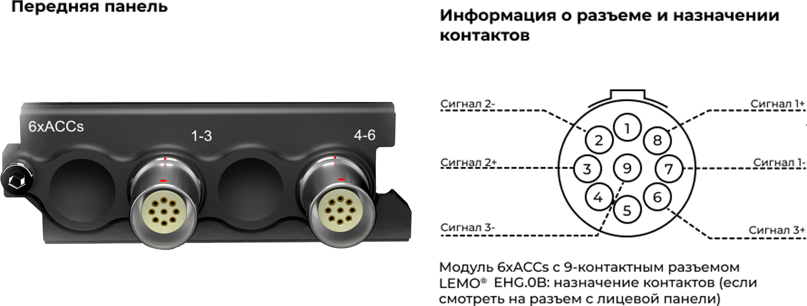
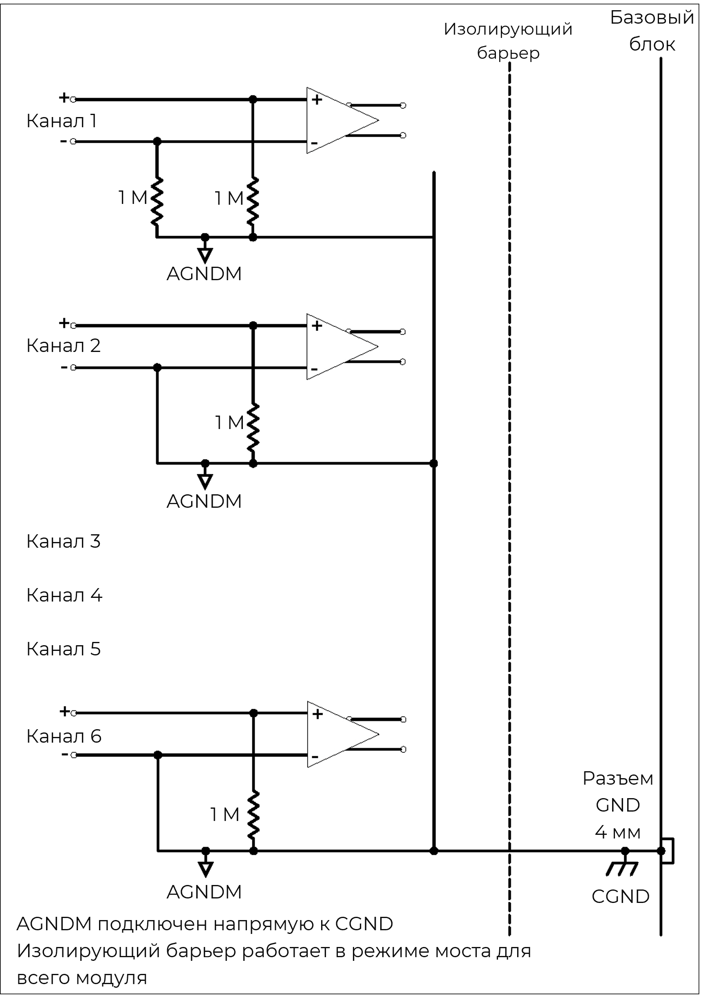
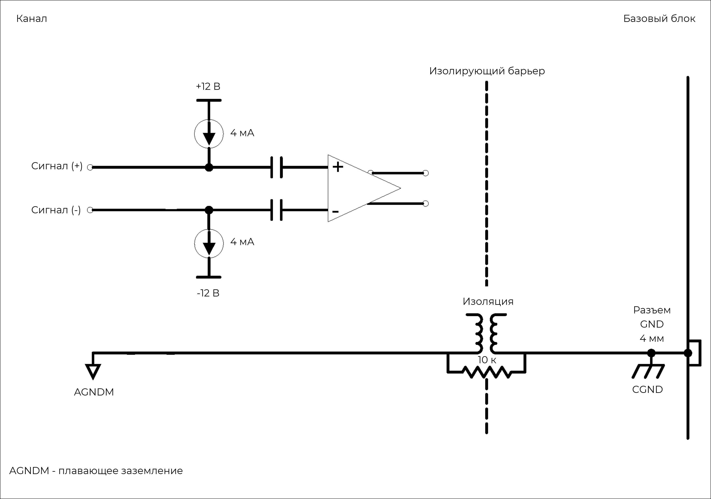
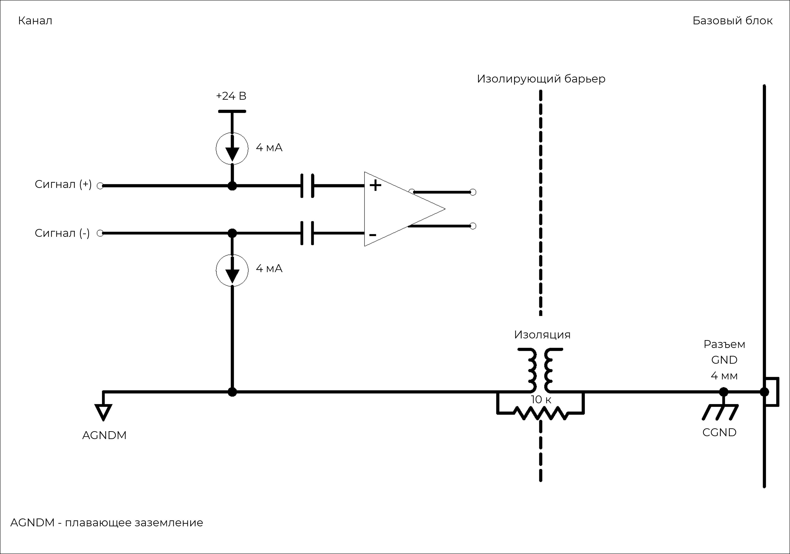
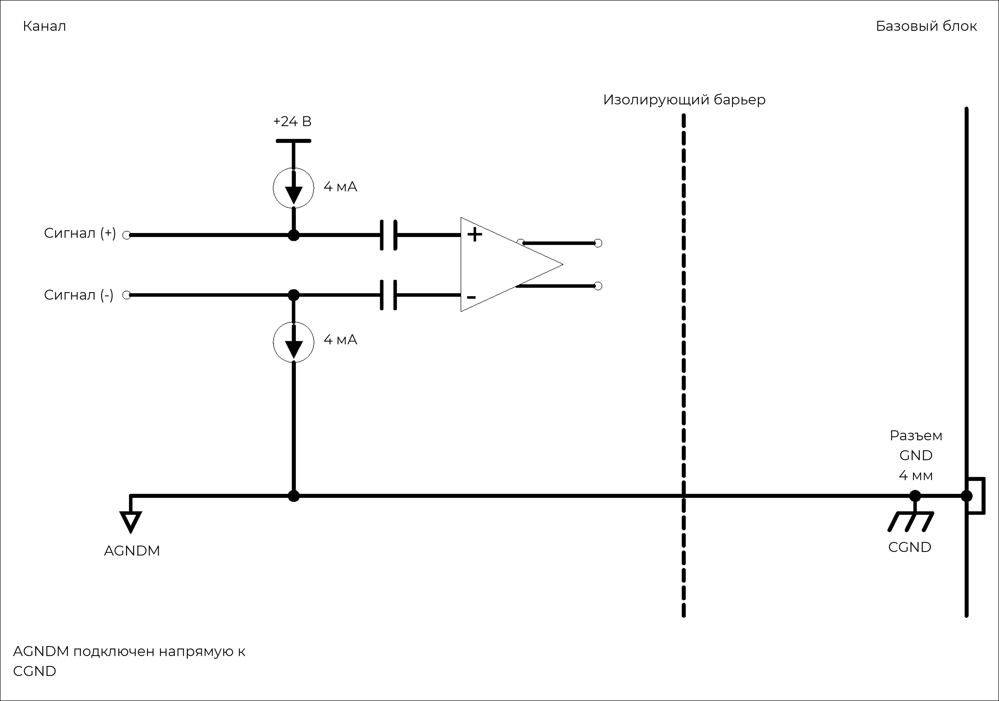
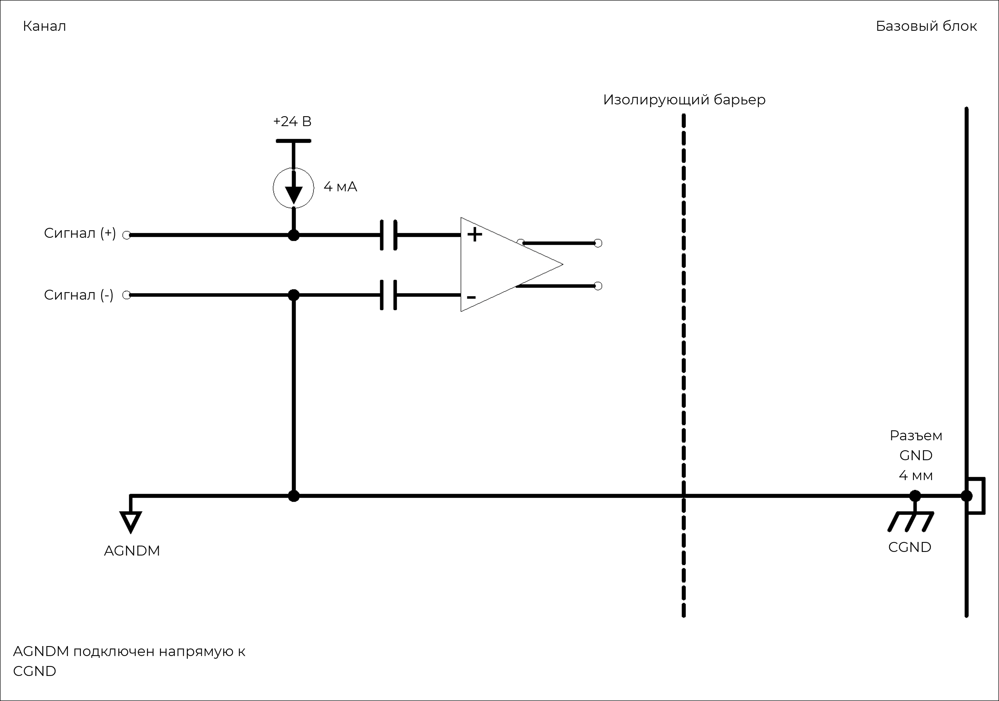

### **Описание**

Модуль 6xACCs можно использовать с ICP®-акселерометрами, датчиками силы и давления, а также для измерения аналоговых сигналов напряжения. Все 6 каналов работают независимо друг от друга. Для каждого можно отдельно настроить режим, усиление и развязку. Модуль можно использовать:

•           с любыми ICP®-датчиками, обычно применяемыми для измерения вибрации, ускорения, силы или давления

•           с любым источником напряжения до ±10 В в режиме ввода напряжения

{width=915px height=350px}

### **Функции**

  <table style="border-collapse: collapse; width: 100%;">
    <tbody>
      <tr>
        <td style="border: 1px solid #ccc; padding: 8px; vertical-align: top;">
          <ul style="margin: 0; padding-left: 1.2em;">
            <li>6 каналов</li>
            <li>Два входных режима:
                <ul style="padding-left: 1.5em; margin-top: 4px; margin-bottom: 4px;">
                    <li>Режим ICP® с пост. током 4 мА при возбуждении &plusmn;12 В или 24 В</li>
                    <li>Режим входного сигнала напряжения с развязкой по пост. или перем. току</li>
                </ul>
            </li>
            <li>Поддержка TEDS IEEE 1451.4 V0.9, V1.0</li>
            <li>Разрешение 24 бит</li>
            <li>Входные диапазоны: &plusmn;100 мВ, 1 В и 10 В</li>
            <li>Широкие возможности настройки для односторонних и трехосевых датчиков</li>
          </ul>
        </td>
        <td style="border: 1px solid #ccc; padding: 8px; vertical-align: top;">
          <ul style="margin: 0; padding-left: 1.2em;">
            <li>Поддержка широкого ряда промышленных триаксиальных кабелей</li>
            <li>Отслеживание коротких замыканий и кабелей с разомкнутым контуром</li>
            <li>Цепь целостности сигнала и защита от перегрузки</li>
            <li>Отслеживание переполнения до и после фильтра</li>
            <li>Возможность выбора цифровых фильтров</li>
            <li>Низкое энергопотребление</li>
            <li>9-контактные разъемы LEMO® EHG 0B</li>
          </ul>
        </td>
      </tr>
      
      <tr>
        <th style="border: 1px solid #ccc; padding: 8px; text-align: left; vertical-align: top;">Интерфейс</th>
        <td style="border: 1px solid #ccc; padding: 8px;">
            ICP®-датчики 
            Аналоговые входные сигналы напряжения
        </td>
      </tr>
      <tr>
        <th style="border: 1px solid #ccc; padding: 8px; text-align: left; vertical-align: top;">Развязка по входу</th>
        <td style="border: 1px solid #ccc; padding: 8px;">
            Перем. ток (для режима ICP®) 
            Пост. или перем. ток (для режима измерения напряжения)
        </td>
      </tr>
      <tr>
        <th style="border: 1px solid #ccc; padding: 8px; text-align: left; vertical-align: top;">Частотная характеристика развязки по перем. току</th>
        <td style="border: 1px solid #ccc; padding: 8px;">
            <strong>Затухание:</strong> -3 дБ 
            <strong>Макс. частота:</strong> 0,16 Гц
        </td>
      </tr>
      <tr>
        <th style="border: 1px solid #ccc; padding: 8px; text-align: left; vertical-align: top;">Другие значения частоты дискретизации</th>
        <td style="border: 1px solid #ccc; padding: 8px;">Доступно через цифровые ФНЧ и децимацию</td>
      </tr>
      <tr>
        <th style="border: 1px solid #ccc; padding: 8px; text-align: left; vertical-align: top;">Дополнительные программируемые цифровые БИХ-фильтры</th>
        <td style="border: 1px solid #ccc; padding: 8px;">Полосовой фильтр и полосовой заградительный фильтр: 6 дБ на октаву; ФВЧ/ФНЧ: 12 дБ на октаву</td>
      </tr>
      <tr>
        <th style="border: 1px solid #ccc; padding: 8px; text-align: left; vertical-align: top;">Дополнительный ФВЧ первого порядка</th>
        <td style="border: 1px solid #ccc; padding: 8px;">-3 дБ при 1 Гц</td>
      </tr>
      <tr>
        <th style="border: 1px solid #ccc; padding: 8px; text-align: left; vertical-align: top;">Защита</th>
        <td style="border: 1px solid #ccc; padding: 8px;">
          ЭСР 2 кВ 
          Короткое замыкание между корпусом датчика и заземлением (для режима ICP®)
        </td>
      </tr>
      <tr>
        <th style="border: 1px solid #ccc; padding: 8px; text-align: left; vertical-align: top;">Гальваническая изоляция</th>
        <td style="border: 1px solid #ccc; padding: 8px;">50 В</td>
      </tr>
    </tbody>
  </table>

### **Характеристики**

  <table style="width: 100%; border-collapse: collapse;">
    <tbody>
     
      <tr>
        <th style="border: 1px solid #ccc; padding: 8px; text-align: left; vertical-align: top;">Полоса пропускания</th>
        <td style="border: 1px solid #ccc; padding: 8px;">Пост. ток до 49 кГц</td>
      </tr>
      <tr>
        <th style="border: 1px solid #ccc; padding: 8px; text-align: left; vertical-align: top;">Максимальная частота дискретизации на канал</th>
        <td style="border: 1px solid #ccc; padding: 8px;">102,4 Квыб/с</td>
      </tr>
      <tr>
        <th style="border: 1px solid #ccc; padding: 8px; text-align: left; vertical-align: top;">АЦП</th>
        <td style="border: 1px solid #ccc; padding: 8px;">24 бит</td>
      </tr>
      <tr>
        <th style="border: 1px solid #ccc; padding: 8px; text-align: left; vertical-align: top;">Передача данных</th>
        <td style="border: 1px solid #ccc; padding: 8px;">24 бит</td>
      </tr>
      <tr>
        <th style="border: 1px solid #ccc; padding: 8px; text-align: left; vertical-align: top;">Диапазоны входного напряжения (пик)</th>
        <td style="border: 1px solid #ccc; padding: 8px;">&plusmn;100 мВ, &plusmn;1 В, &plusmn;10 В</td>
      </tr>
      <tr>
        <th style="border: 1px solid #ccc; padding: 8px; text-align: left; vertical-align: top;">Режим ICP®</th>
        <td style="border: 1px solid #ccc; padding: 8px;">Постоянный ток 4 мА при возбуждении &plusmn;12/24 В</td>
      </tr>
      <tr>
        <th style="border: 1px solid #ccc; padding: 8px; text-align: left; vertical-align: top;">Параметры входного смещения</th>
        <td style="border: 1px solid #ccc; padding: 8px;">
          <strong>Дифференциальное смещение (балансируемое):</strong> Положительный и отрицательный входы сигнала подключены по линии 1 МОм к плавающему заземлению.  
          <strong>Несимметричное смещение (небалансируемое):</strong> Положительный вход сигнала подключен к плавающему заземлению по линии 1 МОм; отрицательный вход сигнала подключен к плавающему заземлению.  
          <strong>Несимметричное заземление (небалансируемое):</strong> Положительный вход сигнала подключен к заземлению по линии 1 МОм; отрицательный вход сигнала подключен к заземлению.
        </td>
      </tr>
      <tr>
        <th style="border: 1px solid #ccc; padding: 8px; text-align: left; vertical-align: top;">Входное сопротивление</th>
        <td style="border: 1px solid #ccc; padding: 8px;">
          <strong>Дифференциальное:</strong> 2 МОм || 80 пФ 
          <strong>Несимметричное:</strong> 1 МОм || 100 пФ
        </td>
      </tr>
      <tr>
        <th style="border: 1px solid #ccc; padding: 8px; text-align: left; vertical-align: top;">Цифровой ФНЧ <small>Шкала фильтра: частота дискретизации</small></th>
        <td style="border: 1px solid #ccc; padding: 8px;">
          <strong>Полоса пропускания:</strong> частота дискретизации &times; 0,45 Гц 
          <strong>Полоса задержания:</strong> частота дискретизации &times; 0,55 Гц 
          <strong>Неравномерность в полосе пропускания:</strong> &plusmn;0,005 дБ 
          <strong>Затухание в полосе задержания:</strong> 100 дБ
        </td>
      </tr>
      <tr>
        <th style="border: 1px solid #ccc; padding: 8px; text-align: left; vertical-align: top;">Погрешность на фазу <small>Каналы в сходном диапазоне</small></th>
        <td style="border: 1px solid #ccc; padding: 8px;">Стандартно: &lt; 0,2&deg; при 10 кГц</td>
      </tr>
    </tbody>
  </table>

  <table style="width: 100%; border-collapse: collapse; margin-bottom: 20px;">
    <thead>
      <tr>
        <th style="border: 1px solid #ccc; padding: 8px; text-align: left; ">Характеристика</th>
        <th style="border: 1px solid #ccc; padding: 8px; text-align: left; ">Входной диапазон (пик)</th>
        <th style="border: 1px solid #ccc; padding: 8px; text-align: left; ">% показания + % диапазона</th>
      </tr>
    </thead>
    <tbody>
      <tr>
        <th style="border: 1px solid #ccc; padding: 8px; text-align: left;  vertical-align: middle;" rowspan="3">Точность напряжения пост. тока</th>
        <td style="border: 1px solid #ccc; padding: 8px;">&plusmn;100 мВ</td>
        <td style="border: 1px solid #ccc; padding: 8px;">0,200% + 0,200%</td>
      </tr>
      <tr>
        <td style="border: 1px solid #ccc; padding: 8px;">&plusmn;1 В</td>
        <td style="border: 1px solid #ccc; padding: 8px;">0,068% + 0,020%</td>
      </tr>
      <tr>
        <td style="border: 1px solid #ccc; padding: 8px;">&plusmn;10 В</td>
        <td style="border: 1px solid #ccc; padding: 8px;">0,113% + 0,015%</td>
      </tr>
    </tbody>
  </table>

  <table style="width: 100%; border-collapse: collapse; margin-bottom: 20px;">
    <thead>
      <tr>
        <th style="border: 1px solid #ccc; padding: 8px; text-align: left; ">Характеристика</th>
        <th style="border: 1px solid #ccc; padding: 8px; text-align: left; ">Диапазон частот</th>
        <th style="border: 1px solid #ccc; padding: 8px; text-align: left; ">Входной диапазон (пик)</th>
        <th style="border: 1px solid #ccc; padding: 8px; text-align: left; ">Гарантировано</th>
        <th style="border: 1px solid #ccc; padding: 8px; text-align: left; ">Стандартно</th>
      </tr>
    </thead>
    <tbody>
      <tr>
        <th style="border: 1px solid #ccc; padding: 8px; text-align: left;  vertical-align: middle;" rowspan="6">Шум <small>Оконечная нагрузка входа — резистор 50 Ом</small></th>
        <td style="border: 1px solid #ccc; padding: 8px;">от 10 Гц до 23 кГц</td>
        <td style="border: 1px solid #ccc; padding: 8px; vertical-align: middle;" rowspan="2">&plusmn;100 мВ</td>
        <td style="border: 1px solid #ccc; padding: 8px;">&lt; 2,6 мкВ СКЗ</td>
        <td style="border: 1px solid #ccc; padding: 8px;">&lt; 2,2 мкВ СКЗ</td>
      </tr>
      <tr>
        <td style="border: 1px solid #ccc; padding: 8px;">от 10 Гц до 49 кГц</td>
        <td style="border: 1px solid #ccc; padding: 8px;">&lt; 4 мкВ СКЗ</td>
        <td style="border: 1px solid #ccc; padding: 8px;">&lt; 3 мкВ СКЗ</td>
      </tr>
      <tr>
        <td style="border: 1px solid #ccc; padding: 8px;">от 10 Гц до 23 кГц</td>
        <td style="border: 1px solid #ccc; padding: 8px; vertical-align: middle;" rowspan="2">&plusmn;1 В</td>
        <td style="border: 1px solid #ccc; padding: 8px;">&lt; 9 мкВ СКЗ</td>
        <td style="border: 1px solid #ccc; padding: 8px;">&lt; 6 мкВ СКЗ</td>
      </tr>
      <tr>
        <td style="border: 1px solid #ccc; padding: 8px;">от 10 Гц до 49 кГц</td>
        <td style="border: 1px solid #ccc; padding: 8px;">&lt; 14 мкВ СКЗ</td>
        <td style="border: 1px solid #ccc; padding: 8px;">&lt; 10 мкВ СКЗ</td>
      </tr>
      <tr>
        <td style="border: 1px solid #ccc; padding: 8px;">от 10 Гц до 23 кГц</td>
        <td style="border: 1px solid #ccc; padding: 8px; vertical-align: middle;" rowspan="2">&plusmn;10 В</td>
        <td style="border: 1px solid #ccc; padding: 8px;">&lt; 45 мкВ СКЗ</td>
        <td style="border: 1px solid #ccc; padding: 8px;">&lt; 40 мкВ СКЗ</td>
      </tr>
      <tr>
        <td style="border: 1px solid #ccc; padding: 8px;">от 10 Гц до 49 кГц</td>
        <td style="border: 1px solid #ccc; padding: 8px;">&lt; 113 мкВ СКЗ</td>
        <td style="border: 1px solid #ccc; padding: 8px;">&lt; 84 мкВ СКЗ</td>
      </tr>
    </tbody>
  </table>

  <table style="width: 100%; border-collapse: collapse; margin-bottom: 20px;">
    <thead>
      <tr>
        <th style="border: 1px solid #ccc; padding: 8px; text-align: left; ">Характеристика</th>
        <th style="border: 1px solid #ccc; padding: 8px; text-align: left; ">Частота дискретизации</th>
        <th style="border: 1px solid #ccc; padding: 8px; text-align: left; ">Входной диапазон (пик)</th>
        <th style="border: 1px solid #ccc; padding: 8px; text-align: left; ">Затухание <small>(уровень входного сигнала 100% от полного диапазона)</small></th>
      </tr>
    </thead>
    <tbody>
      <tr>
        <th style="border: 1px solid #ccc; padding: 8px; text-align: left;  vertical-align: middle;" rowspan="6">Неравномерность амплитудной хар-ки <small>Относительно 1 кГц  Измерено до 0,39 × частота дискретизации</small></th>
        <td style="border: 1px solid #ccc; padding: 8px;">51,2 Квыб/с</td>
        <td style="border: 1px solid #ccc; padding: 8px; vertical-align: middle;" rowspan="2">&plusmn;100 мВ</td>
        <td style="border: 1px solid #ccc; padding: 8px;">-0,06 дБ</td>
      </tr>
      <tr>
        <td style="border: 1px solid #ccc; padding: 8px;">102,4 Квыб/с</td>
        <td style="border: 1px solid #ccc; padding: 8px;">-0,10 дБ</td>
      </tr>
      <tr>
        <td style="border: 1px solid #ccc; padding: 8px;">51,2 Квыб/с</td>
        <td style="border: 1px solid #ccc; padding: 8px; vertical-align: middle;" rowspan="2">&plusmn;1 В</td>
        <td style="border: 1px solid #ccc; padding: 8px;">-0,04 дБ</td>
      </tr>
      <tr>
        <td style="border: 1px solid #ccc; padding: 8px;">102,4 Квыб/с</td>
        <td style="border: 1px solid #ccc; padding: 8px;">-0,05 дБ</td>
      </tr>
      <tr>
        <td style="border: 1px solid #ccc; padding: 8px;">51,2 Квыб/с</td>
        <td style="border: 1px solid #ccc; padding: 8px; vertical-align: middle;" rowspan="2">&plusmn;10 В</td>
        <td style="border: 1px solid #ccc; padding: 8px;">-0,03 дБ</td>
      </tr>
      <tr>
        <td style="border: 1px solid #ccc; padding: 8px;">102,4 Квыб/с</td>
        <td style="border: 1px solid #ccc; padding: 8px;">-0,04 дБ</td>
      </tr>
    </tbody>
  </table>
  
  <table style="width: 100%; border-collapse: collapse;">
    <thead>
      <tr>
        <th style="border: 1px solid #ccc; padding: 8px; text-align: left; ">Характеристика</th>
        <th style="border: 1px solid #ccc; padding: 8px; text-align: left; ">Входной диапазон (пик)</th>
        <th style="border: 1px solid #ccc; padding: 8px; text-align: left; ">Гарантировано</th>
        <th style="border: 1px solid #ccc; padding: 8px; text-align: left; ">Стандартно</th>
      </tr>
    </thead>
    <tbody>
      <tr>
        <th style="border: 1px solid #ccc; padding: 8px; text-align: left;  vertical-align: middle;" rowspan="3">Взаимное влияние</th>
        <td style="border: 1px solid #ccc; padding: 8px;">&plusmn;100 мВ</td>
        <td style="border: 1px solid #ccc; padding: 8px;">113 дБ</td>
        <td style="border: 1px solid #ccc; padding: 8px;">118 дБ</td>
      </tr>
      <tr>
        <td style="border: 1px solid #ccc; padding: 8px;">&plusmn;1 В</td>
        <td style="border: 1px solid #ccc; padding: 8px;">110 дБ</td>
        <td style="border: 1px solid #ccc; padding: 8px;">115 дБ</td>
      </tr>
      <tr>
        <td style="border: 1px solid #ccc; padding: 8px;">&plusmn;10 В</td>
        <td style="border: 1px solid #ccc; padding: 8px;">102 дБ</td>
        <td style="border: 1px solid #ccc; padding: 8px;">107 дБ</td>
      </tr>
    </tbody>
  </table>
 

!!! info "Информация"
    Информация о параметрах модулей и условиях измерения, используемых во время измерений для определения технических характеристик, доступна по запросу.

### **Функциональная схема на канал**

{width=915px height=350px}

##### *Режим измерения напряжения модуля 6xACCs (на канал).*

{width=915px height=350px}

##### *Режим ICP*® *модуля 6xACCs (на канал).*

### **Подключение акселерометров**

6xACCs поддерживает входные сигналы от одно- и трехосевых акселерометров ICP®. Конфигурация разъемов на передней панели обеспечивает удобное подключение к двум трехосевым датчикам на модуль. На схеме назначения контактов 9-контактного разъема LEMO® EHG.0B показаны контакты для подключения сигнала по каждой оси X, Y и Z и общего выхода трехосевого датчика.

{width=915px height=350px}

### **Варианты заземления**

Для модуля 6xACCs предусмотрено четыре варианта заземления режима изм. напряжения (аналоговый вход):

•           Дифференциальное смещение (балансируемое смещение):

\-     Оба входа подключены по линии 1 МОм к плавающему заземлению.

•           Дифференциальное заземление (балансируемое заземление):

\-     Оба входа подключены по линии 1 МОм напрямую к заземлению.

•           Несимметричное смещение (небалансируемое смещение):

\-     Один вход подключен по линии 1 МОм к плавающему заземлению, а другой -- напрямую к плавающему заземлению.

•           Несимметричное заземление (небалансируемое заземление):

\-     Один вход подключен по линии 1 МОм к плавающему заземлению, а другой -- напрямую к заземлению.

### **Схемы заземления: режим изм. напряжения**

{width=915px height=350px}

##### *Модуль* 6xACCs *в режиме изм. напряжения с дифференциальным смещением (на канал)*

{width=915px height=350px}

##### ***Модуль*** **6xACCs *в режиме изм. напряжения с несимметричным смещением (на канал)***

{width=915px height=350px}

##### ***Модуль*** **6xACCs *в режиме изм. напряжения с дифференциальным заземлением (влияет на весь модуль)***

{width=915px height=350px}

##### ***Модуль*** **6xACCs *в режиме изм. напряжения с несимметричным заземлением (влияет на весь модуль)***

Для каждого канала модуля 6xACCs тип заземления можно настроить отдельно, однако при выборе варианта заземления на любом одном канале изолирующий барьер модуля переходит в режим моста (т.е. AGNDM всех 6 каналов будут напрямую подключены к CGND).

{width=915px height=350px}

##### ***Настройка заземления*** **6xACCs *влияет на все 6 каналов.***

### **Схемы возбуждения: режим ICP**®

При использовании режима входа ICP® с возбуждением током 4 мА предусмотрено два варианта смещения. Настройки смещения не зависят от вариантов заземления. В таблице ниже приведены различные возможные настройки модуля 6xACCs в режиме входа ICP®:

| **Напряжение возбуждения** | **Параметры смещения**              | **Варианты заземления**             |
|----------------------------|-------------------------------------|-------------------------------------|
| ±12 В (симметричное)       | Дифференциальное                    | Заземление или плавающее заземление |
| 24 В (асимметричное)       | Дифференциальное или несимметричное | Заземление или плавающее заземление |

*Настройки модуля 6xACCs в режиме входа ICP*® *с возбуждением током 4 мА*

{width=915px height=350px}

##### ***Модуль 6xACCs в режиме ICP***® ***с возбуждением током 4 мА, выбрано возбуждение ±12 В, дифференциальное смещение и плавающее заземление***

{width=915px height=350px}

##### ***Модуль 6xACCs в режиме ICP***® ***с возбуждением током 4 мА, выбрано возбуждение ±12 В, дифференциальное смещение и заземление***

{width=915px height=350px}

##### ***Модуль 6xACCs в режиме ICP® с возбуждением током 4 мА, выбрано возбуждение 24 В, дифференциальное смещение и плавающее заземление***

{width=915px height=350px}

##### ***Модуль 6xACCs в режиме ICP***® ***с возбуждением током 4 мА, выбрано возбуждение 24 В, дифференциальное смещение и заземление***

{width=915px height=350px}

##### ***Модуль 6xACCs в режиме ICP***® ***с возбуждением током 4 мА, выбрано возбуждение 24 В, несимметричное смещение и плавающее заземление***

{width=915px height=350px}

##### ***Модуль 6xACCs в режиме ICP***® ***с возбуждением током 4 мА, выбрано возбуждение 24 В, несимметричное смещение и заземление.***

