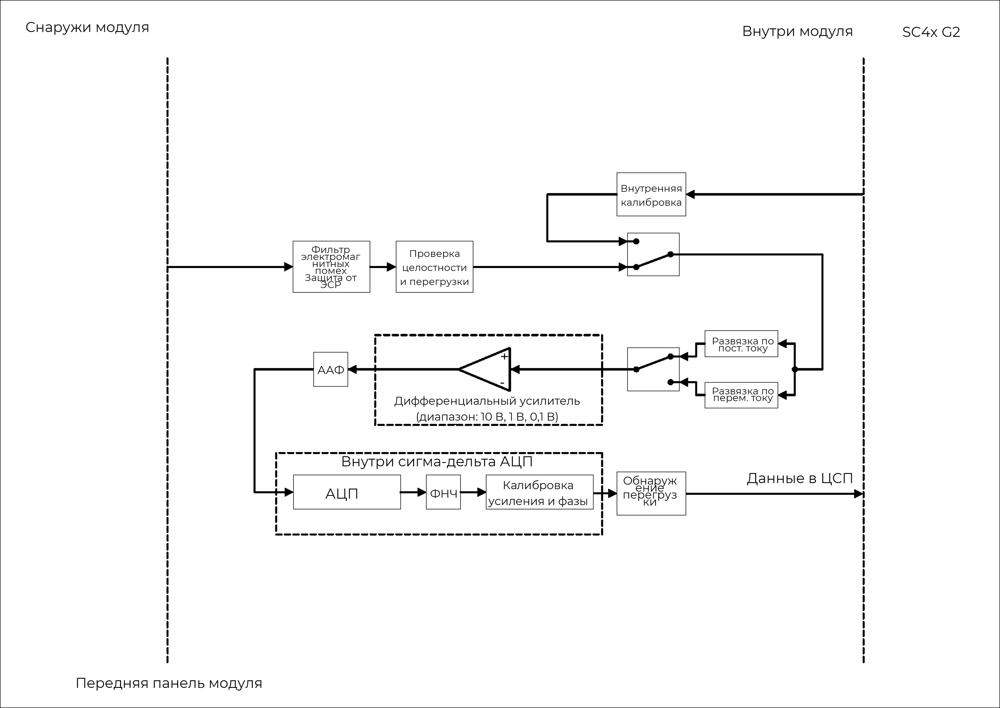
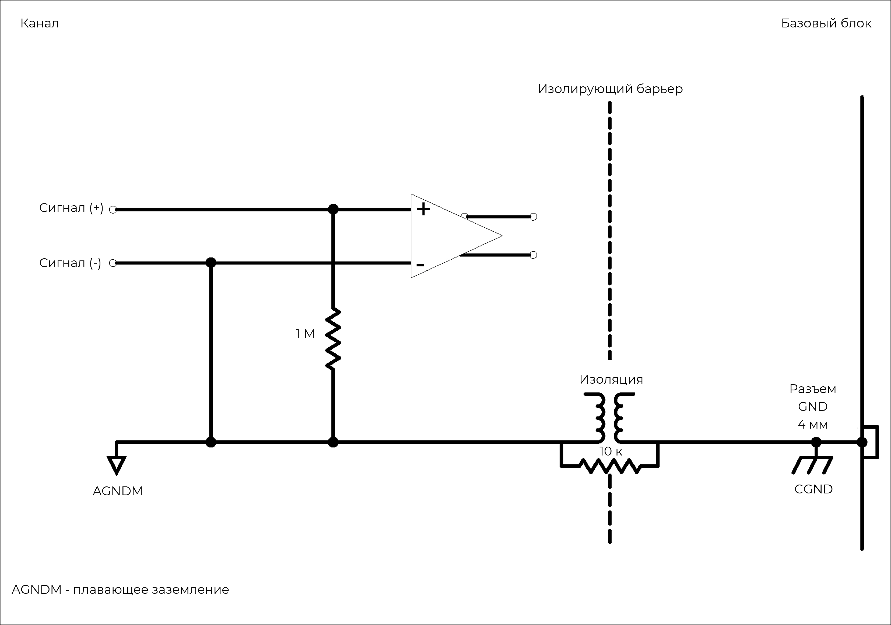
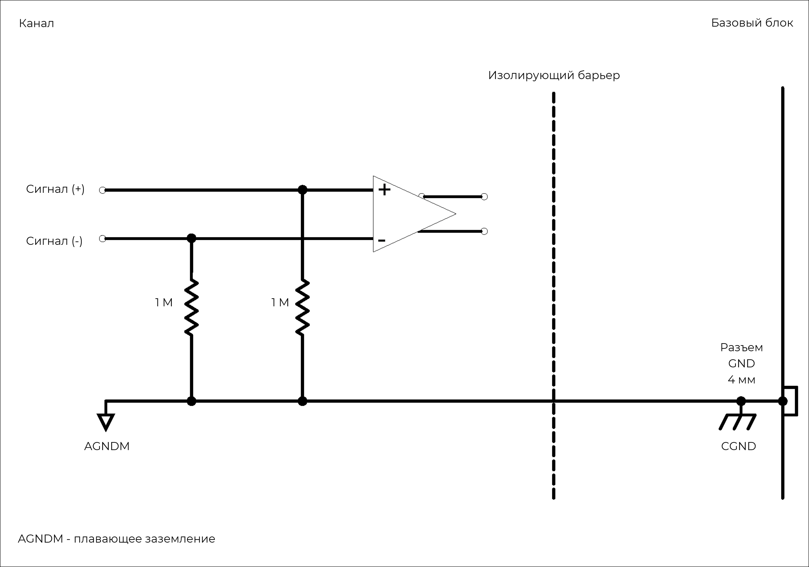
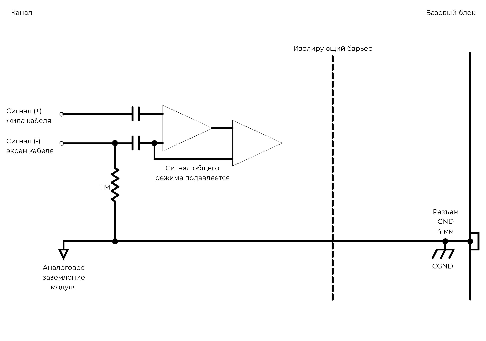
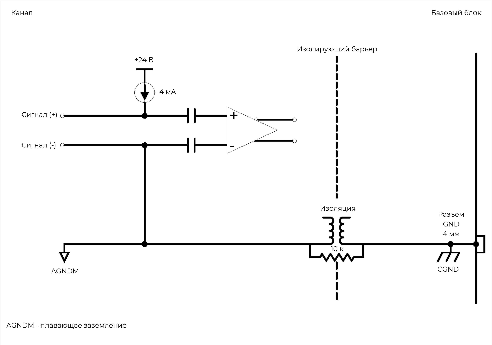
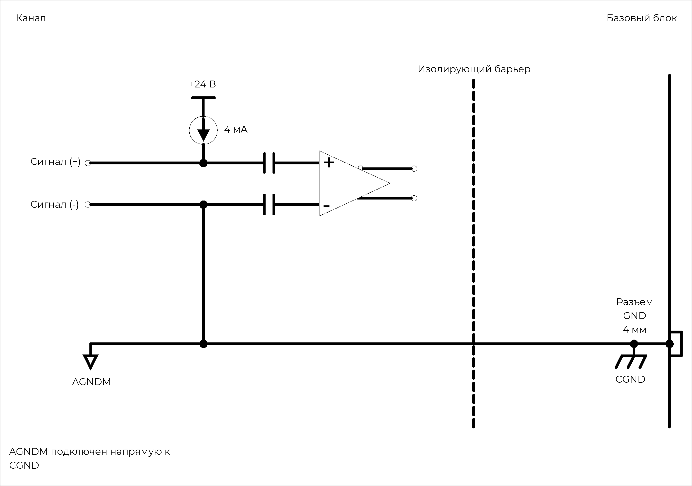

### **Описание**

Модуль 6xCHGs/ACCs можно использовать с ICP®-акселерометрами, датчиками силы и давления, кварцевыми и пьезокерамическими датчиками, а также для измерения аналоговых сигналов напряжения. Модуль можно использовать в двух режимах:

·        режим 6xCHGs -- 6 каналов измерения зарядовых сигналов,

·        режим 6xACCs – 6 каналов измерения напряжения до ±10 В и сигналов ICP® датчиков:

{width=915px height=350px}

!!! note "ПРЕДУПРЕЖДЕНИЕ ОБ ЭЛЕКТРОСТАТИЧЕСКИХ РАЗРЯДАХ"
    Входы модуля 6xCHGs/ACCs чувствительны к электростатическим разрядам. Прежде чем подключать кабель или разъем к модулю 6xCHGs/ACCs, принимайте меры по снятию статического электричества, которое может на них накапливаться.

### **Функции режима 6xACCs (входной сигнал напряжения и ICP**®**)**

  <table style="border-collapse: collapse; width: 100%;">
    <tbody>
      <tr>
        <th colspan="2" style="border: 1px solid #ccc; padding: 8px; text-align: left;  font-size: 1.1em;">
          Функции режима входного сигнала напряжения и ICP®
        </th>
      </tr>
      <tr>
        <td style="border: 1px solid #ccc; padding: 8px; vertical-align: top;">
          <ul style="margin: 0; padding-left: 1.2em;">
            <li>6 каналов</li>
            <li>Режим ICP® с пост. током 4 мА при возбуждении 24 В</li>
            <li>Режим входного сигнала напряжения с развязкой по пост. или перем. току</li>
            <li>Поддержка TEDS IEEE 1451.4 V0.9, V1.0 (класс 1)</li>
            <li>Разрешение 24 бит, выборка 102,4 квыб/с</li>
            <li>Широкие возможности настройки для подключения односторонних и трехосевых датчиков</li>
            <li>Поддержка широкого ряда промышленных триаксиальных кабелей</li>
          </ul>
        </td>
        <td style="border: 1px solid #ccc; padding: 8px; vertical-align: top;">
          <ul style="margin: 0; padding-left: 1.2em;">
            <li>Отслеживание коротких замыканий и кабелей с разомкнутым контуром</li>
            <li>Цепь целостности сигнала и защита от перегрузки</li>
            <li>Отслеживание переполнения до и после фильтра</li>
            <li>Возможность выбора цифровых фильтров высоких и низких частот</li>
            <li>Низкое энергопотребление</li>
            <li>9-контактные разъемы LEMO® EHG 0B</li>
          </ul>
        </td>
      </tr>
      
      <tr>
        <th style="border: 1px solid #ccc; padding: 8px; text-align: left; vertical-align: top;">Интерфейс</th>
        <td style="border: 1px solid #ccc; padding: 8px;">
            ICP®-датчики 
            Аналоговые входные сигналы напряжения
        </td>
      </tr>
      <tr>
        <th style="border: 1px solid #ccc; padding: 8px; text-align: left; vertical-align: top;">Развязка по входу</th>
        <td style="border: 1px solid #ccc; padding: 8px;">
            Перем. ток (для режима ICP®) 
            Пост. или перем. ток (в режиме измерения напряжения)
        </td>
      </tr>
      <tr>
        <th style="border: 1px solid #ccc; padding: 8px; text-align: left; vertical-align: top;">Частотная характеристика развязки по перем. току</th>
        <td style="border: 1px solid #ccc; padding: 8px;">
            <strong>Затухание:</strong> -3 дБ 
            <strong>Макс. частота:</strong> 0,16 Гц
        </td>
      </tr>
      <tr>
        <th style="border: 1px solid #ccc; padding: 8px; text-align: left; vertical-align: top;">Другие значения частоты дискретизации</th>
        <td style="border: 1px solid #ccc; padding: 8px;">Доступно через цифровые ФНЧ и децимацию</td>
      </tr>
      <tr>
        <th style="border: 1px solid #ccc; padding: 8px; text-align: left; vertical-align: top;">Дополнительный ФВЧ первого порядка</th>
        <td style="border: 1px solid #ccc; padding: 8px;">-3 дБ при 1 Гц</td>
      </tr>
       <tr>
        <th style="border: 1px solid #ccc; padding: 8px; text-align: left; vertical-align: top;">Калибровка модуля</th>
        <td style="border: 1px solid #ccc; padding: 8px;">Внутренняя калибровка амплитуды и фазы</td>
      </tr>
      <tr>
        <th style="border: 1px solid #ccc; padding: 8px; text-align: left; vertical-align: top;">Защита</th>
        <td style="border: 1px solid #ccc; padding: 8px;">
          ЭСР 2 кВ 
          Короткое замыкание между корпусом датчика и заземлением (для режима ICP®)
        </td>
      </tr>
      <tr>
        <th style="border: 1px solid #ccc; padding: 8px; text-align: left; vertical-align: top;">Гальваническая изоляция</th>
        <td style="border: 1px solid #ccc; padding: 8px;">50 В</td>
      </tr>
    </tbody>
  </table>

##### *Функции режима 6xACCs (входной сигнал напряжения и ICP*®*) модуля  6xCHGs/ACCs*

### **Характеристики режима 6xACCs (входной сигнал напряжения и ICP®)**

  <table style="width: 100%; border-collapse: collapse;">
    <tbody>
      <tr>
        <th style="border: 1px solid #ccc; padding: 8px; text-align: left;  width: 30%;">Полоса пропускания -3 дБ</th>
        <td colspan="2" style="border: 1px solid #ccc; padding: 8px;">Пост. ток до 44,3 кГц</td>
      </tr>
      <tr>
        <th style="border: 1px solid #ccc; padding: 8px; text-align: left; ">Максимальная частота дискретизации на канал</th>
        <td colspan="2" style="border: 1px solid #ccc; padding: 8px;">102,4 Квыб/с</td>
      </tr>
      <tr>
        <th style="border: 1px solid #ccc; padding: 8px; text-align: left; ">АЦП</th>
        <td colspan="2" style="border: 1px solid #ccc; padding: 8px;">24 бит</td>
      </tr>
      <tr>
        <th style="border: 1px solid #ccc; padding: 8px; text-align: left; ">Диапазоны входного напряжения (пик)</th>
        <td colspan="2" style="border: 1px solid #ccc; padding: 8px;">&plusmn;100 мВ, &plusmn;1 В, &plusmn;10 В</td>
      </tr>
      <tr>
        <th style="border: 1px solid #ccc; padding: 8px; text-align: left; ">Режим ICP®</th>
        <td colspan="2" style="border: 1px solid #ccc; padding: 8px;">Постоянный ток 4 мА при возбуждении 24 В</td>
      </tr>

      <tr>
        <th style="border: 1px solid #ccc; padding: 8px; text-align: left;  vertical-align: middle;" rowspan="3">Параметры входного смещения</th>
        <td style="border: 1px solid #ccc; padding: 8px;"><strong>Дифференциальное смещение (балансируемое)</strong></td>
        <td style="border: 1px solid #ccc; padding: 8px;">Положительный и отрицательный входы сигнала подключены по линии 1 МОм к плавающему заземлению.</td>
      </tr>
      <tr>
        <td style="border: 1px solid #ccc; padding: 8px;"><strong>Несимметричное смещение (небалансируемое)</strong></td>
        <td style="border: 1px solid #ccc; padding: 8px;">Положительный вход сигнала подключен к плавающему заземлению по линии 1 МОм; отрицательный вход сигнала подключен к плавающему заземлению.</td>
      </tr>
      <tr>
        <td style="border: 1px solid #ccc; padding: 8px;"><strong>Несимметричное заземление (небалансируемое)</strong></td>
        <td style="border: 1px solid #ccc; padding: 8px;">Положительный вход сигнала подключен к заземлению по линии 1 МОм; отрицательный вход сигнала подключен к заземлению.</td>
      </tr>

      <tr>
        <th style="border: 1px solid #ccc; padding: 8px; text-align: left;  vertical-align: middle;" rowspan="2">Входное сопротивление</th>
        <td style="border: 1px solid #ccc; padding: 8px;">Дифференциальное</td>
        <td style="border: 1px solid #ccc; padding: 8px;">2 МОм || 80 пФ</td>
      </tr>
      <tr>
        <td style="border: 1px solid #ccc; padding: 8px;">Одностороннее</td>
        <td style="border: 1px solid #ccc; padding: 8px;">1 МОм || 100 пФ</td>
      </tr>

      <tr>
        <th style="border: 1px solid #ccc; padding: 8px; text-align: left;  vertical-align: middle;" rowspan="4">Цифровой ФНЧ <small>Шкала фильтра: частота дискретизации</small></th>
        <td style="border: 1px solid #ccc; padding: 8px;">Полоса пропускания</td>
        <td style="border: 1px solid #ccc; padding: 8px;">частота дискретизации &times; 0,433 Гц</td>
      </tr>
      <tr>
        <td style="border: 1px solid #ccc; padding: 8px;">Полоса задержания</td>
        <td style="border: 1px solid #ccc; padding: 8px;">частота дискретизации &times; 0,499 Гц</td>
      </tr>
      <tr>
        <td style="border: 1px solid #ccc; padding: 8px;">Неравномерность в полосе пропускания</td>
        <td style="border: 1px solid #ccc; padding: 8px;">&plusmn;0,005 дБ</td>
      </tr>
      <tr>
        <td style="border: 1px solid #ccc; padding: 8px;">Затухание в полосе задержания</td>
        <td style="border: 1px solid #ccc; padding: 8px;">105 дБ</td>
      </tr>
      
      <tr>
        <th style="border: 1px solid #ccc; padding: 8px; text-align: left; ">Погрешность на фазу для режима входного сигнала напряжения/ICP® <small>Все каналы в режиме входного сигнала напряжения/ICP®</small></th>
        <td style="border: 1px solid #ccc; padding: 8px;">Стандартно</td>
        <td style="border: 1px solid #ccc; padding: 8px;">&plusmn;0,2&deg; при 10 кГц</td>
      </tr>
      <tr>
        <th style="border: 1px solid #ccc; padding: 8px; text-align: left; ">Погрешность на фазу для режима входного сигнала напряжения и заряда/ICP® <small>Каналы в комбинации режима входного сигнала напряжения и заряда/ICP®</small></th>
        <td style="border: 1px solid #ccc; padding: 8px;">Стандартно</td>
        <td style="border: 1px solid #ccc; padding: 8px;">&plusmn;0,7&deg; при 10 кГц</td>
      </tr>
    </tbody>
  </table>

  <table style="width: 100%; border-collapse: collapse; margin-bottom: 20px;">
    <thead>
      <tr>
        <th style="border: 1px solid #ccc; padding: 8px; text-align: left; ">Характеристика</th>
        <th style="border: 1px solid #ccc; padding: 8px; text-align: left; ">Входной диапазон (пик)</th>
        <th style="border: 1px solid #ccc; padding: 8px; text-align: left; ">% показания + % диапазона</th>
      </tr>
    </thead>
    <tbody>
      <tr>
        <th style="border: 1px solid #ccc; padding: 8px; text-align: left; vertical-align: middle;" rowspan="3">Точность напряжения пост. тока</th>
        <td style="border: 1px solid #ccc; padding: 8px;">&plusmn;100 мВ</td>
        <td style="border: 1px solid #ccc; padding: 8px;">0,200% + 0,200%</td>
      </tr>
      <tr>
        <td style="border: 1px solid #ccc; padding: 8px;">&plusmn;1 В</td>
        <td style="border: 1px solid #ccc; padding: 8px;">0,068% + 0,020%</td>
      </tr>
      <tr>
        <td style="border: 1px solid #ccc; padding: 8px;">&plusmn;10 В</td>
        <td style="border: 1px solid #ccc; padding: 8px;">0,113% + 0,015%</td>
      </tr>
    </tbody>
  </table>

  <table style="width: 100%; border-collapse: collapse; margin-bottom: 20px;">
    <thead>
      <tr>
        <th style="border: 1px solid #ccc; padding: 8px; text-align: left; ">Характеристика</th>
        <th style="border: 1px solid #ccc; padding: 8px; text-align: left; ">Диапазон частот</th>
        <th style="border: 1px solid #ccc; padding: 8px; text-align: left; ">Входной диапазон (пик)</th>
        <th style="border: 1px solid #ccc; padding: 8px; text-align: left; ">Гарантировано</th>
        <th style="border: 1px solid #ccc; padding: 8px; text-align: left; ">Стандартно</th>
      </tr>
    </thead>
    <tbody>
      <tr>
        <th style="border: 1px solid #ccc; padding: 8px; text-align: left;  vertical-align: middle;" rowspan="6">Шум <small>Оконечная нагрузка входа — резистор 50 Ом</small></th>
        <td style="border: 1px solid #ccc; padding: 8px;">от 10 Гц до 23 кГц</td>
        <td style="border: 1px solid #ccc; padding: 8px; vertical-align: middle;" rowspan="2">&plusmn;100 мВ</td>
        <td style="border: 1px solid #ccc; padding: 8px;">&lt; 2,6 мкВ СКЗ</td>
        <td style="border: 1px solid #ccc; padding: 8px;">&lt; 2,2 мкВ СКЗ</td>
      </tr>
      <tr>
        <td style="border: 1px solid #ccc; padding: 8px;">от 10 Гц до 49 кГц</td>
        <td style="border: 1px solid #ccc; padding: 8px;">&lt; 4 мкВ СКЗ</td>
        <td style="border: 1px solid #ccc; padding: 8px;">&lt; 3 мкВ СКЗ</td>
      </tr>
      <tr>
        <td style="border: 1px solid #ccc; padding: 8px;">от 10 Гц до 23 кГц</td>
        <td style="border: 1px solid #ccc; padding: 8px; vertical-align: middle;" rowspan="2">&plusmn;1 В</td>
        <td style="border: 1px solid #ccc; padding: 8px;">&lt; 9 мкВ СКЗ</td>
        <td style="border: 1px solid #ccc; padding: 8px;">&lt; 6 мкВ СКЗ</td>
      </tr>
      <tr>
        <td style="border: 1px solid #ccc; padding: 8px;">от 10 Гц до 49 кГц</td>
        <td style="border: 1px solid #ccc; padding: 8px;">&lt; 14 мкВ СКЗ</td>
        <td style="border: 1px solid #ccc; padding: 8px;">&lt; 10 мкВ СКЗ</td>
      </tr>
      <tr>
        <td style="border: 1px solid #ccc; padding: 8px;">от 10 Гц до 23 кГц</td>
        <td style="border: 1px solid #ccc; padding: 8px; vertical-align: middle;" rowspan="2">&plusmn;10 В</td>
        <td style="border: 1px solid #ccc; padding: 8px;">&lt; 45 мкВ СКЗ</td>
        <td style="border: 1px solid #ccc; padding: 8px;">&lt; 40 мкВ СКЗ</td>
      </tr>
      <tr>
        <td style="border: 1px solid #ccc; padding: 8px;">от 10 Гц до 49 кГц</td>
        <td style="border: 1px solid #ccc; padding: 8px;">&lt; 113 мкВ СКЗ</td>
        <td style="border: 1px solid #ccc; padding: 8px;">&lt; 84 мкВ СКЗ</td>
      </tr>
    </tbody>
  </table>

  <table style="width: 100%; border-collapse: collapse; margin-bottom: 20px;">
    <thead>
      <tr>
        <th style="border: 1px solid #ccc; padding: 8px; text-align: left; ">Характеристика</th>
        <th style="border: 1px solid #ccc; padding: 8px; text-align: left; ">Частота дискретизации</th>
        <th style="border: 1px solid #ccc; padding: 8px; text-align: left; ">Входной диапазон (пик)</th>
        <th style="border: 1px solid #ccc; padding: 8px; text-align: left; ">Затухание <small>(уровень входного сигнала 100% от полного диапазона)</small></th>
      </tr>
    </thead>
    <tbody>
      <tr>
        <th style="border: 1px solid #ccc; padding: 8px; text-align: left;  vertical-align: middle;" rowspan="6">Неравномерность амплитудной хар-ки <small>Относительно 1 кГц  Измерено от 50 Гц до 0,40 × частота дискретизации</small></th>
        <td style="border: 1px solid #ccc; padding: 8px;">51,2 Квыб/с</td>
        <td style="border: 1px solid #ccc; padding: 8px; vertical-align: middle;" rowspan="2">&plusmn;100 мВ</td>
        <td style="border: 1px solid #ccc; padding: 8px;">-0,06 дБ</td>
      </tr>
      <tr>
        <td style="border: 1px solid #ccc; padding: 8px;">102,4 Квыб/с</td>
        <td style="border: 1px solid #ccc; padding: 8px;">-0,10 дБ</td>
      </tr>
      <tr>
        <td style="border: 1px solid #ccc; padding: 8px;">51,2 Квыб/с</td>
        <td style="border: 1px solid #ccc; padding: 8px; vertical-align: middle;" rowspan="2">&plusmn;1 В</td>
        <td style="border: 1px solid #ccc; padding: 8px;">-0,04 дБ</td>
      </tr>
      <tr>
        <td style="border: 1px solid #ccc; padding: 8px;">102,4 Квыб/с</td>
        <td style="border: 1px solid #ccc; padding: 8px;">-0,05 дБ</td>
      </tr>
      <tr>
        <td style="border: 1px solid #ccc; padding: 8px;">51,2 Квыб/с</td>
        <td style="border: 1px solid #ccc; padding: 8px; vertical-align: middle;" rowspan="2">&plusmn;10 В</td>
        <td style="border: 1px solid #ccc; padding: 8px;">-0,03 дБ</td>
      </tr>
      <tr>
        <td style="border: 1px solid #ccc; padding: 8px;">102,4 Квыб/с</td>
        <td style="border: 1px solid #ccc; padding: 8px;">-0,04 дБ</td>
      </tr>
    </tbody>
  </table>
  
  <table style="width: 100%; border-collapse: collapse;">
    <thead>
      <tr>
        <th style="border: 1px solid #ccc; padding: 8px; text-align: left; ">Характеристика</th>
        <th style="border: 1px solid #ccc; padding: 8px; text-align: left; ">Входной диапазон (пик)</th>
        <th style="border: 1px solid #ccc; padding: 8px; text-align: left; ">Гарантировано</th>
        <th style="border: 1px solid #ccc; padding: 8px; text-align: left; ">Стандартно</th>
      </tr>
    </thead>
    <tbody>
      <tr>
        <th style="border: 1px solid #ccc; padding: 8px; text-align: left;  vertical-align: middle;" rowspan="3">Взаимное влияние</th>
        <td style="border: 1px solid #ccc; padding: 8px;">&plusmn;100 мВ</td>
        <td style="border: 1px solid #ccc; padding: 8px;">113 дБ</td>
        <td style="border: 1px solid #ccc; padding: 8px;">118 дБ</td>
      </tr>
      <tr>
        <td style="border: 1px solid #ccc; padding: 8px;">&plusmn;1 В</td>
        <td style="border: 1px solid #ccc; padding: 8px;">110 дБ</td>
        <td style="border: 1px solid #ccc; padding: 8px;">115 дБ</td>
      </tr>
      <tr>
        <td style="border: 1px solid #ccc; padding: 8px;">&plusmn;10 В</td>
        <td style="border: 1px solid #ccc; padding: 8px;">102 дБ</td>
        <td style="border: 1px solid #ccc; padding: 8px;">107 дБ</td>
      </tr>
    </tbody>
  </table>

##### *Характеристики режима 6xACCs (входной сигнал напряжения и ICP*®*) модуля  6xCHGs/ACCs.*

### **Функции режима 6xCHGs (входной сигнал заряд)**

  <table style="border-collapse: collapse; width: 100%;">
    <tbody>
      
      <tr>
        <td style="border: 1px solid #ccc; padding: 8px; vertical-align: top;">
          <ul style="margin: 0; padding-left: 1.2em;">
            <li>6 каналов</li>
            <li>Разрешение 24 бит, частота дискретизации 102,4 Квыб/с на канал, полоса пропускания 49 кГц</li>
            <li>Уход напряжения менее 4 мВ/ч при любой чувствительности и усилении</li>
            <li>Экран кабеля можно подсоединить или отсоединить от заземления модуля</li>
          </ul>
        </td>
        <td style="border: 1px solid #ccc; padding: 8px; vertical-align: top;">
          <ul style="margin: 0; padding-left: 1.2em;">
            <li>Низкое энергопотребление</li>
            <li>Высокое входное сопротивление</li>
            <li>Возможность выбора цифровых фильтров высоких и низких частот</li>
            <li>9-контактные разъемы LEMO® EHG 0B</li>
          </ul>
        </td>
      </tr>
      
      <tr>
        <th style="border: 1px solid #ccc; padding: 8px; text-align: left; vertical-align: top;">Интерфейс</th>
        <td style="border: 1px solid #ccc; padding: 8px;">Для пьезоэлектрических датчиков</td>
      </tr>
      <tr>
        <th style="border: 1px solid #ccc; padding: 8px; text-align: left; vertical-align: top;">Диапазон усилителя напряжения (пик)</th>
        <td style="border: 1px solid #ccc; padding: 8px;">&plusmn;100 мВ, &plusmn;1 В, &plusmn;10 В</td>
      </tr>
      <tr>
        <th style="border: 1px solid #ccc; padding: 8px; text-align: left; vertical-align: top;">Входной диапазон заряда (пик)</th>
        <td style="border: 1px solid #ccc; padding: 8px;">
          1 мВ/пКл: &plusmn;10 000 пКл 
          0,1 мВ/пКл: &plusmn;100 000 пКл 
          0,01 мВ/пКл: &plusmn;1 000 000 пКл
        </td>
      </tr>
      <tr>
        <th style="border: 1px solid #ccc; padding: 8px; text-align: left; vertical-align: top;">ФВЧ -3 дБ</th>
        <td style="border: 1px solid #ccc; padding: 8px;">
          1 мВ/пКл: 0,16 Гц 
          0,1 мВ/пКл: 0,16 Гц 
          0,01 мВ/пКл: 0,16 Гц
        </td>
      </tr>
      <tr>
        <th style="border: 1px solid #ccc; padding: 8px; text-align: left; vertical-align: top;">Другие значения частоты дискретизации</th>
        <td style="border: 1px solid #ccc; padding: 8px;">Доступно через цифровые ФНЧ и децимацию</td>
      </tr>
      <tr>
        <th style="border: 1px solid #ccc; padding: 8px; text-align: left; vertical-align: top;">Дополнительный ФВЧ первого порядка</th>
        <td style="border: 1px solid #ccc; padding: 8px;">-3 дБ при 1 Гц</td>
      </tr>
       <tr>
        <th style="border: 1px solid #ccc; padding: 8px; text-align: left; vertical-align: top;">Калибровка модуля</th>
        <td style="border: 1px solid #ccc; padding: 8px;">Внутренняя калибровка амплитуды и фазы</td>
      </tr>
      <tr>
        <th style="border: 1px solid #ccc; padding: 8px; text-align: left; vertical-align: top;">Защита</th>
        <td style="border: 1px solid #ccc; padding: 8px;">Серия 1 кОм (в линии)</td>
      </tr>
      <tr>
        <th style="border: 1px solid #ccc; padding: 8px; text-align: left; vertical-align: top;">Гальваническая изоляция</th>
        <td style="border: 1px solid #ccc; padding: 8px;">50 В</td>
      </tr>
    </tbody>
  </table>

##### *Функции режима 6xCHGs (входной сигнал заряд) модуля 6xCHGs/ACCs.*

### **Характеристики режима 6xCHGs (входной сигнал заряд)**

  <table style="width: 100%; border-collapse: collapse;">
    <tbody>
      <tr>
        <th style="border: 1px solid #ccc; padding: 8px; text-align: left;  width: 30%;">Полоса пропускания -3 дБ</th>
        <td colspan="3" style="border: 1px solid #ccc; padding: 8px;">от 1 Гц до 44,3 кГц</td>
      </tr>
      <tr>
        <th style="border: 1px solid #ccc; padding: 8px; text-align: left; ">Макс. частота дискретизации на канал</th>
        <td colspan="3" style="border: 1px solid #ccc; padding: 8px;">102,4 Квыб/с</td>
      </tr>
      <tr>
        <th style="border: 1px solid #ccc; padding: 8px; text-align: left; ">АЦП</th>
        <td colspan="3" style="border: 1px solid #ccc; padding: 8px;">24 бит</td>
      </tr>
      <tr>
        <th style="border: 1px solid #ccc; padding: 8px; text-align: left; ">Диапазоны входного напряжения (пик)</th>
        <td colspan="3" style="border: 1px solid #ccc; padding: 8px;">&plusmn;100 мВ, &plusmn;1 В, &plusmn;10 В</td>
      </tr>
      <tr>
        <th style="border: 1px solid #ccc; padding: 8px; text-align: left; ">Диапазоны чувствительности (пик)</th>
        <td colspan="3" style="border: 1px solid #ccc; padding: 8px;">1 мВ/пКл, 0,1 мВ/пКл, 0,01 мВ/пКл</td>
      </tr>

      <tr>
        <th style="border: 1px solid #ccc; padding: 8px; text-align: left;  vertical-align: middle;" rowspan="4">Параметры входного смещения</th>
        <td style="border: 1px solid #ccc; padding: 8px; vertical-align: middle;" rowspan="2">Несимметричное смещение</td>
        <td style="border: 1px solid #ccc; padding: 8px;">Экран кабеля отсоединен</td>
        <td style="border: 1px solid #ccc; padding: 8px;">Отрицательный вход сигнала (экран кабеля) подсоединен к плавающему заземлению через 1 МОм</td>
      </tr>
      <tr>
        <td style="border: 1px solid #ccc; padding: 8px;">Экран кабеля подсоединен</td>
        <td style="border: 1px solid #ccc; padding: 8px;">Отрицательный вход сигнала (экран кабеля) подсоединен к плавающему заземлению</td>
      </tr>
      <tr>
        <td style="border: 1px solid #ccc; padding: 8px; vertical-align: middle;" rowspan="2">Несимметричное заземление</td>
        <td style="border: 1px solid #ccc; padding: 8px;">Экран кабеля отсоединен</td>
        <td style="border: 1px solid #ccc; padding: 8px;">Отрицательный вход сигнала (экран кабеля) подсоединен к заземлению через 1 МОм</td>
      </tr>
      <tr>
        <td style="border: 1px solid #ccc; padding: 8px;">Экран кабеля подсоединен</td>
        <td style="border: 1px solid #ccc; padding: 8px;">Отрицательный вход сигнала (экран кабеля) подсоединен к заземлению</td>
      </tr>
      
      <tr>
        <th style="border: 1px solid #ccc; padding: 8px; text-align: left;  vertical-align: middle;" rowspan="4">Цифровой ФНЧ <small>Шкала фильтра: частота дискретизации</small></th>
        <td style="border: 1px solid #ccc; padding: 8px;" colspan="2">Полоса пропускания</td>
        <td style="border: 1px solid #ccc; padding: 8px;">частота дискретизации &times; 0,433 Гц</td>
      </tr>
      <tr>
        <td style="border: 1px solid #ccc; padding: 8px;" colspan="2">Полоса задержания</td>
        <td style="border: 1px solid #ccc; padding: 8px;">частота дискретизации &times; 0,499 Гц</td>
      </tr>
      <tr>
        <td style="border: 1px solid #ccc; padding: 8px;" colspan="2">Неравномерность в полосе пропускания</td>
        <td style="border: 1px solid #ccc; padding: 8px;">&plusmn;0,005 дБ</td>
      </tr>
      <tr>
        <td style="border: 1px solid #ccc; padding: 8px;" colspan="2">Затухание в полосе задержания</td>
        <td style="border: 1px solid #ccc; padding: 8px;">105 дБ</td>
      </tr>

      <tr>
        <th style="border: 1px solid #ccc; padding: 8px; text-align: left; ">Погрешность на фазу для режима заряда <small>Все каналы в режиме заряда</small></th>
        <td style="border: 1px solid #ccc; padding: 8px;">Стандартно</td>
        <td colspan="2" style="border: 1px solid #ccc; padding: 8px;">&lt; 0,5&deg; при 10 кГц</td>
      </tr>
      <tr>
        <th style="border: 1px solid #ccc; padding: 8px; text-align: left; ">Погрешность на фазу для режима входного сигнала напряжения и заряда/ICP® <small>Каналы в комбинации режима входного сигнала напряжения и заряда/ICP®</small></th>
        <td style="border: 1px solid #ccc; padding: 8px;">Стандартно</td>
        <td colspan="2" style="border: 1px solid #ccc; padding: 8px;">&plusmn;0,7&deg; при 10 кГц</td>
      </tr>
    </tbody>
  </table>

  <table style="width: 100%; border-collapse: collapse; margin-bottom: 20px;">
    <thead>
      <tr>
        <th style="border: 1px solid #ccc; padding: 8px; text-align: left; ">Характеристика</th>
        <th style="border: 1px solid #ccc; padding: 8px; text-align: left; ">Входной диапазон (пик)</th>
        <th style="border: 1px solid #ccc; padding: 8px; text-align: left; ">Диапазон чувствительности</th>
        <th style="border: 1px solid #ccc; padding: 8px; text-align: left; ">% диапазона</th>
      </tr>
    </thead>
    <tbody>
      <tr>
        <th style="border: 1px solid #ccc; padding: 8px; text-align: left;  vertical-align: middle;" rowspan="9">Точность напряжения перем. тока режима заряда <small>Измерено при 1 кГц</small></th>
        <td style="border: 1px solid #ccc; padding: 8px; vertical-align: middle;" rowspan="3">&plusmn;100 мВ</td>
        <td style="border: 1px solid #ccc; padding: 8px;">0,01 мВ/пКл</td>
        <td style="border: 1px solid #ccc; padding: 8px;">3,0%</td>
      </tr>
      <tr>
        <td style="border: 1px solid #ccc; padding: 8px;">0,1 мВ/пКл</td>
        <td style="border: 1px solid #ccc; padding: 8px;">3,1%</td>
      </tr>
      <tr>
        <td style="border: 1px solid #ccc; padding: 8px;">1 мВ/пКл</td>
        <td style="border: 1px solid #ccc; padding: 8px;">2,7%</td>
      </tr>
      <tr>
        <td style="border: 1px solid #ccc; padding: 8px; vertical-align: middle;" rowspan="3">&plusmn;1 В</td>
        <td style="border: 1px solid #ccc; padding: 8px;">0,01 мВ/пКл</td>
        <td style="border: 1px solid #ccc; padding: 8px;">2,5%</td>
      </tr>
      <tr>
        <td style="border: 1px solid #ccc; padding: 8px;">0,1 мВ/пКл</td>
        <td style="border: 1px solid #ccc; padding: 8px;">2,7%</td>
      </tr>
      <tr>
        <td style="border: 1px solid #ccc; padding: 8px;">1 мВ/пКл</td>
        <td style="border: 1px solid #ccc; padding: 8px;">1,9%</td>
      </tr>
      <tr>
        <td style="border: 1px solid #ccc; padding: 8px; vertical-align: middle;" rowspan="3">&plusmn;10 В</td>
        <td style="border: 1px solid #ccc; padding: 8px;">0,01 мВ/пКл</td>
        <td style="border: 1px solid #ccc; padding: 8px;">2,5%</td>
      </tr>
      <tr>
        <td style="border: 1px solid #ccc; padding: 8px;">0,1 мВ/пКл</td>
        <td style="border: 1px solid #ccc; padding: 8px;">2,6%</td>
      </tr>
      <tr>
        <td style="border: 1px solid #ccc; padding: 8px;">1 мВ/пКл</td>
        <td style="border: 1px solid #ccc; padding: 8px;">2,1%</td>
      </tr>
    </tbody>
  </table>

  <table style="width: 100%; border-collapse: collapse; margin-bottom: 20px;">
    <thead>
      <tr>
        <th style="border: 1px solid #ccc; padding: 8px; text-align: left; ">Характеристика</th>
        <th style="border: 1px solid #ccc; padding: 8px; text-align: left; ">Диапазон частот</th>
        <th style="border: 1px solid #ccc; padding: 8px; text-align: left; ">Входной диапазон (пик)</th>
        <th style="border: 1px solid #ccc; padding: 8px; text-align: left; ">Гарантировано</th>
        <th style="border: 1px solid #ccc; padding: 8px; text-align: left; ">Стандартно</th>
      </tr>
    </thead>
    <tbody>
      <tr>
        <th style="border: 1px solid #ccc; padding: 8px; text-align: left;  vertical-align: middle;" rowspan="6">Шум в режиме заряда <small>Измерено для открытого входа с диапазоном чувствительности 1 мВ/пКл</small></th>
        <td style="border: 1px solid #ccc; padding: 8px;">от 10 Гц до 23 кГц</td>
        <td style="border: 1px solid #ccc; padding: 8px; vertical-align: middle;" rowspan="2">&plusmn;100 мВ</td>
        <td style="border: 1px solid #ccc; padding: 8px;">&lt; 6,0 мкВ СКЗ</td>
        <td style="border: 1px solid #ccc; padding: 8px;">&lt; 5,0 мкВ СКЗ</td>
      </tr>
      <tr>
        <td style="border: 1px solid #ccc; padding: 8px;">от 10 Гц до 49 кГц</td>
        <td style="border: 1px solid #ccc; padding: 8px;">&lt; 10 мкВ СКЗ</td>
        <td style="border: 1px solid #ccc; padding: 8px;">&lt; 8 мкВ СКЗ</td>
      </tr>
      <tr>
        <td style="border: 1px solid #ccc; padding: 8px;">от 10 Гц до 23 кГц</td>
        <td style="border: 1px solid #ccc; padding: 8px; vertical-align: middle;" rowspan="2">&plusmn;1 В</td>
        <td style="border: 1px solid #ccc; padding: 8px;">&lt; 7,0 мкВ СКЗ</td>
        <td style="border: 1px solid #ccc; padding: 8px;">&lt; 6,5 мкВ СКЗ</td>
      </tr>
      <tr>
        <td style="border: 1px solid #ccc; padding: 8px;">от 10 Гц до 49 кГц</td>
        <td style="border: 1px solid #ccc; padding: 8px;">&lt; 14,9 мкВ СКЗ</td>
        <td style="border: 1px solid #ccc; padding: 8px;">&lt; 12,1 мкВ СКЗ</td>
      </tr>
      <tr>
        <td style="border: 1px solid #ccc; padding: 8px;">от 10 Гц до 23 кГц</td>
        <td style="border: 1px solid #ccc; padding: 8px; vertical-align: middle;" rowspan="2">&plusmn;10 В</td>
        <td style="border: 1px solid #ccc; padding: 8px;">&lt; 40 мкВ СКЗ</td>
        <td style="border: 1px solid #ccc; padding: 8px;">&lt; 35 мкВ СКЗ</td>
      </tr>
      <tr>
        <td style="border: 1px solid #ccc; padding: 8px;">от 10 Гц до 49 кГц</td>
        <td style="border: 1px solid #ccc; padding: 8px;">&lt; 125 мкВ СКЗ</td>
        <td style="border: 1px solid #ccc; padding: 8px;">&lt; 89 мкВ СКЗ</td>
      </tr>
    </tbody>
  </table>
  
  <table style="width: 100%; border-collapse: collapse;">
    <thead>
      <tr>
        <th style="border: 1px solid #ccc; padding: 8px; text-align: left; ">Характеристика</th>
        <th style="border: 1px solid #ccc; padding: 8px; text-align: left; ">Диапазон частот</th>
        <th style="border: 1px solid #ccc; padding: 8px; text-align: left; ">Входной диапазон (пик)</th>
        <th style="border: 1px solid #ccc; padding: 8px; text-align: left; ">Гарантировано</th>
        <th style="border: 1px solid #ccc; padding: 8px; text-align: left; ">Стандартно</th>
      </tr>
    </thead>
    <tbody>
      <tr>
        <th style="border: 1px solid #ccc; padding: 8px; text-align: left;  vertical-align: middle;" rowspan="6">Шум в режиме заряда <small>Измерено для открытого входа с диапазоном чувствительности 0,1 мВ/пКл</small></th>
        <td style="border: 1px solid #ccc; padding: 8px;">от 10 Гц до 23 кГц</td>
        <td style="border: 1px solid #ccc; padding: 8px; vertical-align: middle;" rowspan="2">&plusmn;100 мВ</td>
        <td style="border: 1px solid #ccc; padding: 8px;">&lt; 6,0 мкВ СКЗ</td>
        <td style="border: 1px solid #ccc; padding: 8px;">&lt; 5,5 мкВ СКЗ</td>
      </tr>
      <tr>
        <td style="border: 1px solid #ccc; padding: 8px;">от 10 Гц до 49 кГц</td>
        <td style="border: 1px solid #ccc; padding: 8px;">&lt; 8,0 мкВ СКЗ</td>
        <td style="border: 1px solid #ccc; padding: 8px;">&lt; 7,5 мкВ СКЗ</td>
      </tr>
      <tr>
        <td style="border: 1px solid #ccc; padding: 8px;">от 10 Гц до 23 кГц</td>
        <td style="border: 1px solid #ccc; padding: 8px; vertical-align: middle;" rowspan="2">&plusmn;1 В</td>
        <td style="border: 1px solid #ccc; padding: 8px;">&lt; 7,5 мкВ СКЗ</td>
        <td style="border: 1px solid #ccc; padding: 8px;">&lt; 6,5 мкВ СКЗ</td>
      </tr>
      <tr>
        <td style="border: 1px solid #ccc; padding: 8px;">от 10 Гц до 49 кГц</td>
        <td style="border: 1px solid #ccc; padding: 8px;">&lt; 9,0 мкВ СКЗ</td>
        <td style="border: 1px solid #ccc; padding: 8px;">&lt; 8,5 мкВ СКЗ</td>
      </tr>
      <tr>
        <td style="border: 1px solid #ccc; padding: 8px;">от 10 Гц до 23 кГц</td>
        <td style="border: 1px solid #ccc; padding: 8px; vertical-align: middle;" rowspan="2">&plusmn;10 В</td>
        <td style="border: 1px solid #ccc; padding: 8px;">&lt; 90 мкВ СКЗ</td>
        <td style="border: 1px solid #ccc; padding: 8px;">&lt; 65 мкВ СКЗ</td>
      </tr>
      <tr>
        <td style="border: 1px solid #ccc; padding: 8px;">от 10 Гц до 49 кГц</td>
        <td style="border: 1px solid #ccc; padding: 8px;">&lt; 140 мкВ СКЗ</td>
        <td style="border: 1px solid #ccc; padding: 8px;">&lt; 105 мкВ СКЗ</td>
      </tr>
    </tbody>
  </table>

  <table style="width: 100%; border-collapse: collapse; margin-bottom: 20px;">
    <thead>
      <tr>
        <th style="border: 1px solid #ccc; padding: 8px; text-align: left; ">Характеристика</th>
        <th style="border: 1px solid #ccc; padding: 8px; text-align: left; ">Диапазон частот</th>
        <th style="border: 1px solid #ccc; padding: 8px; text-align: left; ">Входной диапазон (пик)</th>
        <th style="border: 1px solid #ccc; padding: 8px; text-align: left; ">Гарантировано</th>
        <th style="border: 1px solid #ccc; padding: 8px; text-align: left; ">Стандартно</th>
      </tr>
    </thead>
    <tbody>
      <tr>
        <th style="border: 1px solid #ccc; padding: 8px; text-align: left;  vertical-align: middle;" rowspan="6">Шум в режиме заряда <small>Измерено для открытого входа с диапазоном чувствительности 0,01 мВ/пКл</small></th>
        <td style="border: 1px solid #ccc; padding: 8px;">от 10 Гц до 23 кГц</td>
        <td style="border: 1px solid #ccc; padding: 8px; vertical-align: middle;" rowspan="2">&plusmn;100 мВ</td>
        <td style="border: 1px solid #ccc; padding: 8px;">&lt; 10 мкВ СКЗ</td>
        <td style="border: 1px solid #ccc; padding: 8px;">&lt; 9,5 мкВ СКЗ</td>
      </tr>
      <tr>
        <td style="border: 1px solid #ccc; padding: 8px;">от 10 Гц до 49 кГц</td>
        <td style="border: 1px solid #ccc; padding: 8px;">&lt; 8,0 мкВ СКЗ</td>
        <td style="border: 1px solid #ccc; padding: 8px;">&lt; 7,0 мкВ СКЗ</td>
      </tr>
      <tr>
        <td style="border: 1px solid #ccc; padding: 8px;">от 10 Гц до 23 кГц</td>
        <td style="border: 1px solid #ccc; padding: 8px; vertical-align: middle;" rowspan="2">&plusmn;1 В</td>
        <td style="border: 1px solid #ccc; padding: 8px;">&lt; 8,5 мкВ СКЗ</td>
        <td style="border: 1px solid #ccc; padding: 8px;">&lt; 7,5 мкВ СКЗ</td>
      </tr>
      <tr>
        <td style="border: 1px solid #ccc; padding: 8px;">от 10 Гц до 49 кГц</td>
        <td style="border: 1px solid #ccc; padding: 8px;">&lt; 9,0 мкВ СКЗ</td>
        <td style="border: 1px solid #ccc; padding: 8px;">&lt; 8,5 мкВ СКЗ</td>
      </tr>
      <tr>
        <td style="border: 1px solid #ccc; padding: 8px;">от 10 Гц до 23 кГц</td>
        <td style="border: 1px solid #ccc; padding: 8px; vertical-align: middle;" rowspan="2">&plusmn;10 В</td>
        <td style="border: 1px solid #ccc; padding: 8px;">&lt; 45 мкВ СКЗ</td>
        <td style="border: 1px solid #ccc; padding: 8px;">&lt; 35 мкВ СКЗ</td>
      </tr>
      <tr>
        <td style="border: 1px solid #ccc; padding: 8px;">от 10 Гц до 49 кГц</td>
        <td style="border: 1px solid #ccc; padding: 8px;">&lt; 50 мкВ СКЗ</td>
        <td style="border: 1px solid #ccc; padding: 8px;">&lt; 40 мкВ СКЗ</td>
      </tr>
    </tbody>
  </table>

  <table style="width: 100%; border-collapse: collapse;">
    <thead>
      <tr>
        <th style="border: 1px solid #ccc; padding: 8px; text-align: left; vertical-align: middle;" rowspan="2">Характеристика</th>
        <th style="border: 1px solid #ccc; padding: 8px; text-align: left; vertical-align: middle;" rowspan="2">Частота дискретизации</th>
        <th style="border: 1px solid #ccc; padding: 8px; text-align: left;  vertical-align: middle;" rowspan="2">Входной диапазон (пик)</th>
        <th style="border: 1px solid #ccc; padding: 8px; text-align: center; " colspan="3">Затухание (уровень входного сигнала 100% от полного диапазона)</th>
      </tr>
      <tr>
        <th style="border: 1px solid #ccc; padding: 8px; text-align: left; ">0,01 мВ/пКл <small>диапазон ч-сти</small></th>
        <th style="border: 1px solid #ccc; padding: 8px; text-align: left; ">0,1 мВ/пКл <small>диапазон ч-сти</small></th>
        <th style="border: 1px solid #ccc; padding: 8px; text-align: left; ">1 мВ/пКл <small>диапазон ч-сти</small></th>
      </tr>
    </thead>
    <tbody>
      <tr>
        <th style="border: 1px solid #ccc; padding: 8px; text-align: left;  vertical-align: middle;" rowspan="6">Неравномерность амплитудной хар-ки режима заряда <small>Измерено от 50 Гц до 0,40 × частота дискретизации</small></th>
        <td style="border: 1px solid #ccc; padding: 8px;">51,2 Квыб/с</td>
        <td style="border: 1px solid #ccc; padding: 8px; vertical-align: middle;" rowspan="2">&plusmn;100 мВ</td>
        <td style="border: 1px solid #ccc; padding: 8px;">-0,35 дБ</td>
        <td style="border: 1px solid #ccc; padding: 8px;">-0,24 дБ</td>
        <td style="border: 1px solid #ccc; padding: 8px;">-0,48 дБ</td>
      </tr>
      <tr>
        <td style="border: 1px solid #ccc; padding: 8px;">102,4 Квыб/с</td>
        <td style="border: 1px solid #ccc; padding: 8px;">-0,45 дБ</td>
        <td style="border: 1px solid #ccc; padding: 8px;">-0,77 дБ</td>
        <td style="border: 1px solid #ccc; padding: 8px;">-1,45 дБ</td>
      </tr>
      <tr>
        <td style="border: 1px solid #ccc; padding: 8px;">51,2 Квыб/с</td>
        <td style="border: 1px solid #ccc; padding: 8px; vertical-align: middle;" rowspan="2">&plusmn;1 В</td>
        <td style="border: 1px solid #ccc; padding: 8px;">-0,18 дБ</td>
        <td style="border: 1px solid #ccc; padding: 8px;">-0,22 дБ</td>
        <td style="border: 1px solid #ccc; padding: 8px;">-0,39 дБ</td>
      </tr>
      <tr>
        <td style="border: 1px solid #ccc; padding: 8px;">102,4 Квыб/с</td>
        <td style="border: 1px solid #ccc; padding: 8px;">-0,76 дБ</td>
        <td style="border: 1px solid #ccc; padding: 8px;">-0,76 дБ</td>
        <td style="border: 1px solid #ccc; padding: 8px;">-0,96 дБ</td>
      </tr>
      <tr>
        <td style="border: 1px solid #ccc; padding: 8px;">51,2 Квыб/с</td>
        <td style="border: 1px solid #ccc; padding: 8px; vertical-align: middle;" rowspan="2">&plusmn;10 В</td>
        <td style="border: 1px solid #ccc; padding: 8px;">-0,22 дБ</td>
        <td style="border: 1px solid #ccc; padding: 8px;">-0,21 дБ</td>
        <td style="border: 1px solid #ccc; padding: 8px;">-0,41 дБ</td>
      </tr>
      <tr>
        <td style="border: 1px solid #ccc; padding: 8px;">102,4 Квыб/с</td>
        <td style="border: 1px solid #ccc; padding: 8px;">-0,75 дБ</td>
        <td style="border: 1px solid #ccc; padding: 8px;">-0,80 дБ</td>
        <td style="border: 1px solid #ccc; padding: 8px;">-0,99 дБ</td>
      </tr>
    </tbody>
  </table>

##### *Характеристики режима 6xCHGs (входной сигнал заряд) модуля 6xCHGs/ACCs.*

### **Функциональная схема на канал**

{width=915px height=350px}

##### *Режим ICP*® *модуля 6xCHGs/ACCs (на канал).*

{width=915px height=350px}

##### *Режим заряда модуля 6xCHGs/ACCs (на канал).*

### **Схема разъемов**

На передней панели модуля *6xCHGs/ACCs* нанесена схема разъемов.

{width=350px height=100px}

*Схема разъемов 6xCHGs/ACCs*

!!! note "Примечание"
    Разъемы, отмеченные ①, принимают сигналы ICP®, а также входные сигналы напряжения. Разъемы, отмеченные ©, принимают сигналы заряда.

### **Схема подключения для разъемов ICP**®**\-акселерометров**

*6xCHGs/ACCs* поддерживает входные сигналы от одно- и трехосевых акселерометров ICP®. Конфигурация разъемов на передней панели обеспечивает удобное подключение к двум трехосевым датчикам на модуль. На схеме назначения контактов 9-контактного разъема LEMO® EHG.0B показаны контакты для подключения сигнала по каждой оси X, Y и Z и общего выхода трехосевого датчика.

{width=915px height=350px}

##### *Схема разъемов на передней панели модуля 6xCHGs/ACCs с двумя трехосевыми ICP*®*\-акселерометрами.*

**Варианты заземления: режим измерения входного напряжения**

Для модуля 6xCHGs/ACCs предусмотрено четыре варианта заземления режима ALI:

•           Дифференциальное смещение (балансируемое смещение):

\-        Оба входа подключены по линии 1 МОм к плавающему заземлению.

•           Дифференциальное заземление (балансируемое заземление):

\-        Оба входа подключены по линии 1 МОм напрямую к заземлению.

•           Несимметричное смещение (небалансируемое смещение):

\-        Один вход подключен по линии 1 МОм к плавающему заземлению, а другой -- напрямую к плавающему заземлению.

•           Несимметричное заземление (небалансируемое заземление):

\-        Один вход подключен по линии 1 МОм к плавающему заземлению, а другой -- напрямую к заземлению.

### **Схемы заземления: режим ALI (режим входного напряжения)**

{width=915px height=350px}

##### *Модуль 6xCHGs/ACCs в режиме измерения напряжения с дифференциальным смещением (на канал).*

{width=915px height=350px}

##### *Модуль 6xCHGs/ACCs в режиме измерения напряжения с несимметричным смещением (на канал).*

{width=915px height=350px}

##### *Модуль 6xCHGs/ACCs в режиме измерения напряжения с дифференциальным заземлением (влияет на весь модуль).*

{width=915px height=350px}

##### *Модуль 6xCHGs/ACCs в режиме измерения напряжения с несимметричным заземлением (влияет на весь модуль).*

!!! note "Примечание"
    Для каждого канала модуля 6xCHGs/ACCs тип заземления можно настроить отдельно, однако при выборе варианта заземления на любом одном канале изолирующий барьер модуля в переходит режим моста (т.е. AGNDM всех 6 каналов будут напрямую подключены к CGND).

{width=915px height=350px}

##### *Настройка заземления 6xCHGs/ACCs влияет на все 6 каналов.*

### **Варианты заземления: режим заряда**

Для модуля 6xCHGs/ACCs предусмотрено 4 варианта заземления. Они служат для снижения электромагнитных помех, которые могут присутствовать в кабелях датчиков.

| **Модуль**  | **Экран кабеля подсоединен** | **Тип**        | **Экран-корпус** |
|-------------|------------------------------|----------------|------------------|
| \*Плавающее | \*Нет                        | Плавающее      | 1 МОм + 10 кОм   |
| Плавающее   | Да                           | \-             | 10 кОм           |
| Заземлено   | Нет                          | \-             | 1 МОм            |
| Заземлено   | Да                           | Несимметричное | \< 20 Ом         |

##### *Варианты заземления режима заряда модуля  6xCHGs/ACCs*

!!! note "Заземление модуля"
    \* Значение по умолчанию при запуске модуля. Эта комбинация обеспечивает путь для медленного снятия электростатического разряда, а также некоторую защиту от быстрых разрядов, которые могут повредить чувствительные входы сигнала заряда.

### **Схемы заземления: режим заряда**

{width=915px height=350px}

##### *Схема заземления 6xCHGs/ACCs: плавающее заземление модуля, экран кабеля отсоединен.*

{width=915px height=350px}

##### *Схема заземления 6xCHGs/ACCs: плавающее заземление модуля, экран кабеля подсоединен.*

{width=915px height=350px}

##### *Схема заземления 6xCHGs/ACCs: модуль заземлен, экран кабеля отсоединен.*

### **Схемы возбуждения: режим ICP**®

Модуль 6xCHGs/ACCs поддерживает входной режим ICP® с возбуждением током 4 мА. Настройки смещения не зависят от вариантов заземления. В таблице ниже приведены различные возможные настройки модуля в режиме входа ICP®:

| **Напряжение возбуждения** | **Параметры смещения**              | **Варианты заземления**             |
|----------------------------|-------------------------------------|-------------------------------------|
| 24 В (асимметричное)       | Дифференциальное или несимметричное | Заземление или плавающее заземление |

*Настройки модуля 6xCHGs/ACCs в режиме входа ICP*® *с возбуждением током 4 мА*

{width=915px height=350px}

##### *Модуль 6xCHGs/ACCs в режиме ICP*® *с возбуждением током 4 мА, выбрано возбуждение 24 В, дифференциальное смещение и плавающее заземление.*

{width=915px height=350px}

##### *Модуль 6xCHGs/ACCs в режиме ICP*® *с возбуждением током 4 мА, выбрано возбуждение 24 В, несимметричное смещение и плавающее заземление.*

{width=915px height=350px}

##### *Модуль 6xCHGs/ACCs в режиме ICP*® *с возбуждением током 4 мА, выбрано возбуждение 24 В, несимметричное смещение и плавающее заземление.*

{width=915px height=350px}

##### *Модуль 6xCHGs/ACCs в режиме ICP*® *с возбуждением током 4 мА, выбрано возбуждение 24 В, несимметричное смещение и заземление.*

