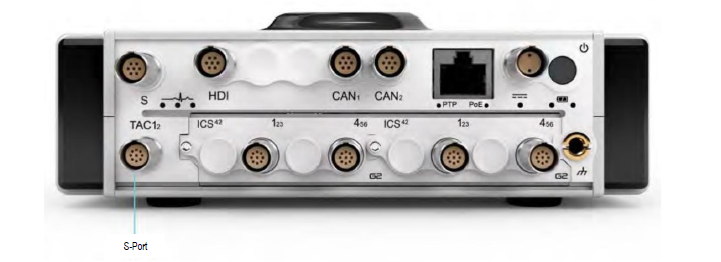

{width=915px height=350px}

### **Описание**

Порт S-Port находится на передней панели ORIONm. Он служит для подключения различных дополнительных подключаемых устройств. К ним относятся, например блоки SNAV и SGPS.

{width=350px height=350px}

*Интерфейс **S**\-Port: назначение контактов 7-контактного разъема LEMO*® *EHG.0B (если смотреть на разъем на лицевой панели). Рекомендуется использовать ответный разъем FGG.0B.307.CYCD52Z.*

!!! note "Примечание"
    Максимальная мощность, доступная по STP-порту: 12 В при 1 А и 5 В при 1 А.