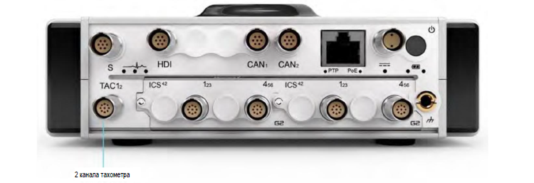

{width=915px height=350px}

### **Описание**

Интерфейс тахометра на передней панели ORIONm включает два канала тахометра, обеспечивающие интервальные измерения с разрешением 20 нс: выборка производится, когда сигнал пересекает заданный уровень срабатывания. Триггер для сигналов тахометра можно настроить по переднему или заднему краю с регулируемым гистерезисом, дополнительно обеспечивая развязку по переменному току для датчиков с различными значениями смещения напряжения постоянного тока. Для канала предусмотрен режим осциллографа 6,5 Мвыб/с для просмотра сигналов тахометра -- это упрощает задание уровней триггера. Каналы можно использовать при измерении частоты повторения импульсов, а также времени между импульсами (например, для измерения оборотов в минуту и угла поворота коленчатого вала).

### **Функции**

•           2 канала

•           Разрешение 20 нс

•           Миллион импульсов/с в сумме для двух каналов

•           Входной сигнал может быть связан по перем. и пост. току

•           Регулировка уровня триггера 16 бит

•           Входной диапазон ±(24 В, 5 В)

•           Регулируемый гистерезис уровня триггера

•           Триггер по n-краю

•           Режим осциллографа для каждого канала тахометра с частотой дискретизации до 6,5 Мвыб/с

•           Выходное напряжение возбуждения на датчик 11 В

•           Ток возбуждения 125 мА на канал

•           Минимальная разность напряжений между уровнями триггера:

-  24 В: 0,2% диапазона, то есть 0,05 В

-  5 В: 0,2% диапазона, то есть 0,01 В

{width=350px height=350px}

!!! note "Примечание" 
    *Интерфейс TAC: назначение контактов 9-контактного разъема LEMO*® *EHG.0B (если смотреть на разъем на лицевой панели). Рекомендуется использовать ответный разъем FGG.0B.309.CYCD52Z.*

### **Функциональная схема**

{width=915px height=350px}