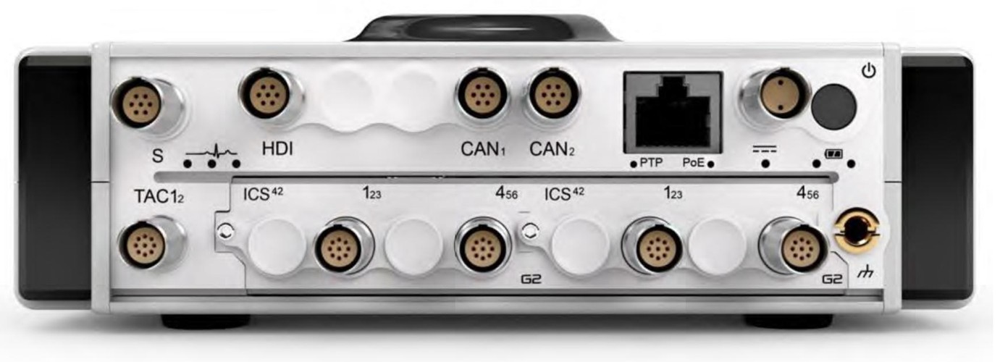

### Вид спереди
{width=915px height=350px}

Выделяются несколько модификаций прибора в зависимости от функционала (без корпусных изменений). 

ORIONm - Стандартные функции:
•	Корпус, контроллер и интерфейс нормирования сигнала
•	Два слота для модулей преобразования электрических сигналов.
•	S-Port (цифровая шина) для дополнительных устройств ввода-вывода
•	Ethernet: 1000BASE-T
•	Power over Ethernet (PoE) IEEE 802.3at Type 2, LTPoE++
•	Поддержка PTP IEEE 1588-2008 (протокол точного времени)
•	Защищенный алюминиевый корпус для использования в полевых условиях  
•	Охлаждение за счет теплопроводности/конвекции
•	Адаптер питания PoE в комплекте.

ORIONm-T - стандартные функции + :
•	Два канала тахометра (добавляется буква T)

ORIONm-CT - стандартные функции + :
•	Два независимых канала CAN/CAN FD (добавляется буква C)
•	Два канала тахометра 

ORIONm-B - стандартные функции +:
•	Встроенная батарея: до 2 часов работы, встроенная память: SSD, 128 ГБ (добавляется буква B)

ORIONm-B-WCGT - стандартные функции +:
•	Встроенная батарея: до 2 часов работы, встроенная память: SSD, 128 ГБ
•	Wi-Fi: зашифрованная сеть Wi-Fi, IEEE 802.11b, g и n (добавляется буква W)
•	Два независимых канала CAN/CAN FD
•	Встроенный GPS-приемник для синхронизации времени и позиционирования (добавляется буква G)
•	Два канала тахометра

ORIONm-B-WCGHT- стандартные функции +:
•	Встроенная батарея: до 2 часов работы, встроенная память: SSD, 128 ГБ
•	Wi-Fi: зашифрованная сеть Wi-Fi, IEEE 802.11b, g и n
•	Два независимых канала CAN/CAN FD
•	Встроенный GPS-приемник для синхронизации времени и позиционирования
•	Два канала тахометра
•	Интерфейс высокой четкости с 2-мя 24-битными аналоговыми входными каналами 7,5 В: ICP® до 102,4 Квыб/с на канал и 2-мя каналами вывода аудиосигнала для бинауральной гарнитуры. (добавляется буква H)
