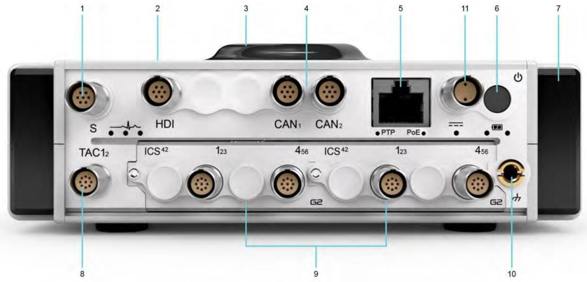

| Характеристика                                                | Значение          |
|---------------------------------------------------------------|-------------------|
| Габариты (Ш x В x Г)                                          | 172 х 251 х 53 мм |
| Масса в полностью укомплектованном состоянии с аккумулятором  | 2,70 кг           |
| Масса в полностью укомплектованном состоянии без аккумулятора | 1,85 кг           |
| Условия окружающей среды                                      | \-20 °C … 50 °C   |
| Пыле- влагозащита                                             | IP40              |
| Влажность (без конденсации)                                   | 90%               |
| Ударный импульс (длительностью 11 мс)                         | 40 g              |
| Случайная вибрация (10–2000 Гц)                               | 0,1 g2/Гц         |

### Вид спереди

{width=915px height=350px}

**1\.      S-Port**

Порт S-Port служит для подключения дополнительных устройств.

[Дополнительные сведения см. в разделе Порты.](../provedenie-izmereniy-pri-pomoschi-orionm/port-s-port.md)

**2\.      Встроенный SSD-накопитель и аккумулятор**

**Встроенный SSD-накопитель**

Безопасное и надежное хранение данных на встроенном твердотельном накопителе 128 ГБ.

**Встроенный аккумулятор**

Литий-ионный аккумулятор

[Дополнительные сведения см. в разделе Питание от аккумуляторов.](../nachalo-raboty-s-priborami-orionm/pitanie-orionm/pitanie-ot-akkumulyatorov.md)

**3\.      GPS-антенна**

Встроенный GPS-модуль для получения информации о времени и местоположении.

[Дополнительные сведения см. в разделе Встроенный GPS канал.](../provedenie-izmereniy-pri-pomoschi-orionm/vstroennyy-gps-kanal.md)

**4\.      2 канала CAN и CAN FD**

2 канала CAN и CAN FD для поддержки шины CAN.

[Дополнительные сведения см. в разделе Встроенные каналы CAN/CAN FD.](../provedenie-izmereniy-pri-pomoschi-orionm/vstroennye-kanaly-can-can-fd.md)

**5\.      Ethernet (PoE, PTP) Ethernet**

Подключение к ноутбуку, ПК и сети через Ethernet.

[Дополнительные сведения см. в разделе Подключение через PoE.](../nachalo-raboty-s-priborami-orionm/nastroyka-orionm/podklyuchenie-cherez-poe.md)

**PoE (питание по сети Ethernet)**

Питание ORIONm и подключение к сети по интерфейсу PoE.

[Дополнительные сведения см. в разделе Питание по PoE.](../nachalo-raboty-s-priborami-orionm/pitanie-orionm/pitanie-po-poe.md)

**PTP (протокол точного времени)**

Синхронизация по протоколу IEEE 1588-2008 PTP через Ethernet.

**6\.      Кнопка питания**

Кнопка для включения и выключения питания ORIONm.

[Дополнительные сведения см. в разделе Включение/выключение.](../nachalo-raboty-s-priborami-orionm/pitanie-orionm/vklyuchenie-vyklyuchenie-orionm.md)

**7\.      Антенна Wi-Fi**

Подключение к ноутбуку, ПК, сети и смартфону по Wi-Fi. Для повышения эффективности подключения установлено две антенны с обеих сторон ORIONm. 
[Дополнительные сведения см. в разделе Подключение по Wi-Fi.](../nachalo-raboty-s-priborami-orionm/nastroyka-orionm/podklyuchenie-po-wi-fi-pri-nalichii.md)

**8\.      TAC-каналы**

2 канала тахометра

Измерение сигналов от тахометра.

[Дополнительные сведения см. в разделе Встроенные каналы тахометра.](../provedenie-izmereniy-pri-pomoschi-orionm/vstroennye-kanaly-takhometra.md)

**9\.      Взаимозаменяемые модули преобразования электрических сигналов аналого-цифровые**

**Представлен: 6xACCs - 6-канальный модуль входного сигнала напряжения и ICP**® **(IEPE)**

[Дополнительные сведения см. в разделе Модуль 6xACCs (ICS42).](../opisanie-moduley-preobrazovaniya-elektricheskikh/modul-6xaccs-ics42.md)

**10\.    Клемма заземления**

Подсоедините клемму заземления к контуру заземления здания, если существует риск поражения электрическим током в среде проведения измерений. Клемму можно использовать в качестве опорного заземления для измерения аналоговых сигналов (необходимо применить подходящие настройки к соответствующим каналам). В некоторых случаях может использоваться для снижения шума аналоговых сигналов.

**11\.    Источник питания пост. тока (разъем LEMO**®**)**

На ORIONm можно подавать питание пост. тока (10–30 В пост. тока).

[Дополнительные сведения см. в разделе Питание от источника постоянного тока.](../nachalo-raboty-s-priborami-orionm/pitanie-orionm/pitanie-ot-istochnika-pitaniya-postoyannogo-toka.md)

### Вид сзади

{width=915px height=350px}

**1\.      Служебный разъем и разъем для внешнего аккумулятора модификации ORIONm-B**

К этому разъему можно подключить внешний аккумулятор.

**2\.      Паз**

Паз находится в верхнем правом углу задней панели модификации ORIONm-B. Для подключения внешнего аккумулятора совместите паз в верхнем правом углу внешнего аккумулятора с соответствующим пазом на задней панели ORIONm-B. 
[Дополнительные сведения см. в разделе Питание от аккумуляторов.](../nachalo-raboty-s-priborami-orionm/pitanie-orionm/pitanie-ot-akkumulyatorov.md)

### Вид снизу

{width=915px height=350px}

**1\.      Паспортная табличка**

Паспортная табличка включает данные о сертификатах и предупреждения об эксплуатации ORIONm.

**2\.**      **Серийный номер**

Серийный номер каждого ORIONm указан на обратной стороне прибора. Этот идентификатор позволяет нашим специалистам получить доступ к информации о конкретном устройстве для предоставления услуг поддержки.